# Journal

## Week1 Make-A-Thing
 
At the beginning of the idea phase, I was inspired by a tiny game example called “Tesla AI Training Mode”, which itself was based on the MIT Moral Machine Test. This made me want to create a small game rooted in a classic puzzle or childhood logic game. At first, I considered several ideas, such as item collection, passing a ball, or even something like “Crossy Road”. However, after deciding to work in Bitsy, I realized some of these ideas were not practical. Bitsy makes scrolling backgrounds tricky, and a ball-passing game would probably end after just one round.

Because of these limitations, I decided to focus on a logic-based, level-up style game. This worked better with Bitsy’s structure and allowed me to build increasing complexity across levels. To keep everything organized, I created a Notion document to track clues, storylines, and level setups.

Core Game Idea:
- The player is trapped in a mysterious structure.
- Each room contains multiple doors (not always the same number).
- Some characters lie. Some tell the truth.
- Only one door in each level allows progression.
- The player must learn rules, not guess randomly.

Level Setup (Original):
-	Level 1: Two-door riddle (2 identical doors, horizontal line) – 2 guards
-	Level 2: Three-door riddle (3 identical doors, horizontal line) – 2 guards
-	Level 3: Five-door riddle (5 identical doors, horizontal line) – 4 guards
-	Level 4: Escape room (find key in box) – hint box
-	Level 5: Four-door riddle (color-based)
-	Level 6: Five-door riddle (shape-based)
-	Level 7: Maze to find the door

#### What Worked Well
Surprisingly, the core logic of the game actually works. Players can move through levels by choosing the correct door, and choosing the wrong one reliably ends the game. This sounds simple, but getting the flow to work without breaking anything felt like a win. The walls, door placement, and one-way paths help guide the player naturally, so they do not wander off or break the intended experience.

The rule explanations and guard dialogue also work well enough to support the “Two Doors Riddle” logic. Players are given information, and whether they trust it or not becomes part of the challenge.

The overall atmosphere turned out better than expected. The color choices and background music create a mysterious mood without being distracted. I originally planned to include jump scares but later realized they did not fit the game. Shifting toward a “final castle” feeling (like the final fight in a Mario game, Bowser’s castle) made the experience more playable and less frustrating.

#### What Didn’t Work
One level was supposed to be based on choosing the correct door by color. In theory, it was a good idea. In practice because Bitsy’s color system applies to the entire room, I could not assign different colors to individual door sprites. After searching tutorials, watching videos, and asking AI, I still could not find a solution. At that point, removing the level felt healthier than continuing to fight the tool. The game went from seven levels to six, and the overall tone of the game was not affected much, so I think this was the best choice.

#### Challenges Encountered
1.	Color Choices and Contrast
As I wanted a mysterious vibe, so I started with purple for the building blocks. Unfortunately, purple does not always cooperate with other colors. The blocks blended into the background more than I expected, which made the space harder to read. I ended up testing different background colors using Adobe Color until the contrast actually worked.

 

  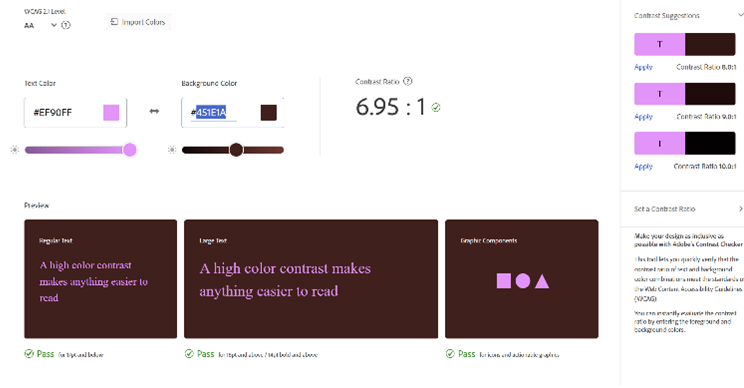
 

2.	Door and Exit Logic Confusion
Because this was my first time using Bitsy, I built all the rooms before fully understanding how exits worked. I did not know doors could have logic attached to them, so I created one-way paths and placed invisible exits before the doors instead. Later, I realized the “correct” way to do it. While my solution was a bit messy, it had one unexpected benefit, which is players do not instantly “die” by barely touching a wrong door.

 

  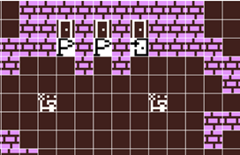
 

3.	Ignoring Rules	
During the game testing, I realized that some players completely ignored the rules and guessed randomly. This was not how I wanted the game to be played, since the core idea is logic-based problem solving. To address this, I added hint NPCs (the cloud-shaped characters) at each level to explain the rules or give small tips. However, testing again showed that players could still skip all the hints and continue guessing anyway. To fix this at least partially, I added a rule in the main starting room that forces the player to view the first hint before opening the door and entering the game. I considered doing this for every level, but the logic became much more complicated. I would need to track whether the player read the hints, whether they also read all the guards’ dialogue, and then unlock the doors based on that. Since each level has slightly different logic, this quickly stopped being a universal rule system. In the end, I decided to let the doors work normally (except for the room escape section and the main starting room). The idea became “I already warned you, if you ignore the hints, you are choosing to guess, and guessing has a high chance of failure”. I am not sure this is the perfect solution, but it supports the original idea of the game and worked reasonably well during testing.

 

  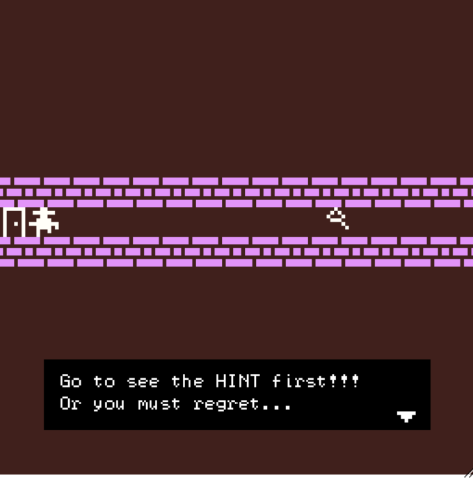
 

 
5.	Naming Organization
Since all guards in the game look the same, and all hint NPCs use the same cloud appearance, while they each have different dialogue. This made organization more difficult than expected. At first, I used long and descriptive names for each character, but this quickly became time-consuming and hard to check, especially when looking at the scene as a whole.To solve this, I switched to a simple naming pattern such as “T1_guard1” or “F1_guard2,” meaning Level 1 guard1 who tells the truth, or Level 1 guard2 who lies. This system made it much easier for me to check whether a guard was saying the correct dialogue and appearing at the correct level.

 

  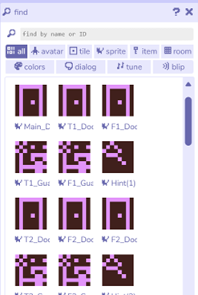
 

 
6.	Using AI as assistance for Dialogue and Logic
For the hints and guards’ speech, I first wrote everything myself. Later on, because I wanted the game to feel more mysterious and require more logical thinking from the player, I asked AI for some help. For storytelling and general tone, it actually did a pretty good job. However, for the rules and guard dialogue, I only used some of its ideas and still had to fix and adjust the logic myself.I would say AI helped speed up the game-making process, but since I already had my own ideas in mind, I still needed to fine-tune its suggestions to make sure everything worked the way I wanted.

Overall, while there are still many parts that could be improved, the final game reflects my original idea, which I feel pretty satisfied with!!!

 

  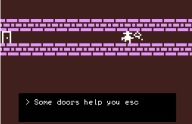
  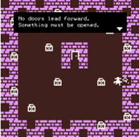
  
 

## **Week2** (23.1.2026 to 29.1.2026) – Unity 3D Movements 

This week, I started by reading and watching the class materials to understand the focus for the week. From that and this week design journal guidelines , it seems that we would be working mainly with movement, colliders, and basic interaction, so I planned my exploration around those topics. Since I’m more interested in 3D, I decided to focus entirely on Unity’s 3D workflow. 

My idea for this week was to build a small prototype to test basic movement, interaction, and physics working together in Unity 3D.

I began by exploring YouTube tutorials related to 3D and movement. I tried a [first-person movement tutorial](https://www.youtube.com/watch?v=f473C43s8nE) first because it looked engaging and looked like I could learn the code quickly. However, while following it, I realized I had forgotten many Unity basics, such as where to find certain settings and how the editor is organized. (Also ,I only tried 2D mode before , maybe it’s also the reason why it was hard for me to catch up with the 3D workflow at first.) So, at that point, I noticed that copying a video without fully understanding the Unity editor was slowing me down.

### Learning through [Unity Essentials pathway]
To fix this, I switched to Unity’s official [Unity Learn tutorials](https://learn.unity.com/) which I found on internet randomly, it called  [Unity Essentials pathway](https://learn.unity.com/pathway/unity-essentials?version=6.3), which includes guided practice directly inside Unity, especially a section call [movement script](https://learn.unity.com/pathway/unity-essentials/unit/programming-essentials/tutorial/add-a-movement-script?version=6.3)( which I am looking for ).  This really helped me rebuild my foundation, especially around movement, colliders, and Rigidbody.

There is one issues that I initially struggled to find the Unity Essentials project, but after returning to the Editor Essentials tutorials ( the first tutorial in the series) , I realized it must be opened through [Unity Hub](https://learn.unity.com/pathway/unity-essentials/unit/editor-essentials/tutorial/open-the-unity-essentials-project?version=6.0). Once that was resolved, the tutorials aligned correctly with my workspace.

- Note to self: any unknown/unfamiliar material showed in the tutorial, find the creator or the beginning tutorial of that series first.That’s may helps !

As I worked through the tutorials, I learned a lot of the editor itself , including flythrough mode, camera alignment, and working with child objects and pivots. These tools made scene navigation and setup much more efficient for me!

As part of understanding physics, I built a bouncy ball that hits and knocks down tower blocks. This helped me clearly see how Rigidbody, colliders, mass, and physics materials affect gameplay. I also explored different lighting, background settings, and camera angles throughout the process.

  

I also followed a tutorial to add a frame object and put a cat image inside it. While following the tutorial, it felt like completely new knowledge, even though I had done similar things before. This made me realize how much I had forgotten simply because I hadn’t used Unity in a long time, especially the 3D version. It shows that why going through structured tutorials again was necessary instead of relying on memory.

Also, since the tutorial also include an audio section , I experimented with audio by adding audio sources to game objects, setting background sounds, placing random bird sounds outside the main area, and testing Audio Reverb Zones to improve atmosphere. ( It is a useful skill that I think I could implement in my future prototype)

From there, I implemented several gameplay systems: movement scripts using child objects, rotating collectible items, a collect function with visual effects, jumping, and doors that open when the player(the vacuum cleaner) approaches using triggers and tags.

 

 ### Small original prototype

After finishing the tutorials and individual experiments, I wanted to check whether I actually understood what I learned. Instead of following another guide, I built a small original prototype using only the systems I had practiced during the week.

- first-person movement
- a child camera
- jumping
- collectible objects (with rotation and effects)
- a simple environment built from square shapes

  

The visuals are very basic, but all systems work together, which confirmed that I understood how the components connect. So is Greattttt!!!!! And I also did a small prototyoe as met my expectations for this week

### Common issues and technical reminders

During this process, I noted several common issues and technical reminders that will be useful for future prototypes:

- Remember to set colliders to "Is Trigger" if want the player object to pass through an object while still detecting interactions

- Assign the correct "Tag" to an object if code uses tags for comparison [Common Error that I faced]

- "Box Colliders" should be set slightly larger than the object. If the collider is too small, the player may collide with the door before it has time to open

- If a bouncing ball gets stuck inside another object, it is likely because the object does not have a "Mesh Collider"
  - Reminder: make sure the Mesh Collider component is added and enabled

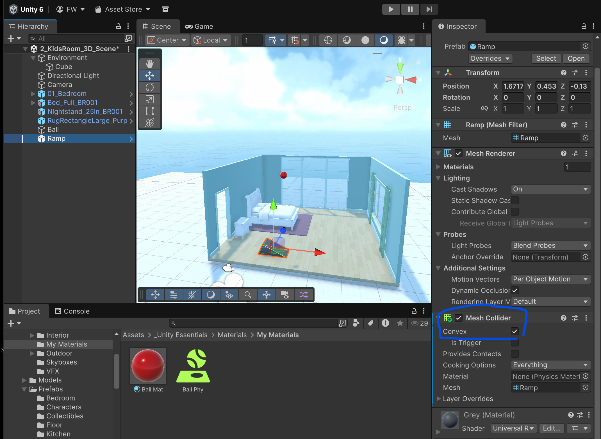

- ShortCut: **Ctrl + Shift + F**: Aligns the camera to the current view angle

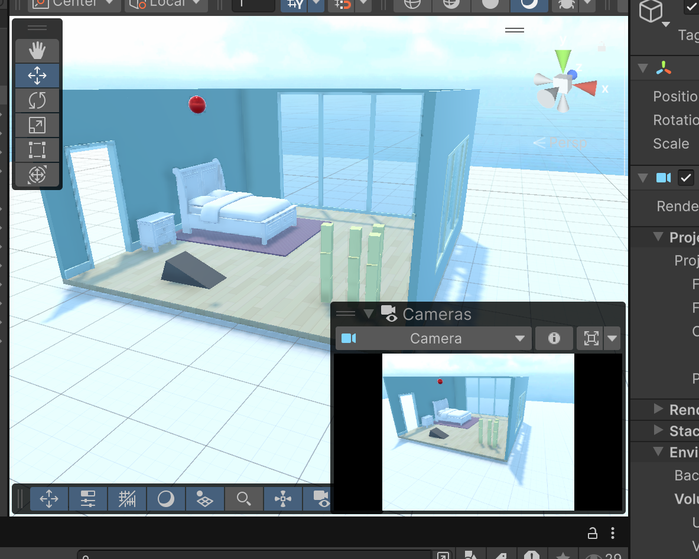

### Next Steps

Now that I’ve caught up on many of the basics, I plan to go back to the first-person movement video and other external tutorials. With a stronger foundation, I think I’ll be able to understand them more deeply and customize them instead of just following along.

Also, there is a issue I faced in the small prototype that is player (the UFO object) flipping when landing on uneven surfaces. Since the Rigidbody can rotate during jumps , it may causes the player to fall over and get stuck. There maybe a chance that the problem come from other sessions too , so I will keep figuring it next week 

  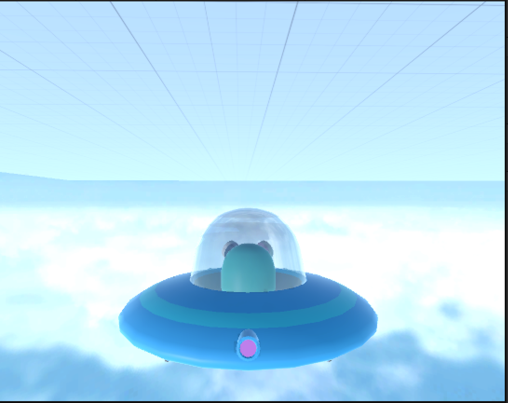

Overall, this week felt like a strong process approach: reading class materials first, choosing focused goals, using structured tutorials, and then experimenting on my own. If I had only relied on self-discovery and random tutorials, I would have spent most of my time debugging unknown issues without understanding why things weren’t working. I wouldn’t have been able to learn as efficiently as I did this week. 

This made it much easier to focus on learning the actual systems instead of fighting the tool.

So , Keep Moving On !!! and Learn Smartly 😉
 	
## **Week3** (30.1.2026 to 5.2.2026) – Exploring Mechanics Through Pawng

This week I started by thinking about what kind of idea I should work on, and I kept coming back to the same direction: **small scale, small scope**. I didn’t want to start with something too big or complicated. I wanted something simple enough to actually finish, but still flexible enough to explore.

Because of that, I began by searching through io games. Io games are usually simple, they often support multiplayer, and they rely heavily on simple color and simple shapes. From a coding perspective, this also makes sense, because simpler visuals usually mean cleaner logic. 

At the same time, I was following the class structure like last week — reading the chapters , watching the suggested tutorials and starting a prototype. 

Even though I was still thinking about io games , I wanted to use what we learned in class: physics, object tags, scoring, sound, and so on and expand and put the creativity on it . But at a certain point, I felt stuck again. I had many ideas, but none of them felt like they were moving forward.

That’s when I turned back to the **Pawng game**. Instead of building a brand new game, I asked myself how Pawng could be experimented with in different ways.

I decided to start from a simple concept and expand from there. Pawng only has a few core elements, so I began thinking about how those features could change. I listed a lot of rule-based questions. 

- What if each hit paints the arena, like Splatoon, but in 2D and with Pawng mechanics?
- What if the game is about area capture instead of scoring points?
- What if the ball bounce feels like basketball keep-up game?
- What if Pawng becomes a football game where you shoot the ball into cages at the sides?
- Or what if the player actually needs to avoid hitting the ball?

After reading the book chapters, I saw a mention of recording and showcasing "Boids motion paths", and that gave me another idea. 

- How about ball path itself becomes the important element? like the ball path is recorded by player color???

This felt new, and I hadn’t really seen people talk about it in relation to Pawng. Then, I started!!!

### Questioning Every Element

From there, I started questioning every part of the game. 

#### Ball Behavior
- whether I should add gravity? (probably no)
- whether the ball should curve? (maybe later, additional feature )
- whether repeated hits should increase speed? (fun but needs testing)
- whether the ball should change size as it gets hit more? ( maybe no for this time)
- whether there should only be one ball, or if a new ball should spawn every ten seconds as an additional feature? (fun feature , additional feature)

#### Paddle Design
- whether I should keep the rectangle shape or try something different like a circle or triangle? (need testing)
- how the paddle should move?
    - only up and down / also left and right (will that would make the game too complicated? need testing)
- where paddles should start? (Need to test) 
    - on the sides of the screen / at the top and bottom.

#### Arena and Boundaries
- Should the ball be able to pass through walls?
   (as idea is continuous drawing, I decided that it shouldn’t. That means all four walls should block the ball, and the ball should bounce instead of exiting.)

#### Color Choices
- What should the base background color be? Black? Half-and-half? Should players start on sections opposite their color?
    (It is better to be black as the background)

#### Scoring and UI
For scoring, I decided that calculating score by **percentage of color coverage** made the most sense.Then I questioned when the game should end. One minute? Two minutes? And whether the percentage distribution should be shown during the game or only at the end. I also thought about where the score UI should appear , maybe in a circle at the top middle of the screen.

#### Multiplayer Concerns
Multiplayer raised even more questions.
- How would paddle placement work on a landscape screen? (Need to test)
- Can paddles collide with each other? (Should be no)
- What keys should be used for control?
    (WASD and arrow keys already feel limited, and more players would make it worse.)  

When I started testing by myself, some questions began to resolve naturally. I also marked some notes next to the questions so I could review them later, and I saw some of them as future plans too. 
 

  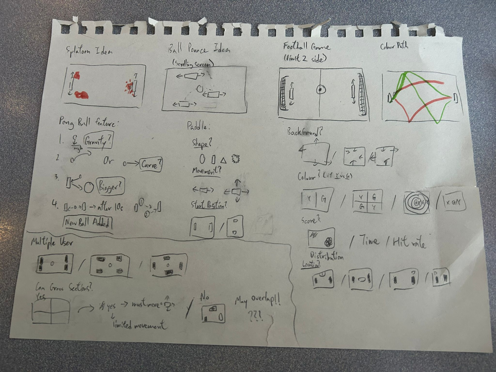
 

#### Low Prototype
I started with a low prototype, creating a storyboard and paper video prototype. 

Two paddles on each side, ball in the middle, random start. The first ball path uses background color, and once a paddle hits the ball, the path changes to that player’s color. The timer counts down, the game ends, and the winner is shown.

#### Mid Prototype
For the mid prototype, I implemented this idea using the class Pawng project and started adding features.

- The first goal : simply to test whether the path could be recorded by color and whether the score could be counted.

This is where a lot of technical struggle started. I tried [Trail Renderer]([https://learn.unity.com/pathway/unity-essentials/unit/editor-essentials/tutorial/open-the-unity-essentials-project?version=6.0](https://docs.unity3d.com/2022.3/Documentation/Manual/class-TrailRenderer.html)), which looked good, but it didn’t actually record anything onto the background, so it couldn’t act as what I originally planned. Then , I turned to use [RenderTexture](https://www.youtube.com/watch?v=tRTbPGalJXk&t=81s) .

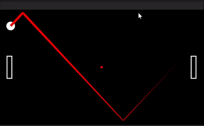

### What Went Wrong (and How I Fixed It)
During testing, the screen started to lag after just one hit, and I kept asking myself how I could solve this. Below are some notes on specific issues I faced and how I fixed them.

  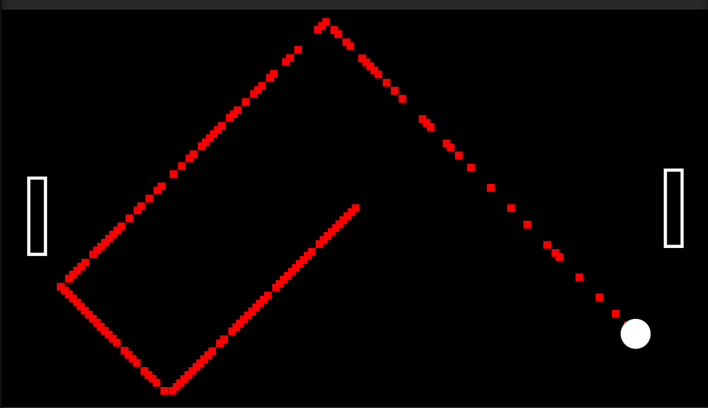
 

To solve the lagging issue,  I removed the "ReadPixels" call, since reading from the RenderTexture every frame was slowing everything down.I also removed the feature that showed the color distribution all the time, and instead calculated the distribution only at the end of the game. That helped a lot!

Another major issue was that all colors turned red, even when I assigned different ones. After reading [Unity discussions](https://discussions.unity.com/t/rendertexture-format-missing-rgb/826685), I discovered that the RenderTexture color format was the problem. When I changed it to **A2B10G10R10**, it finally worked. 

 

  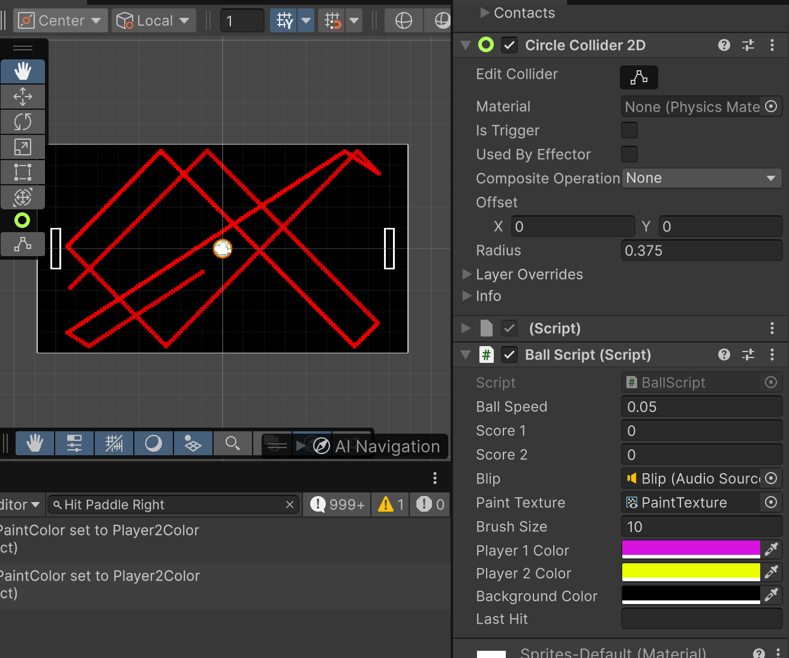
 

When the timer ended, the game still kept running. The physics didn’t stop. That felt wrong, so I fixed it by stopping the ball and enlarging the result text. I added a result panel (panel, not canvas) with a semi-transparent background so the result feels clear. Also, with issue was that the Winner Player was hard to identify because both paddles looked the same, I fixed that by adding text with the corresponding player color and placing it in the panel as well.

 

  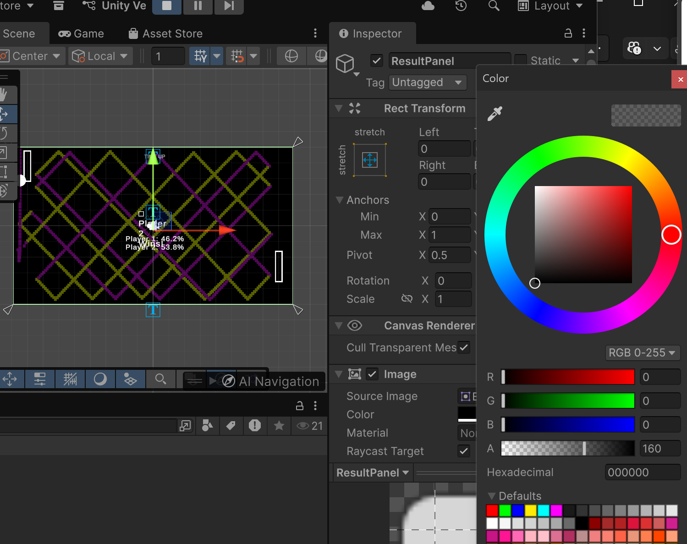
 

#### Common Mistakes
Also , I marked some notes for basic and common mistakes that I faced this time:

- constantly check whether textures were assigned
- the canvas "must" be linked to the camera,
- Check whether objects were actually connected.
- When using "TMP_Text" instead of "Text", remember to add "using TMPro;", and creating empty objects when scripts don’t belong to a specific object.

Finally, the game worked!!! The ball painted the screen. The score showed correctly. The winner was displayed.

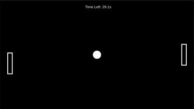

### Player Testing
Then , I asked friends to try the game, here are some notes I marked for their feedbacks:

- Game idea was good
- the paddle shape is fine, no need to change it to a circle or other shape
- multiplayer on one computer would be hard
- placing paddles at the top and bottom might improve the challenge.

There is still a bug where the ball gets stuck bouncing vertically near the wall until time runs out. This is something I would solve in the future. 

 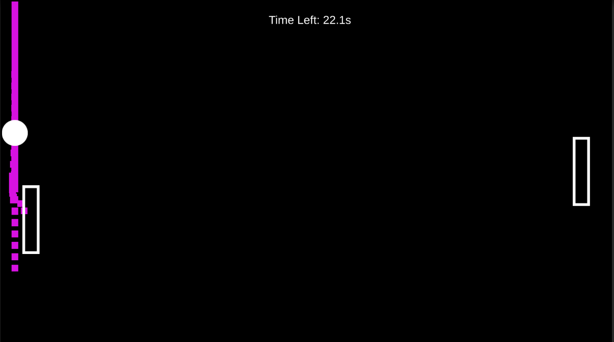

### Next Steps
For the future scope , I will fix the bug and test the features I questioned earlier and marked as additional features:

- place paddles on different position
- make paddle can move by 4 directions
- make the ball path curve
- add new ball for every 10 seconds
- change the paddle color to match the player color

Overall,  the ball path painting works, the scoring works. I feel pretty happy with this prototype!!!✌ 

## **Week4** (6.2.2026 to 12.2.2026) – Singleton GameManager & Laser Challenges

As same as last week, I finished the reading first and then tried to start my prototype. This week the focus is on singletons and spawning children objects with potentially different variables. I told myself to keep the scope small this time also , because last week I found that it is good to prototype a small scale game first . not only for beginner process , but also easy to edit and check the testing .

My starting structure was simple. I wanted:

- Children objects that can change (one or more of the following):
    - Object numbers (more / less)
    - Colour
    - Speed
    - Shape
    - Score / health effect
- A Singleton GameManager to:
    - Control game state
    - Control score
    - Handle GameOver

However, I got stuck at the idea stage again. I understood the technical requirement, but I didn’t know what kind of game mechanic would naturally use spawning and a singleton in a meaningful way.

So I started searching IO games for inspiration again. As through IO games’ repeated shapes, duplicated objects, minimal mechanics,  I hoped I could gain an idea while still following basic features that I could extend. While watching YouTube recommendations, a laser tag game advertisement appeared. That gave me direction. Around the same time, I was also looking at Apple Watch UI design, especially how circle sizes scale smoothly. That visual stayed in my head.

 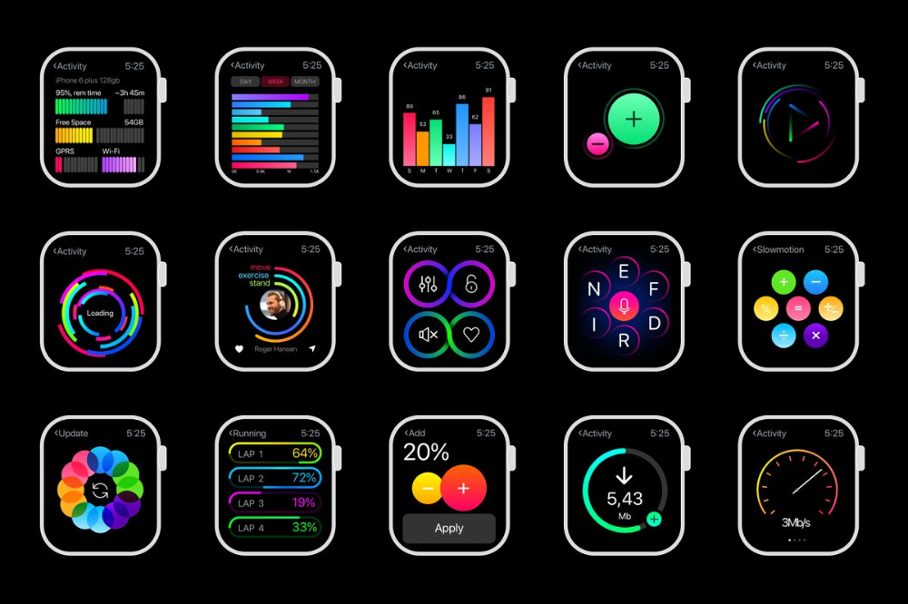

### Core Idea – Bouncing Ball + Scrolling Lasers

Combining those references with what we learned last week, I broke the idea down into something manageable: 

- a bouncing ball that the player controls, and scrolling laser tags that the ball must pass through.

The core rule I imagined was: hold the bouncing ball, do not miss it, and pass through all the laser tags.

At first, my rule prototype looked like this:

- The ball becomes larger each time it passes a laser.
- Hitting a laser reduces one level of the ball size.
- Different lasers could reduce different levels (for example green -1, red -2).
- Touching the bottom space 3 times means losing the game.
- Passing each laser adds 1 score.

To visualise this idea, I created sketches of the scene layout, different ball size levels, and variations of laser designs.

 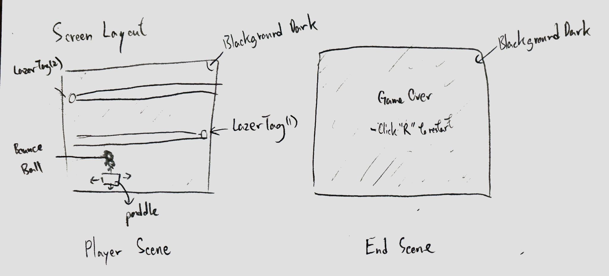
 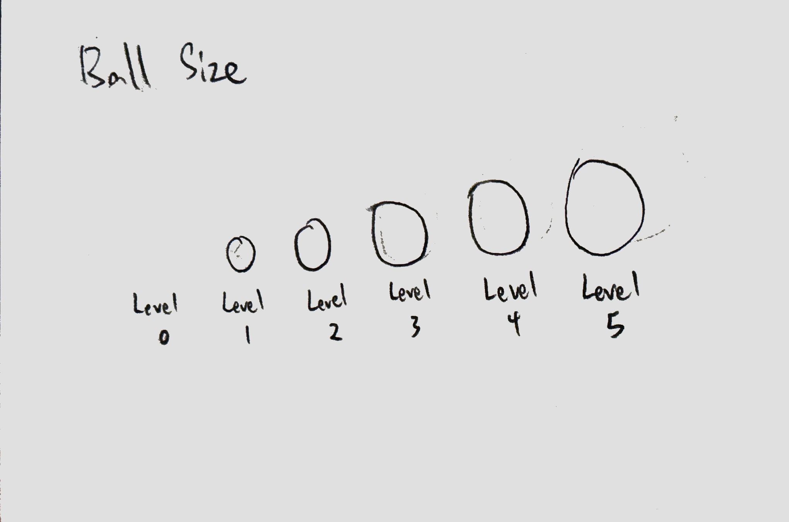
  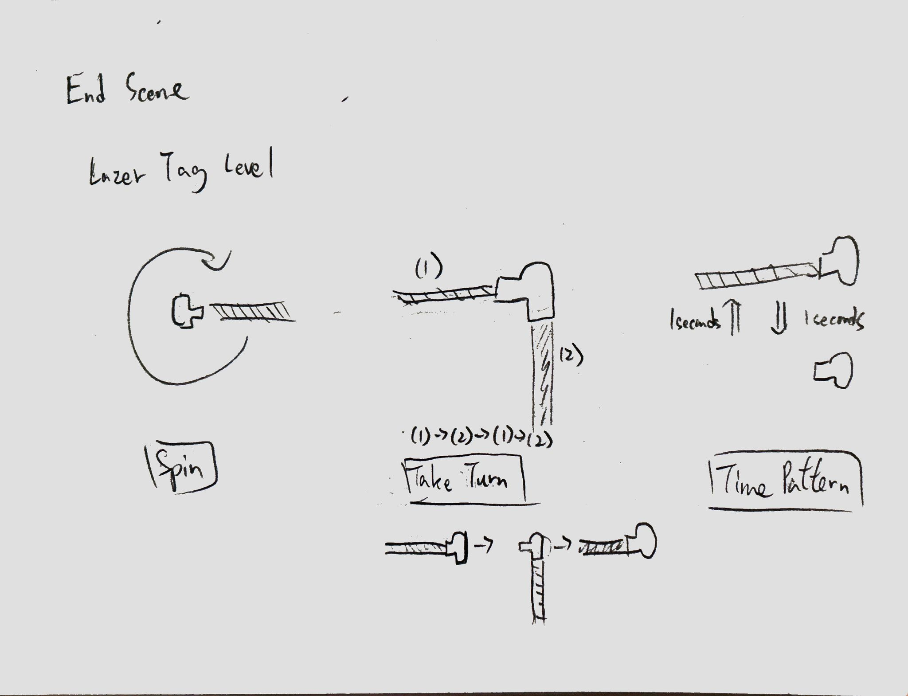

However, while thinking through the system, I realized a design issue. If the player keeps successfully passing lasers, the ball could become infinitely large. That would break the balance and also look strange visually.

So I redesigned the system into five fixed levels of ball size. The ball can grow until Level 5, and then it remains at that size. Losing conditions become either:

- Dropping the ball 3 times, or
- Reducing the ball level to 0.

I also adjusted the starting size. I changed Level 1 to 0.7 scale instead of 0.9 so the growth would feel more noticeable. The scaling became:

- Level 1 = 0.7x
- Level 2 = 1.0x
- Level 3 = 1.15x
- Level 4 = 1.3x
- Level 5 = 1.45x

Interestingly, this size system created tension naturally. Through my own and my friends testing a bigger ball feels stronger and rewarding, but it also becomes harder to dodge lasers. That risk–reward effect was not originally planned. It emerged from testing.

During the gameplay flow prototype, I found another issue. If the ball starts at Level 1 and immediately hits a laser, then according to the rule the game ends instantly. That feels unfair. So I adjusted it so the ball starts at Level 2. When it hits a laser, it reduces one level. If it misses the paddle and drops, it restarts at the same position, level does not change, but drop count increases. If drop count equals 3, then GameOver.

After refining these rules, I updated the prototype game flow diagram to reflect the revised system.

 

Since last week, I’ve found that creating a video prototype is very useful for expressing my ideas and guiding me in implementing the scene and code in Unity. For this week’s idea, I created a similar video prototype, but I used an app to assist with the stop-motion video. As in last week, my hand blocked some of the object movements, so this time I wanted to avoid that issue.

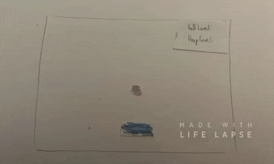

The video prototype is not mentioned the whole game rule flow , but hightlight: 

- Ball size reduction when hitting laser
- Ball falling from paddle
- Ball bouncing
- Scrolling laser collider repeating
- Text UI showing ball level and drop count
- GameOver scene appearing

In my implementation testing, I will not only include the features mentioned above, but I will also experiment with additional features. For example, I would like to count the number of times the ball is dropped and the number of times it hits the laser light, along with sound implementation.

#### Mid Prototype - What I Was Testing

So overall , this prototype I wish to mainly tested:

1. Can I implement a vertical scrolling laser system?
2. Can I change ball size dynamically using an array?
3. Can I use Singleton properly for:
    - Score
    - Drop counting
    - Scene switching
    - Sound control
4. Can the player handle paddle + bouncing ball ?

#### Issue and Adjustments

During the implementation, I found that there were better ways to present the game and debug certain logic issues. As a result, I revised and refined several parts of my original game rule design.

- First , I simplified collision logic. Originally I wanted both the paddle and the ball hitting the laser to count. But during testing, it became messy and harder to trigger properly. So I reduced it to only count when the ball hits the laser. This made the system smoother and easier to debug.
    
    Also during testing, the scrolling setup made it hard to increase the level and verify whether the ball and paddle successfully passed through the LaserCollider. Because in the code implementation the Scroller Scene repeats LaserColliders, collision checks became tricky. To make the process easier , I temporarily removed the “add points” function and started the ball at Level 5, so it could only reduce in size.
    
- Second, for the scrolling gameplay, I chose the laser-moving-down approach. The player stays mostly in the lower part of the screen, and laser containers spawn above and scroll downward. When they reach the bottom, I originally destroyed them, but I noted that destroying objects repeatedly is heavy. It might be better to recycle them later.
    
    Therefore, I created a LaserContainer prefab with a ScrollingLaser script, and a LaserSpawner object to instantiate them. This connects directly to spawning children objects from what we learned in class. Each laser container behaves independently ,  they have their own position and different way to give lazer light.
    
- Also , I initially believed that giving each LaserContainer a random X position would increase the difficulty level and improve visual variety, preventing the scene from feeling repetitive. I implemented: float randomX = Random.Range(minX, maxX);
    
    However, during testing, I found that my minX and maxX values were too large (-7f to 7f), which made the layout feel messy and inconsistent. The scene lacked intentional design.
  
    
    I first attempted to reduce the range, but the result still felt visually chaotic. So finally, I removed the randomness and used fixed starting positions instead. This made the overall composition much cleaner and more balanced.
    
    - Note: Sometimes less randomness can create a stronger visual rhythm and better game clarity.
    
- Lastly , A major bug occurred when I attempted to reduce the ball’s level after it hit the laser. The ball suddenly froze and stopped moving, and Unity displayed the following error: IndexOutOfRangeException: Index was outside the bounds of the array.
    
    The issue was that my currentLevel variable did not properly match the size of my levelSizes array. Since Unity arrays are 0-indexed, I failed to correctly account for level 0. When currentLevel became 0 or exceeded the array size, the program crashed.
    
    To fix this, I:
    - Expanded the array to include enough elements
    - Added proper boundary checks before accessing the array
    
    After these adjustments, the system worked correctly.
    
    - Note: Game rules and data structures must align exactly.
    
    If the system logic defines 5 levels (0–5), then the data structure must safely support all 6 indices. Consistency between logic and data is essential for stability.
    

### Common Issues and Technical Reminders

During this prototype development, I also encountered several technical issues. I noted them down as reminders for future projects:

- When using SceneManager.LoadScene(), remember in the script add “using UnityEngine.SceneManagement;”” [Common Mistake]
- When using GetComponent<AudioSource>(), ensure that the GameObject actually has an AudioSource component attached. Cannot drag an AudioClip directly into the script unless the AudioSource exists on the object , since they are AudioResource , not AudioSource.
 

 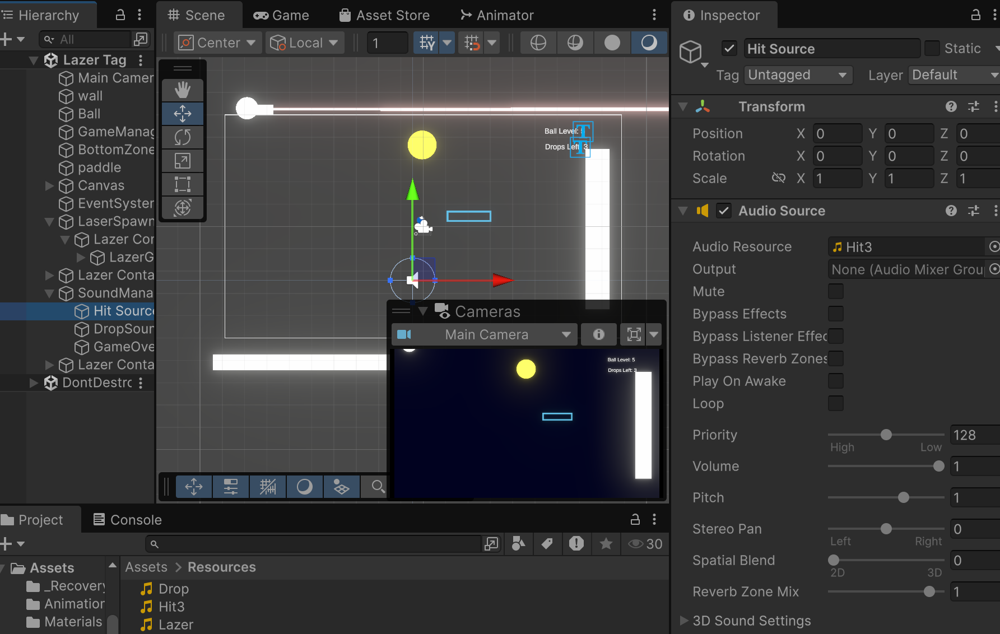

- When the background appears incorrect, check the camera’s Background Type. Change it from “Skybox”(Default) to “Solid Colour” if want a self-defined background.
 

 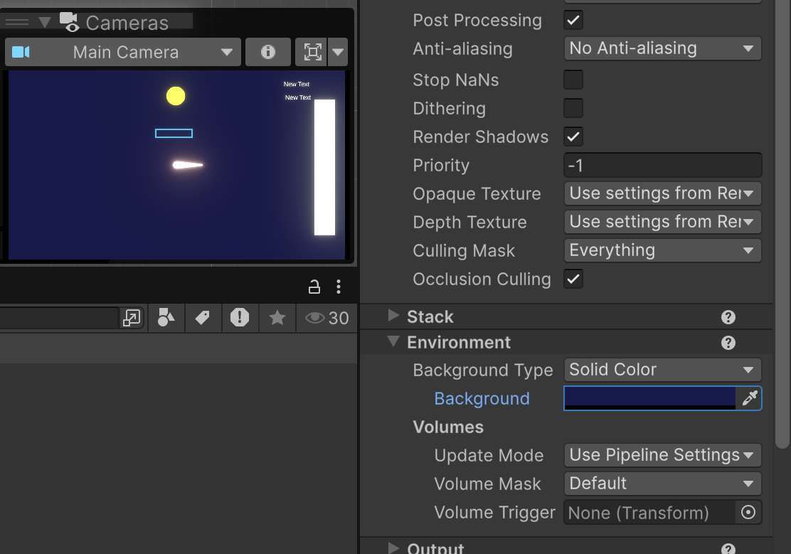

### What Was Successful

The core loop works clearly.Yeahhhhhh!!!!!! The scrolling laser system functions properly, and the ball scaling system responds correctly to collisions. The GameManager successfully controls score, drop count, and GameOver transitions.

I also found some additional successes:

- I implemented GameOver scene that the player can restart by pressing “R”, returning to the Laser Tag scene. This makes the game flow more user-friendly and reflects what I learned in previous classes.
- Simplified collision logic (counting only the ball hitting lasers) improved system stability.

The most interesting success was the unexpected emergence of tension. The bigger ball mechanic naturally created risk–reward dynamics. 

### Next Steps

I shared the prototype with my friends and got some suggestions:

From testing with friends, they recommended adding more variation in laser timing. Currently, many lasers flash with the same pattern. In the future, I could offset their timers so some have a 2-second break and some a 1-second break to create more unpredictable flashing intervals

I also noticed issues with sound effects. I already added sound sources for ball hit, ball drop, and GameOver. However, the GameOver sound was cut off because the scene loaded too quickly. I removed the GameOver sound effect to make the transition smoother, but fixing this will be part of the future scope.

For future testing and development, I want to continue exploring:

- Adding different laser difficulty patterns (which I already designed in my paper prototype, but did not implement in this test)
- Improving sound and visual feedback
- Allowing different lasers to reduce the ball by different levels (currently, there is only one LaserObject with one material, so in future implementation could include more variety and difficulty)

Overall , I feel like I made good progress this week. The game stayed simple, but how to make the prototype feels much clearer.😃
