# Journal

## Week1 Make-A-Thing
 
At the beginning of the idea phase, I was inspired by a tiny game example called “Tesla AI Training Mode”, which itself was based on the MIT Moral Machine Test. This made me want to create a small game rooted in a classic puzzle or childhood logic game. At first, I considered several ideas, such as item collection, passing a ball, or even something like “Crossy Road”. However, after deciding to work in Bitsy, I realized some of these ideas were not practical. Bitsy makes scrolling backgrounds tricky, and a ball-passing game would probably end after just one round.

Because of these limitations, I decided to focus on a logic-based, level-up style game. This worked better with Bitsy’s structure and allowed me to build increasing complexity across levels. To keep everything organized, I created a Notion document to track clues, storylines, and level setups.

Core Game Idea:
- The player is trapped in a mysterious structure.
- Each room contains multiple doors (not always the same number).
- Some characters lie. Some tell the truth.
- Only one door in each level allows progression.
- The player must learn rules, not guess randomly.

Level Setup (Original):
-	Level 1: Two-door riddle (2 identical doors, horizontal line) – 2 guards
-	Level 2: Three-door riddle (3 identical doors, horizontal line) – 2 guards
-	Level 3: Five-door riddle (5 identical doors, horizontal line) – 4 guards
-	Level 4: Escape room (find key in box) – hint box
-	Level 5: Four-door riddle (color-based)
-	Level 6: Five-door riddle (shape-based)
-	Level 7: Maze to find the door

#### What Worked Well
Surprisingly, the core logic of the game actually works. Players can move through levels by choosing the correct door, and choosing the wrong one reliably ends the game. This sounds simple, but getting the flow to work without breaking anything felt like a win. The walls, door placement, and one-way paths help guide the player naturally, so they do not wander off or break the intended experience.

The rule explanations and guard dialogue also work well enough to support the “Two Doors Riddle” logic. Players are given information, and whether they trust it or not becomes part of the challenge.

The overall atmosphere turned out better than expected. The color choices and background music create a mysterious mood without being distracted. I originally planned to include jump scares but later realized they did not fit the game. Shifting toward a “final castle” feeling (like the final fight in a Mario game, Bowser’s castle) made the experience more playable and less frustrating.

#### What Didn’t Work
One level was supposed to be based on choosing the correct door by color. In theory, it was a good idea. In practice because Bitsy’s color system applies to the entire room, I could not assign different colors to individual door sprites. After searching tutorials, watching videos, and asking AI, I still could not find a solution. At that point, removing the level felt healthier than continuing to fight the tool. The game went from seven levels to six, and the overall tone of the game was not affected much, so I think this was the best choice.

#### Challenges Encountered
1.	Color Choices and Contrast
As I wanted a mysterious vibe, so I started with purple for the building blocks. Unfortunately, purple does not always cooperate with other colors. The blocks blended into the background more than I expected, which made the space harder to read. I ended up testing different background colors using Adobe Color until the contrast actually worked.

 <p align="center">
  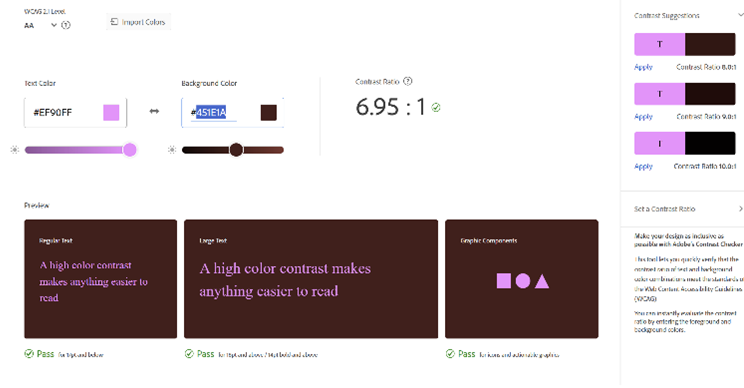
 </p>

2.	Door and Exit Logic Confusion
Because this was my first time using Bitsy, I built all the rooms before fully understanding how exits worked. I did not know doors could have logic attached to them, so I created one-way paths and placed invisible exits before the doors instead. Later, I realized the “correct” way to do it. While my solution was a bit messy, it had one unexpected benefit, which is players do not instantly “die” by barely touching a wrong door.

 <p align="center">
  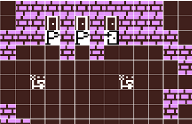
 </p>

3.	Ignoring Rules	
During the game testing, I realized that some players completely ignored the rules and guessed randomly. This was not how I wanted the game to be played, since the core idea is logic-based problem solving. To address this, I added hint NPCs (the cloud-shaped characters) at each level to explain the rules or give small tips. However, testing again showed that players could still skip all the hints and continue guessing anyway. To fix this at least partially, I added a rule in the main starting room that forces the player to view the first hint before opening the door and entering the game. I considered doing this for every level, but the logic became much more complicated. I would need to track whether the player read the hints, whether they also read all the guards’ dialogue, and then unlock the doors based on that. Since each level has slightly different logic, this quickly stopped being a universal rule system. In the end, I decided to let the doors work normally (except for the room escape section and the main starting room). The idea became “I already warned you, if you ignore the hints, you are choosing to guess, and guessing has a high chance of failure”. I am not sure this is the perfect solution, but it supports the original idea of the game and worked reasonably well during testing.

 <p align="center">
  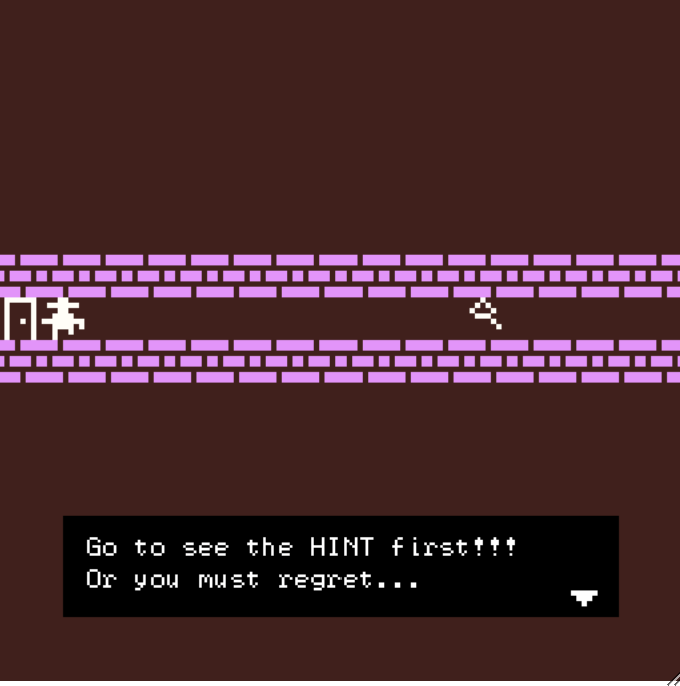
 </p>
 
5.	Naming Organization
Since all guards in the game look the same, and all hint NPCs use the same cloud appearance, while they each have different dialogue. This made organization more difficult than expected. At first, I used long and descriptive names for each character, but this quickly became time-consuming and hard to check, especially when looking at the scene as a whole.To solve this, I switched to a simple naming pattern such as “T1_guard1” or “F1_guard2,” meaning Level 1 guard1 who tells the truth, or Level 1 guard2 who lies. This system made it much easier for me to check whether a guard was saying the correct dialogue and appearing at the correct level.

 <p align="center">
  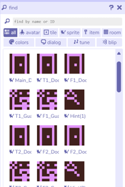
 </p>
 
6.	Using AI as assistance for Dialogue and Logic
For the hints and guards’ speech, I first wrote everything myself. Later on, because I wanted the game to feel more mysterious and require more logical thinking from the player, I asked AI for some help. For storytelling and general tone, it actually did a pretty good job. However, for the rules and guard dialogue, I only used some of its ideas and still had to fix and adjust the logic myself.I would say AI helped speed up the game-making process, but since I already had my own ideas in mind, I still needed to fine-tune its suggestions to make sure everything worked the way I wanted.


Overall, while there are still many parts that could be improved, the final game reflects my original idea, which I feel pretty satisfied with!!!

 <p align="center">
  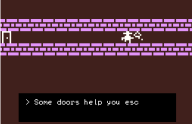
  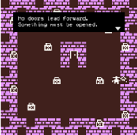
  
 </p>

## **Week2** (23.1.2026 to 29.1.2026) – Unity 3D Movements 

This week, I started by reading and watching the class materials to understand the focus for the week. From that and this week design journal guidelines , it seems that we would be working mainly with movement, colliders, and basic interaction, so I planned my exploration around those topics. Since I’m more interested in 3D, I decided to focus entirely on Unity’s 3D workflow. 

My idea for this week was to build a small prototype to test basic movement, interaction, and physics working together in Unity 3D.

I began by exploring YouTube tutorials related to 3D and movement. I tried a [first-person movement tutorial](https://www.youtube.com/watch?v=f473C43s8nE) first because it looked engaging and looked like I could learn the code quickly. However, while following it, I realized I had forgotten many Unity basics, such as where to find certain settings and how the editor is organized. (Also ,I only tried 2D mode before , maybe it’s also the reason why it was hard for me to catch up with the 3D workflow at first.) So, at that point, I noticed that copying a video without fully understanding the Unity editor was slowing me down.

### Learning through [Unity Essentials pathway]
To fix this, I switched to Unity’s official [Unity Learn tutorials](https://learn.unity.com/) which I found on internet randomly, it called  [Unity Essentials pathway](https://learn.unity.com/pathway/unity-essentials?version=6.3), which includes guided practice directly inside Unity, especially a section call [movement script](https://learn.unity.com/pathway/unity-essentials/unit/programming-essentials/tutorial/add-a-movement-script?version=6.3)( which I am looking for ).  This really helped me rebuild my foundation, especially around movement, colliders, and Rigidbody.

There is one issues that I initially struggled to find the Unity Essentials project, but after returning to the Editor Essentials tutorials ( the first tutorial in the series) , I realized it must be opened through [Unity Hub](https://learn.unity.com/pathway/unity-essentials/unit/editor-essentials/tutorial/open-the-unity-essentials-project?version=6.0). Once that was resolved, the tutorials aligned correctly with my workspace.

- Note to self: any unknown/unfamiliar material showed in the tutorial, find the creator or the beginning tutorial of that series first.That’s may helps !

As I worked through the tutorials, I learned a lot of the editor itself , including flythrough mode, camera alignment, and working with child objects and pivots. These tools made scene navigation and setup much more efficient for me!

As part of understanding physics, I built a bouncy ball that hits and knocks down tower blocks. This helped me clearly see how Rigidbody, colliders, mass, and physics materials affect gameplay. I also explored different lighting, background settings, and camera angles throughout the process.

  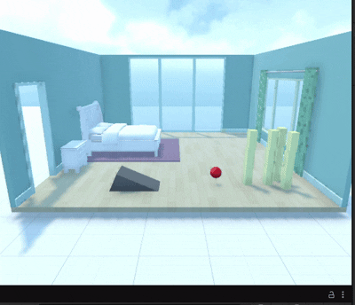

I also followed a tutorial to add a frame object and put a cat image inside it. While following the tutorial, it felt like completely new knowledge, even though I had done similar things before. This made me realize how much I had forgotten simply because I hadn’t used Unity in a long time, especially the 3D version. It shows that why going through structured tutorials again was necessary instead of relying on memory.

Also, since the tutorial also include an audio section , I experimented with audio by adding audio sources to game objects, setting background sounds, placing random bird sounds outside the main area, and testing Audio Reverb Zones to improve atmosphere. ( It is a useful skill that I think I could implement in my future prototype)

From there, I implemented several gameplay systems: movement scripts using child objects, rotating collectible items, a collect function with visual effects, jumping, and doors that open when the player(the vacuum cleaner) approaches using triggers and tags.

 

 ### Small original prototype

After finishing the tutorials and individual experiments, I wanted to check whether I actually understood what I learned. Instead of following another guide, I built a small original prototype using only the systems I had practiced during the week.

- first-person movement
- a child camera
- jumping
- collectible objects (with rotation and effects)
- a simple environment built from square shapes

  

The visuals are very basic, but all systems work together, which confirmed that I understood how the components connect. So is Greattttt!!!!! And I also did a small prototyoe as met my expectations for this week

### Common issues and technical reminders

During this process, I noted several common issues and technical reminders that will be useful for future prototypes:

- Remember to set colliders to "Is Trigger" if want the player object to pass through an object while still detecting ions

- Assign the correct "Tag" to an object if code uses tags for comparison [Common Error that I faced]

- "Box Colliders" should be set slightly larger than the object. If the collider is too small, the player may collide with the door before it has time to open

- If a bouncing ball gets stuck inside another object, it is likely because the object does not have a "Mesh Collider"
  - Reminder: make sure the Mesh Collider component is added and enabled

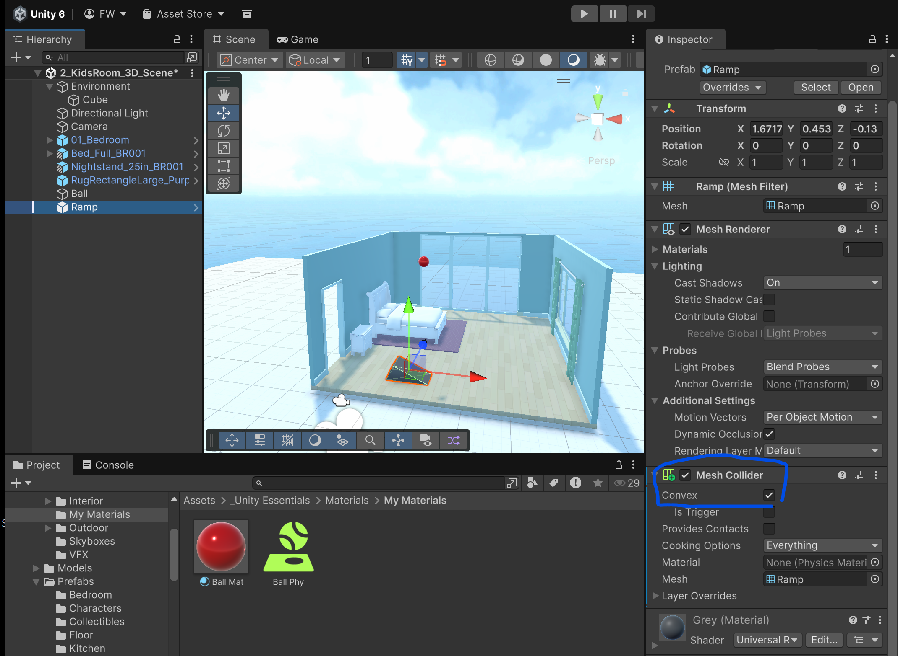

- ShortCut: **Ctrl + Shift + F**: Aligns the camera to the current view angle

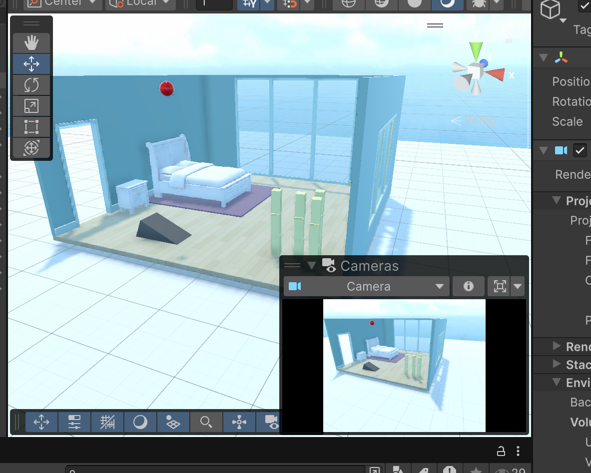


### Next Steps

Now that I’ve caught up on many of the basics, I plan to go back to the first-person movement video and other external tutorials. With a stronger foundation, I think I’ll be able to understand them more deeply and customize them instead of just following along.

Also, there is a issue I faced in the small prototype that is player (the UFO object) flipping when landing on uneven surfaces. Since the Rigidbody can rotate during jumps , it may causes the player to fall over and get stuck. There maybe a chance that the problem come from other sessions too , so I will keep figuring it next week 

  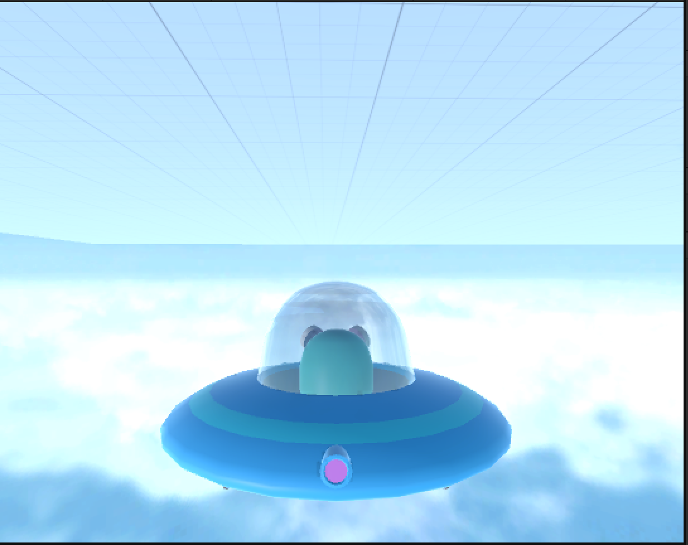

Overall, this week felt like a strong process approach: reading class materials first, choosing focused goals, using structured tutorials, and then experimenting on my own. If I had only relied on self-discovery and random tutorials, I would have spent most of my time debugging unknown issues without understanding why things weren’t working. I wouldn’t have been able to learn as efficiently as I did this week. 

This made it much easier to focus on learning the actual systems instead of fighting the tool.

So , Keep Moving On !!! and Learn Smartly 😉
 	
## **Week3** (30.1.2026 to 5.2.2026) – Exploring Mechanics Through Pawng

This week I started by thinking about what kind of idea I should work on, and I kept coming back to the same direction: **small scale, small scope**. I didn’t want to start with something too big or complicated. I wanted something simple enough to actually finish, but still flexible enough to explore.

Because of that, I began by searching through io games. Io games are usually simple, they often support multiplayer, and they rely heavily on simple color and simple shapes. From a coding perspective, this also makes sense, because simpler visuals usually mean cleaner logic. 

At the same time, I was following the class structure like last week — reading the chapters , watching the suggested tutorials and starting a prototype. 

Even though I was still thinking about io games , I wanted to use what we learned in class: physics, object tags, scoring, sound, and so on and expand and put the creativity on it . But at a certain point, I felt stuck again. I had many ideas, but none of them felt like they were moving forward.

That’s when I turned back to the **Pawng game**. Instead of building a brand new game, I asked myself how Pawng could be experimented with in different ways.

I decided to start from a simple concept and expand from there. Pawng only has a few core elements, so I began thinking about how those features could change. I listed a lot of rule-based questions. 

- What if each hit paints the arena, like Splatoon, but in 2D and with Pawng mechanics?
- What if the game is about area capture instead of scoring points?
- What if the ball bounce feels like basketball keep-up game?
- What if Pawng becomes a football game where you shoot the ball into cages at the sides?
- Or what if the player actually needs to avoid hitting the ball?

After reading the book chapters, I saw a mention of recording and showcasing "Boids motion paths", and that gave me another idea. 

- How about ball path itself becomes the important element? like the ball path is recorded by player color???

This felt new, and I hadn’t really seen people talk about it in relation to Pawng. Then, I started!!!

### Questioning Every Element

From there, I started questioning every part of the game. 


#### Ball Behavior
- whether I should add gravity? (probably no)
- whether the ball should curve? (maybe later, additional feature )
- whether repeated hits should increase speed? (fun but needs testing)
- whether the ball should change size as it gets hit more? ( maybe no for this time)
- whether there should only be one ball, or if a new ball should spawn every ten seconds as an additional feature? (fun feature , additional feature)

#### Paddle Design
- whether I should keep the rectangle shape or try something different like a circle or triangle? (need testing)
- how the paddle should move?
    - only up and down / also left and right (will that would make the game too complicated? need testing)
- where paddles should start? (Need to test) 
    - on the sides of the screen / at the top and bottom.

#### Arena and Boundaries
- Should the ball be able to pass through walls?
   (as idea is continuous drawing, I decided that it shouldn’t. That means all four walls should block the ball, and the ball should bounce instead of exiting.)

#### Color Choices
- What should the base background color be? Black? Half-and-half? Should players start on sections opposite their color?
    (It is better to be black as the background)

#### Scoring and UI
For scoring, I decided that calculating score by **percentage of color coverage** made the most sense.Then I questioned when the game should end. One minute? Two minutes? And whether the percentage distribution should be shown during the game or only at the end. I also thought about where the score UI should appear , maybe in a circle at the top middle of the screen.

#### Multiplayer Concerns
Multiplayer raised even more questions.
- How would paddle placement work on a landscape screen? (Need to test)
- Can paddles collide with each other? (Should be no)
- What keys should be used for control?
    (WASD and arrow keys already feel limited, and more players would make it worse.)  

When I started testing by myself, some questions began to resolve naturally. I also marked some notes next to the questions so I could review them later, and I saw some of them as future plans too. 
 <p align="left">
  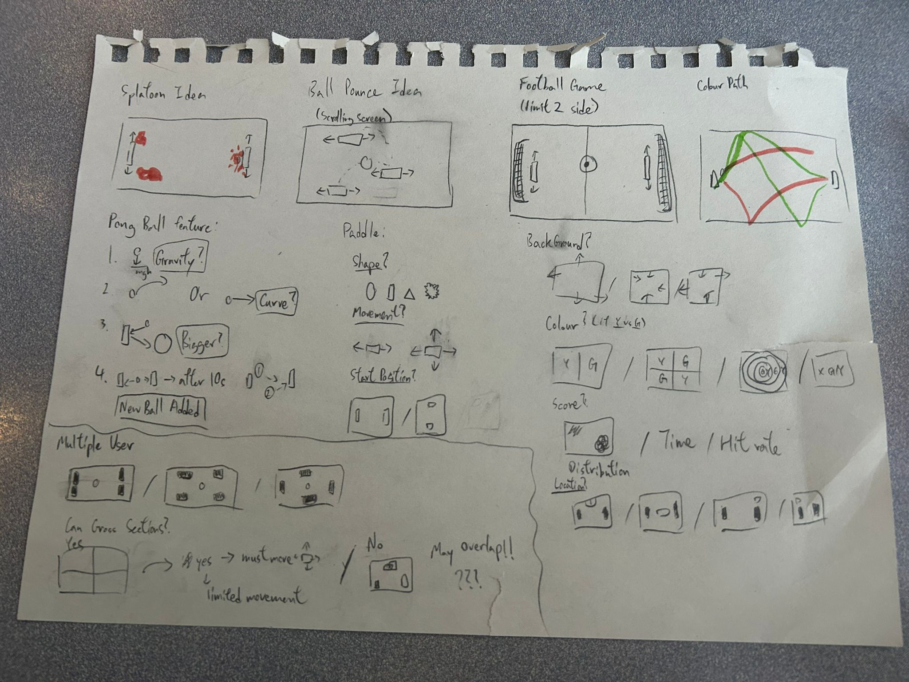
 </p>

#### Low Prototype
I started with a low prototype, creating a storyboard and paper video prototype. 

Two paddles on each side, ball in the middle, random start. The first ball path uses background color, and once a paddle hits the ball, the path changes to that player’s color. The timer counts down, the game ends, and the winner is shown.


#### Mid Prototype
For the mid prototype, I implemented this idea using the class Pawng project and started adding features.

- The first goal : simply to test whether the path could be recorded by color and whether the score could be counted.

This is where a lot of technical struggle started. I tried [Trail Renderer]([https://learn.unity.com/pathway/unity-essentials/unit/editor-essentials/tutorial/open-the-unity-essentials-project?version=6.0](https://docs.unity3d.com/2022.3/Documentation/Manual/class-TrailRenderer.html)), which looked good, but it didn’t actually record anything onto the background, so it couldn’t act as what I originally planned. Then , I turned to use [RenderTexture](https://www.youtube.com/watch?v=tRTbPGalJXk&t=81s) .

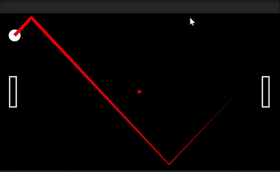

### What Went Wrong (and How I Fixed It)
During testing, the screen started to lag after just one hit, and I kept asking myself how I could solve this. Below are some notes on specific issues I faced and how I fixed them.

<p align="left">
  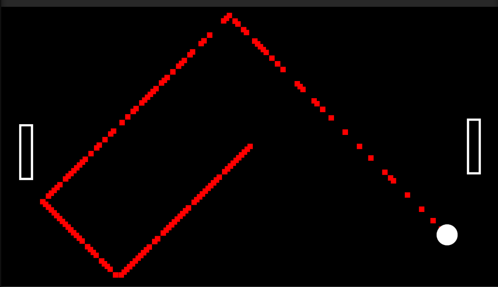
 </p>

To solve the lagging issue,  I removed the "ReadPixels" call, since reading from the RenderTexture every frame was slowing everything down.I also removed the feature that showed the color distribution all the time, and instead calculated the distribution only at the end of the game. That helped a lot!

Another major issue was that all colors turned red, even when I assigned different ones. After reading [Unity discussions](https://discussions.unity.com/t/rendertexture-format-missing-rgb/826685), I discovered that the RenderTexture color format was the problem. When I changed it to **A2B10G10R10**, it finally worked. 

 <p align="left">
  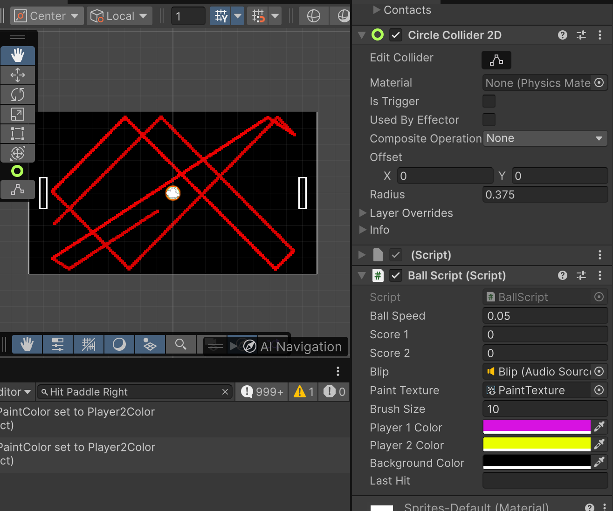
 </p>

When the timer ended, the game still kept running. The physics didn’t stop. That felt wrong, so I fixed it by stopping the ball and enlarging the result text. I added a result panel (panel, not canvas) with a semi-transparent background so the result feels clear. Also, with issue was that the Winner Player was hard to identify because both paddles looked the same, I fixed that by adding text with the corresponding player color and placing it in the panel as well.

 <p align="left">
  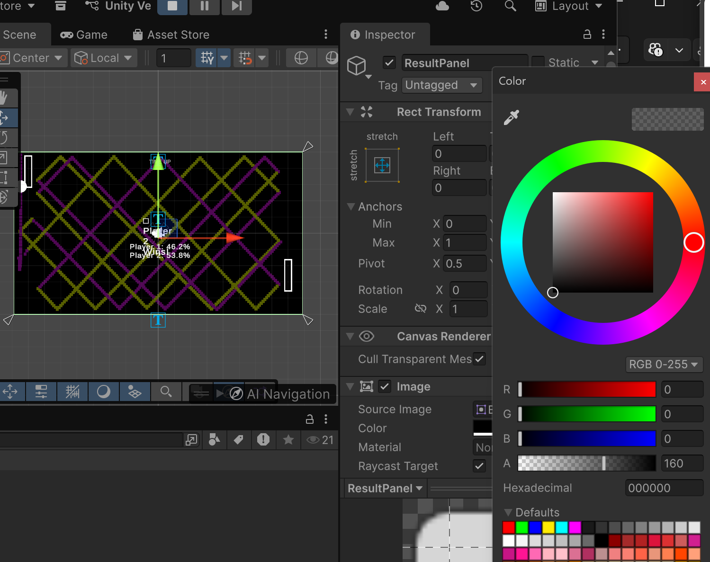
 </p>

#### Common Mistakes
Also , I marked some notes for basic and common mistakes that I faced this time:

- constantly check whether textures were assigned
- the canvas "must" be linked to the camera,
- Check whether objects were actually connected.
- When using "TMP_Text" instead of "Text", remember to add "using TMPro;", and creating empty objects when scripts don’t belong to a specific object.

Finally, the game worked!!! The ball painted the screen. The score showed correctly. The winner was displayed.

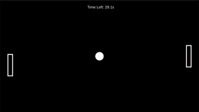

### Player Testing
Then , I asked friends to try the game, here are some notes I marked for their feedbacks:

- Game idea was good
- the paddle shape is fine, no need to change it to a circle or other shape
- multiplayer on one computer would be hard
- placing paddles at the top and bottom might improve the challenge.

There is still a bug where the ball gets stuck bouncing vertically near the wall until time runs out. This is something I would solve in the future. 
<p align="left">
 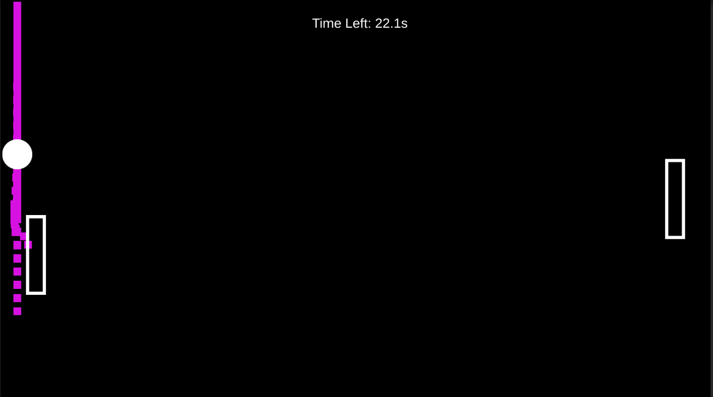
</p>

### Next Steps
For the future scope , I will fix the bug and test the features I questioned earlier and marked as additional features:

- place paddles on different position
- make paddle can move by 4 directions
- make the ball path curve
- add new ball for every 10 seconds
- change the paddle color to match the player color

Overall,  the ball path painting works, the scoring works. I feel pretty happy with this prototype!!!✌ 

## **Week4** (6.2.2026 to 12.2.2026) – Singleton GameManager & Laser Challenges

As same as last week, I finished the reading first and then tried to start my prototype. This week the focus is on singletons and spawning children objects with potentially different variables. I told myself to keep the scope small this time also , because last week I found that it is good to prototype a small scale game first . not only for beginner process , but also easy to edit and check the testing .

My starting structure was simple. I wanted:

- Children objects that can change (one or more of the following):
    - Object numbers (more / less)
    - Colour
    - Speed
    - Shape
    - Score / health effect
- A Singleton GameManager to:
    - Control game state
    - Control score
    - Handle GameOver

However, I got stuck at the idea stage again. I understood the technical requirement, but I didn’t know what kind of game mechanic would naturally use spawning and a singleton in a meaningful way.

So I started searching IO games for inspiration again. As through IO games’ repeated shapes, duplicated objects, minimal mechanics,  I hoped I could gain an idea while still following basic features that I could extend. While watching YouTube recommendations, a laser tag game advertisement appeared. That gave me direction. Around the same time, I was also looking at Apple Watch UI design, especially how circle sizes scale smoothly. That visual stayed in my head.

<p align="left">
 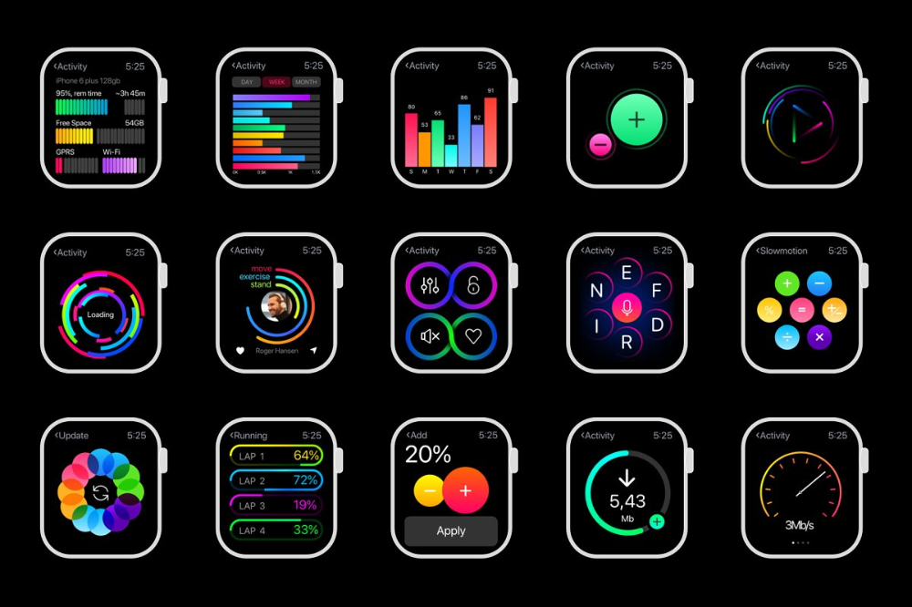
</p>

### Core Idea – Bouncing Ball + Scrolling Lasers

Combining those references with what we learned last week, I broke the idea down into something manageable: 

- a bouncing ball that the player controls, and scrolling laser tags that the ball must pass through.

The core rule I imagined was: hold the bouncing ball, do not miss it, and pass through all the laser tags.

At first, my rule prototype looked like this:

- The ball becomes larger each time it passes a laser.
- Hitting a laser reduces one level of the ball size.
- Different lasers could reduce different levels (for example green -1, red -2).
- Touching the bottom space 3 times means losing the game.
- Passing each laser adds 1 score.

To visualise this idea, I created sketches of the scene layout, different ball size levels, and variations of laser designs.
<p align="left">
 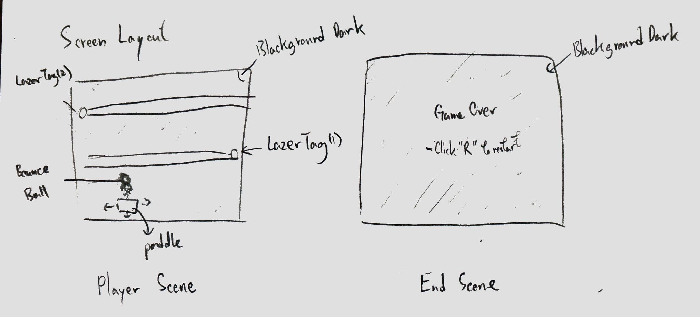
 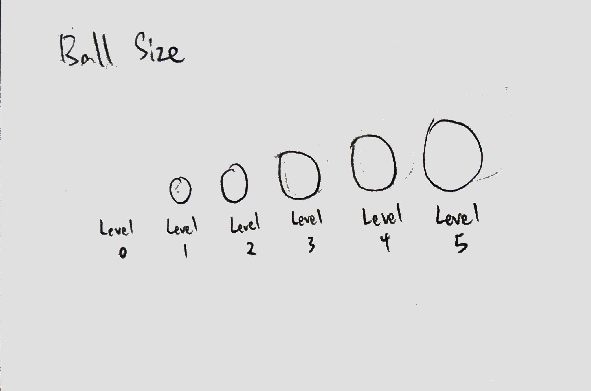
  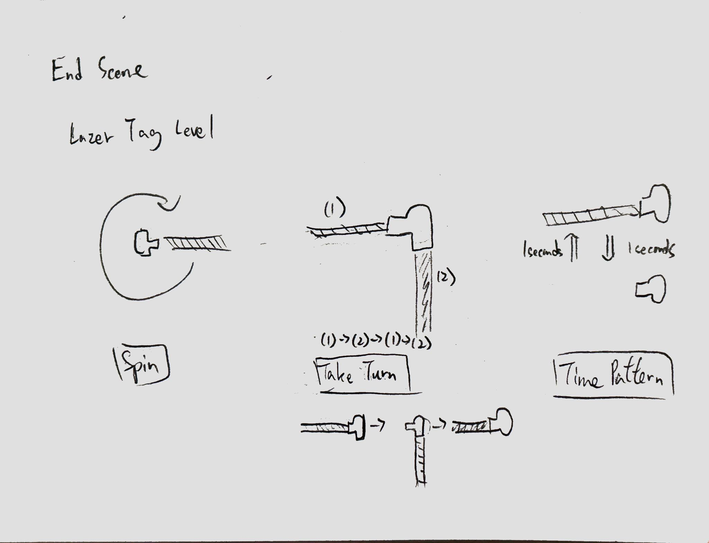
</p>

However, while thinking through the system, I realized a design issue. If the player keeps successfully passing lasers, the ball could become infinitely large. That would break the balance and also look strange visually.

So I redesigned the system into five fixed levels of ball size. The ball can grow until Level 5, and then it remains at that size. Losing conditions become either:

- Dropping the ball 3 times, or
- Reducing the ball level to 0.

I also adjusted the starting size. I changed Level 1 to 0.7 scale instead of 0.9 so the growth would feel more noticeable. The scaling became:

- Level 1 = 0.7x
- Level 2 = 1.0x
- Level 3 = 1.15x
- Level 4 = 1.3x
- Level 5 = 1.45x

Interestingly, this size system created tension naturally. Through my own and my friends testing a bigger ball feels stronger and rewarding, but it also becomes harder to dodge lasers. That risk–reward effect was not originally planned. It emerged from testing.

During the gameplay flow prototype, I found another issue. If the ball starts at Level 1 and immediately hits a laser, then according to the rule the game ends instantly. That feels unfair. So I adjusted it so the ball starts at Level 2. When it hits a laser, it reduces one level. If it misses the paddle and drops, it restarts at the same position, level does not change, but drop count increases. If drop count equals 3, then GameOver.

After refining these rules, I updated the prototype game flow diagram to reflect the revised system.
<p align="left">
 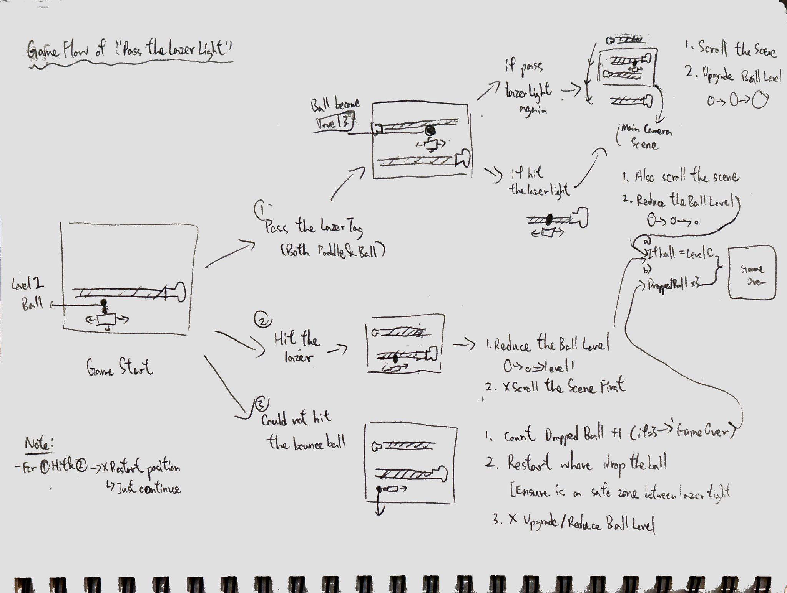
</p>


Since last week, I’ve found that creating a video prototype is very useful for expressing my ideas and guiding me in implementing the scene and code in Unity. For this week’s idea, I created a similar video prototype, but I used an app to assist with the stop-motion video. As in last week, my hand blocked some of the object movements, so this time I wanted to avoid that issue.

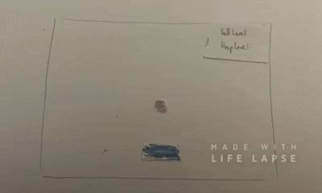

The video prototype is not mentioned the whole game rule flow , but hightlight: 

- Ball size reduction when hitting laser
- Ball falling from paddle
- Ball bouncing
- Scrolling laser collider repeating
- Text UI showing ball level and drop count
- GameOver scene appearing

In my implementation testing, I will not only include the features mentioned above, but I will also experiment with additional features. For example, I would like to count the number of times the ball is dropped and the number of times it hits the laser light, along with sound implementation.

#### Mid Prototype - What I Was Testing

So overall , this prototype I wish to mainly tested:

1. Can I implement a vertical scrolling laser system?
2. Can I change ball size dynamically using an array?
3. Can I use Singleton properly for:
    - Score
    - Drop counting
    - Scene switching
    - Sound control
4. Can the player handle paddle + bouncing ball ?

#### Issue and Adjustments

During the implementation, I found that there were better ways to present the game and debug certain logic issues. As a result, I revised and refined several parts of my original game rule design.

- First , I simplified collision logic. Originally I wanted both the paddle and the ball hitting the laser to count. But during testing, it became messy and harder to trigger properly. So I reduced it to only count when the ball hits the laser. This made the system smoother and easier to debug.
    
    Also during testing, the scrolling setup made it hard to increase the level and verify whether the ball and paddle successfully passed through the LaserCollider. Because in the code implementation the Scroller Scene repeats LaserColliders, collision checks became tricky. To make the process easier , I temporarily removed the “add points” function and started the ball at Level 5, so it could only reduce in size.
    
- Second, for the scrolling gameplay, I chose the laser-moving-down approach. The player stays mostly in the lower part of the screen, and laser containers spawn above and scroll downward. When they reach the bottom, I originally destroyed them, but I noted that destroying objects repeatedly is heavy. It might be better to recycle them later.
    
    Therefore, I created a LaserContainer prefab with a ScrollingLaser script, and a LaserSpawner object to instantiate them. This connects directly to spawning children objects from what we learned in class. Each laser container behaves independently ,  they have their own position and different way to give laser light.

  While implementing the laser performance, I followed a [YouTube tutorial](https://www.youtube.com/watch?v=vdci2oxVaoA&t=156s) as a technical reference. However, I adjusted the structure and parameters to integrate it into my own spawning and collision system.
    
- Also , I initially believed that giving each LaserContainer a random X position would increase the difficulty level and improve visual variety, preventing the scene from feeling repetitive. I implemented: float randomX = Random.Range(minX, maxX);
    
    However, during testing, I found that my minX and maxX values were too large (-7f to 7f), which made the layout feel messy and inconsistent. The scene lacked intentional design.
  
    
    I first attempted to reduce the range, but the result still felt visually chaotic. So finally, I removed the randomness and used fixed starting positions instead. This made the overall composition much cleaner and more balanced.
    
    - Note: Sometimes less randomness can create a stronger visual rhythm and better game clarity.
    
- Lastly , A major bug occurred when I attempted to reduce the ball’s level after it hit the laser. The ball suddenly froze and stopped moving, and Unity displayed the following error: IndexOutOfRangeException: Index was outside the bounds of the array.
    
    The issue was that my currentLevel variable did not properly match the size of my levelSizes array. Since Unity arrays are 0-indexed, I failed to correctly account for level 0. When currentLevel became 0 or exceeded the array size, the program crashed.
    
    To fix this, I:
    - Expanded the array to include enough elements
    - Added proper boundary checks before accessing the array
    
    After these adjustments, the system worked correctly.
    
    - Note: Game rules and data structures must align exactly.
    
    If the system logic defines 5 levels (0–5), then the data structure must safely support all 6 indices. Consistency between logic and data is essential for stability.
    

### Common Issues and Technical Reminders

During this prototype development, I also encountered several technical issues. I noted them down as reminders for future projects:

- When using SceneManager.LoadScene(), remember in the script add “using UnityEngine.SceneManagement;”” [Common Mistake]
- When using GetComponent<AudioSource>(), ensure that the GameObject actually has an AudioSource component attached. Cannot drag an AudioClip directly into the script unless the AudioSource exists on the object , since they are AudioResource , not AudioSource.
 <p align="left">
 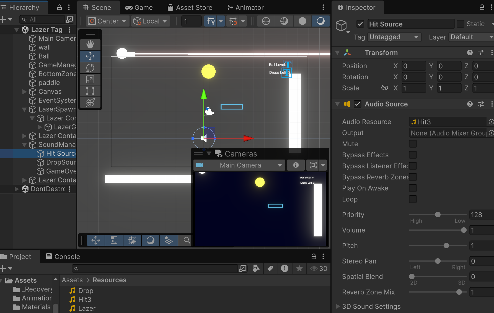
</p>

- When the background appears incorrect, check the camera’s Background Type. Change it from “Skybox”(Default) to “Solid Colour” if want a self-defined background.
 <p align="left">
 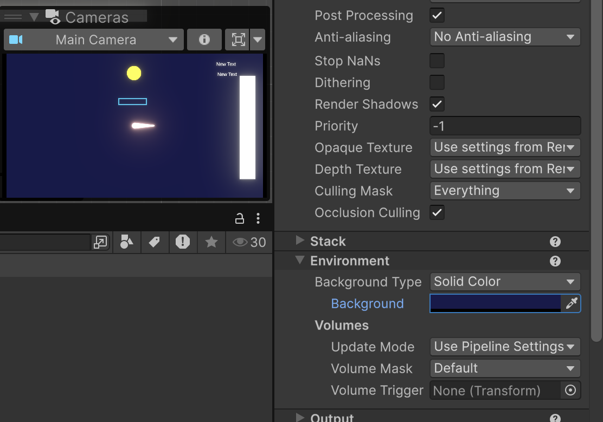
</p>

### What Was Successful

The core loop works clearly.Yeahhhhhh!!!!!! The scrolling laser system functions properly, and the ball scaling system responds correctly to collisions. The GameManager successfully controls score, drop count, and GameOver transitions.

I also found some additional successes:

- I implemented GameOver scene that the player can restart by pressing “R”, returning to the Laser Tag scene. This makes the game flow more user-friendly and reflects what I learned in previous classes.
- Simplified collision logic (counting only the ball hitting lasers) improved system stability.

The most interesting success was the unexpected emergence of tension. The bigger ball mechanic naturally created risk–reward dynamics. 


### Next Steps

I shared the prototype with my friends and got some suggestions:

- They recommended adding more variation in laser timing. Currently, many lasers flash with the same pattern. In the future, I could offset their timers so some have a 2-second break and some a 1-second break to create more unpredictable flashing intervals

I also noticed issues with sound effects. I already added sound sources for ball hit, ball drop, and GameOver. However, the GameOver sound was cut off because the scene loaded too quickly. I removed the GameOver sound effect to make the transition smoother, but fixing this will be part of the future scope.

For future testing and development, I want to continue exploring:

- Adding different laser difficulty patterns (which I already designed in my paper prototype, but did not implement in this test)
- Improving sound and visual feedback
- Allowing different lasers to reduce the ball by different levels (currently, there is only one LaserObject with one material, so in future implementation could include more variety and difficulty)

Overall , I feel like I made good progress this week. The game stayed simple, but how to make the prototype feels much clearer.😃

## **Week5** (13.2.2026 to 19.2.2026) – Expanding the Laser Tag System

When I looked at the guideline for Prototype 4, I did not immediately think about building something completely new. Instead, I went back to what I wrote in last week’s “next steps.” I already had unfinished ideas:

- Adding different laser difficulty patterns (based on my paper prototype)
- Improving sound and visual feedback
- Allowing different lasers to reduce the ball by different levels (e.g., -2 level laser)
- Fixing the GameOver sound

At first, I thought this week would simply be refinement. But once I started thinking deeper, many new ideas appeared. I considered turning the game into 3D, improving the visual outlook of the laser shooter and ball, adding shooting features instead of just holding the bounce ball, changing scroll direction from up–down to right–left, adding holes, extra point materials, freeze animations, even boss fights.

The problem was not lack of ideas ,  it was too many ideas. I felt unsure whether I should deepen the current mechanic or completely transform it.

### Influence by Pattern, Telegraph, Memory

I remembered the video I watched for the upcoming class: [How Cuphead’s Bosses (Try to) Kill You](https://www.youtube.com/watch?v=F8T6Ul4aHTI) by Game Maker's Toolkit. That video changed the way I looked at difficulty design. 

Here are my notes:

- Tricky attack variation, non-straight movement, changes in speed and size, and especially telegraphing.
- Key idea: players learn through memory, reaction, and skill. A good challenge is not purely random. It may feel overwhelming at first, but there is always a readable pattern behind it. The player might get hit the first time, but after observing, they understand the structure. They improve because they remember.

When I compared this concept to my bouncing ball and laser system, I realized something important. My game already requires the player to think about multiple elements at once , paddle control, bounce physics, and scrolling obstacles. However, the difficulty progression was not strong enough. It needed clearer pattern learning and more structured unpredictability.

Around the same time, I noticed a newly released Steam game called [Log Riders](https://store.steampowered.com/app/4082750/Log_Riders/). Although the mechanics are different, the way it forces directional movement and creates pressure through motion inspired me. I started imagining how similar “forced movement” ideas could be translated into rotating lasers and obstacle patterns in 2D form. 

Notes inspired by the Log Riders game:
- Vertical pressure mechanics (Blocks move up and down)
- Rotating circular laser systems:
    - Center positioned at the top (appearing as a half-circle sweep)
    - Center positioned in the middle (forming a full circular rotation)
- One-sided force movement (pushing the player toward one direction)

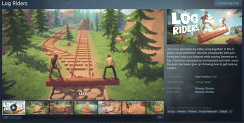


### Clarifying This Week’s Direction

Instead of completely changing the game genre, I decided to keep the core identity of my previous prototype:

- The laser obstacle concept
- A paddle that can move in four directions
- A bouncing ball controlled through paddle interaction

Rather than redesigning everything, I focused on implementing different “tasks” or obstacle variations inside this structure. I also read about [Level Design Patterns in 2D Games](https://www.gamedeveloper.com/design/level-design-patterns-in-2d-games#branching) and became interested in the idea of guidance and safe zones. That concept felt suitable for my game, because the bouncing mechanic already creates tension. If I could give the player brief safe moments, the rhythm would feel more intentional instead of constantly chaotic.

### Design thinking before implementation

After clarifying the core bouncing ball with laser survival structure, I began listing different gameplay tasks that could appear in the game. 

For the laser tag variations, I explored multiple movement and pattern possibilities:

- **Swing Clock (Half-circle spin)**
    
    This creates a predictable arc motion. The player can observe the pattern and learn the timing.
    
- **Full circle spin (with block at the laser end)**
  
    Rotating laser variations (1-side / 2-side / 3-side / 4-side)
  
- **Multiple lasers placed close together**
    
    This forms a “large laser wall” effect. Instead of just timing jumps, the player is forced to reposition strategically.
    
- **Laser moving down with screen scroll, then unexpectedly moving up**
    
    An element of surprise while still keeping pattern logic. It tests adaptability instead of only reaction speed.
    
- **Pattern-based laser formation (e.g., square lighting up 1 → 2 → 3 → 4)**
    
    Rather than chaotic movement, this creates rhythm. The player can memorize the sequence, making the challenge feel fair.
    

Beyond lasers, I explored additional features that expand interaction without changing the survival identity of the game:

- **Hole system**
    
    If the ball falls into a hole, it loses one life, similar to missing a platform. I extended this idea by linking it to ball levels. For example, a Level 4 ball would not fall into a Level 1 hole. 
    
- **Blocking walls that force repositioning**
    
    Unlike lasers (which apply timing pressure), blocks apply positional pressure. This creates variation in gameplay tension.
    
- **Extra attacks (bullets, birds, flying objects)**
    
    These would function similarly to laser damage , so touching them will cause reducing points or life. (However, I had to consider visual overload, as too many moving objects could make the screen chaotic. Hence , this would be put future for future testing). 
    
- **Safe Zone areas**
    
    Inspired directly by the article, I imagined a long protected block area where, if the player chooses correctly, they can briefly rest from danger.

Here are the task ideas I came up with, along with a video paper prototype of them:

 <p align="left">
 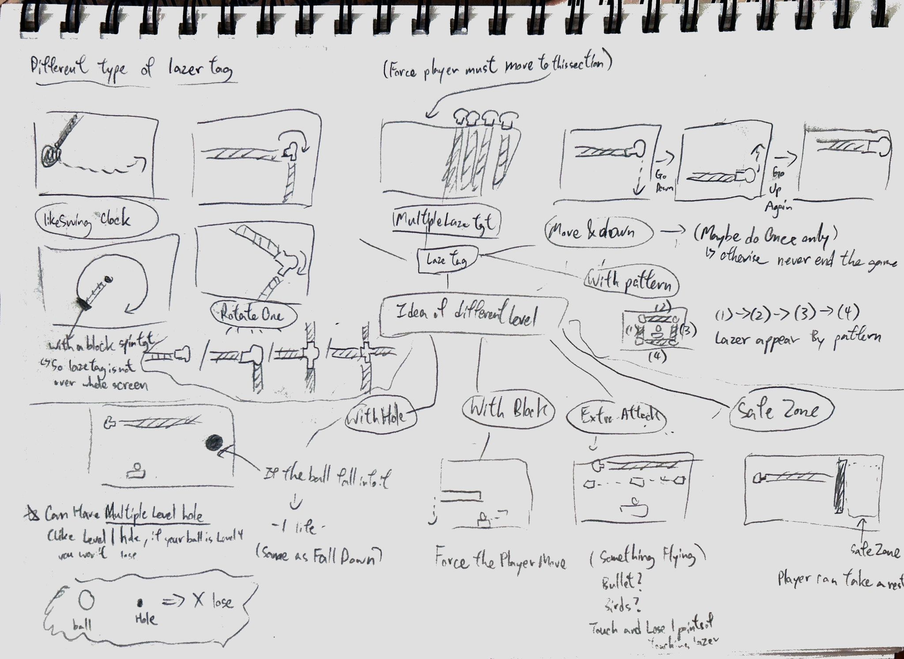
</p>


When I mapped out these level designs, I realized that implementing a big boss would be difficult. My game currently has no attack mechanic, which the player only survives. Adding a boss would require redesigning the entire interaction system. Instead of forcing that idea, I explored alternatives:

- Adding a timer system, similar to my Week 3 game (Exploring Mechanics Through Pawng), where survival until countdown reaches zero indicates success.
- Displaying a completion message like “You Survived” or “Great Job” triggered by scrolling progression.

These solutions maintain the survival identity without introducing combat.

During implementation, I also discovered that the screen scrolling system is technically challenging. It is not always consistent, and object synchronization can break if scripts are not carefully managed. This limitation forced me to evaluate which ideas were realistic rather than idealistic.

To support the visual direction (as wrote in my previous week future scope), I designed pixel art elements using [Pixilart](https://www.pixilart.com/draw), including:

- Laser container
- Laser hit effect
- Blocks

For the ball, flying elements, and hearts, I used existing templates from asset libraries and slightly modified them to maintain visual consistency. 

Here are my rough drawing and the pixel arts:
 <p align="left">
 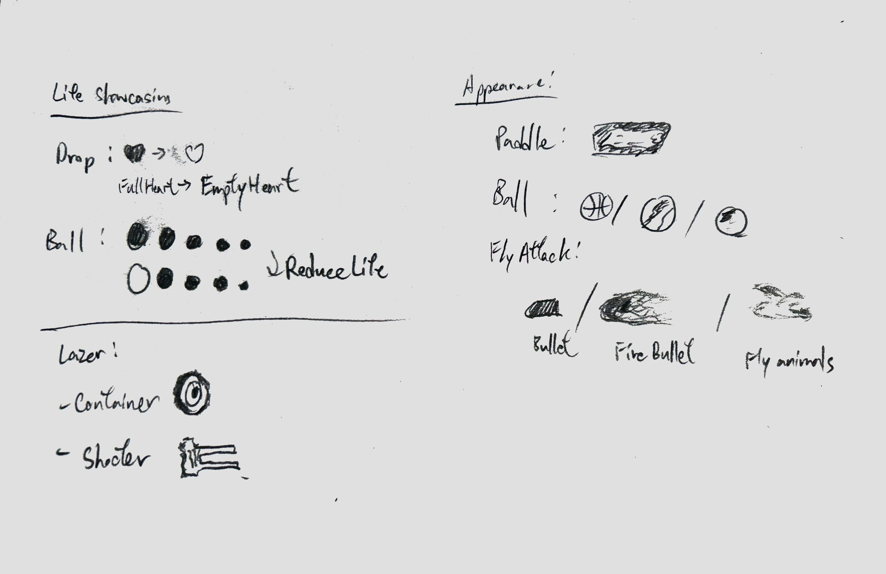
   
</p>

### What Was Successful

This week, several systems worked successfully, and I am genuinely happy about them.

#### 1. Rotating Laser System

I created a RotatingLaser script attached to my Laser Container prefab. With some AI assistance, I reorganized the script so that rotation behavior could be controlled more clearly through Unity’s Inspector. Now I can switch between:

- Continuous rotation (full circle)
- PingPong rotation (swing between minimum and maximum angles)

This improvement made level design much easier. Instead of rewriting logic each time, I can now adjust rotation speed and angle directly in the UI. It feels more like designing rather than coding every variation manually.

#### 2. Hole Level Detection

I added a HoleLevelGate script. Each hole can detect ball level. For example:

- If hole is Level 3
    - Level 2 ball → lose life
    - Level 4 ball → no effect

This connects nicely to the ball size system from last week. It makes ball level more meaningful beyond just size.

#### 3. Safe Zone

I implemented Safe Zone using a trigger block connected to the scrolling system. If the player moves correctly, they can stay briefly in safety. 

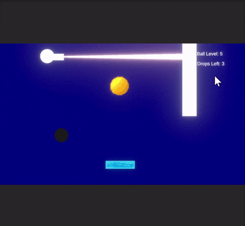

#### 4. Heart Life System

Instead of showing life as numbers, I switched to heart icons using Canvas UI. I created an array of images that switch between full and empty heart sprites depending on current life.

This small UI change makes the game feel much more complete. I was honestly very excited when it worked.

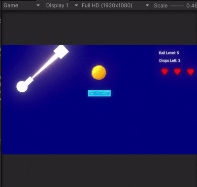

#### 5. Game Ending

The game is no longer an infinite loop. It now has an ending condition. This changes the structure completely. Instead of “how long can you survive,” it becomes “can you survive until the end?”

### Design Struggles 

This week was much harder than last week, mainly because I was building on top of an existing prototype. Every new feature interacts with old logic.

#### 1. Forcing Horizontal Movement

I wanted to design obstacles like multiple lasers or safe zones that force the player to move left or right. However, the bounce mechanic limits direct control.The player cannot freely move the ball horizontally, only influence it during paddle contact.

I tried several approaches:

- Removing fall detection
- Letting the ball follow paddle horizontally
- Adding paddle influence script

But none of them felt correct. Either the bounce feeling disappeared, or the control became visually awkward.

As my bounce identity limits certain obstacle types. If I want strong directional forcing, I may need to rethink the control system instead of forcing it through patches. Right now, this remains an unresolved issue. It is not just a coding problem, it is a design logic problem.

#### 2. Rotating Blocks with Laser

Another struggle was rotating blocks together with the laser. At first, I wrote an additional script to make blocks rotate with the same speed and angle. But they rotated around their own centers instead of around the laser pivot.

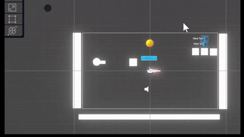

After searching online and finding a [tutorial](https://www.youtube.com/watch?v=x7BWNooNAGM&t=62s), I fixed the issue by debugging and properly adjusting the Transform hierarchy. The block now rotates correctly as a child object with the proper pivot behavior.

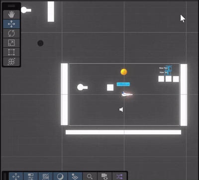

This debugging took a long time, but it was a valuable learning experience.

#### 3. Pattern Laser Conflict

The square pattern laser (1→2→3→4 lighting sequence) conflicted with my original timer-based flashing system inside the Laser Container. Since the container already controlled timing, adding another pattern layer caused logical interference.

While I attempted to debug the issue, I realized that simply adding more code was not enough. The system likely requires refactoring at a foundational level, which I plan to address in the future.

### Notes of Unity Control / Script (Important Reminders)

I also to document these main notes during implementation for future reference:

- To resize image properly:
    - Go to image settings → edit Max Size & Pixels Per Unit
    - Pixel Per Unit 10 → bigger
    - Pixel Per Unit 500 → smaller
    <p align="left">
     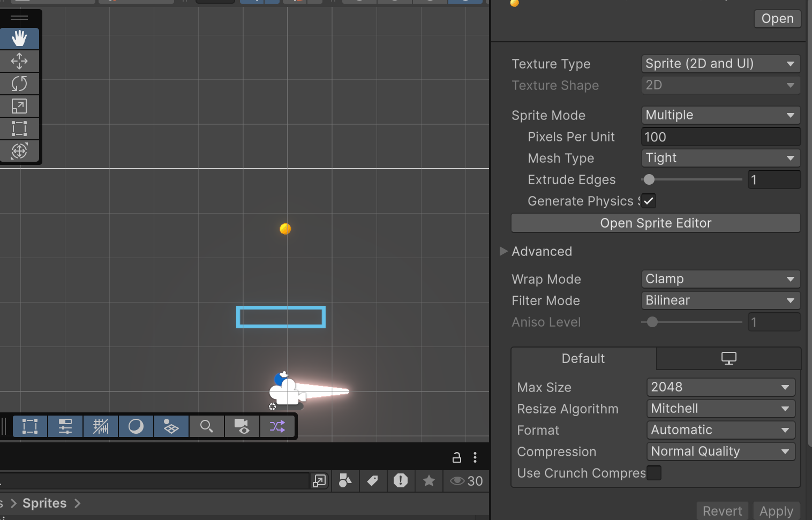
    </p>

- Always attach scrolling script to objects that need to move.
    
    Otherwise, they remain static on screen (this happened to my hole object).

### Future Plan

Due to the time spent debugging, I was not able to implement several features that I had originally planned. I also did not gather peer feedback this week, as most of my time was dedicated to redesigning and fixing internal logic.

In the future, I plan to:

- Test the most effective way to move the ball left and right while preserving its bounce identity
- Properly implement multiple lasers that force player movement
- Refactor the laser pattern logic to avoid timer conflicts
- Implement additional attack elements (e.g., bullets or flying objects), if feasible
- Add a freeze-motion feature
- Experiment with lasers that move downward and then return upward
- Combine all difficulty variations into one final structured scrolling level

The final goal is to integrate all difficulty mechanics into a scrolling scene and link with all already made pixel art components.

I also plan to ask friends to playtest the game and provide feedback on their experience.

### Final Reflection

This week’s exploration is much harder than the previous one. Building on top of another prototype requires more awareness of system interaction. Many bugs were not just coding errors but logic design problems.

I realize now that maybe each new feature should be tested as a smaller isolated prototype first, before merging into the main system.

Even though I felt overwhelmed at times, I am still happy with the progress. The rotating difficulty patterns work. The hole system works. The safe zone works. The heart UI works. The game now has an ending.

Most importantly, the system is slowly moving toward the pattern-learning idea inspired by Game Maker's Toolki , memory, reaction, and skill. Which’s Gooddd!

After taking a short break, I believe I can return with clearer thinking and better balance between player control and difficulty progression. Even though this week was much harder, it also felt like a more serious step forward in understanding system design.


## **Week6** (20.2.2026 to 26.2.2026) – Iterative Prototyping 1 (Family Photo Game)

When I thinking of the ideas, I took a look to my notes that I wrote from last lecture, the speed dating of the ideaization. I found that I really like 2 of them, while I want to enhanced them and maybe well organized those small point as better game design for 1 game idea only. Overall, the design core idea is I want to turn my daily struggles and normal life experience into game systems, and create tension by time pressure and chaos, but still with structure. I want the game feel relatable, but also playful and competitive.


### Idea 1 – Day/Night Cycle, Invisible Marker

The first one, Day/Night Cycle, idea come from “Maker & Area”.

Core Elements
- Day/Night cycle
- Invisible marker at night
- Idea can be in 10 mins games, day and night time take turns (2.5mins day and 0.5mins night)
- Idea: Spy game, spy only see at night or team identification could see at night
- Money / weight (who got the heaviest at the end)
- Zone can be claimed (could be 2or even 10 zones)

The idea come from the UV marker, only appear in UV light, so ppl need to turn the room dark and see use the UV light. The idea also come from a movie scene, that the last victim die and stamp a UV only stamp to murderer during the train is running. After the train arrived to the platform, the police got the tips and check ppl body to found who has the stamp mark. Hence, I want to know how I made a game feel like the spy game while found by UV lights.

#### Main Game Concept

Having 2 team, team “red” & team “blue”. During the day time they are all white team. The time of each round will change the background scene to be day / dark mode, and the dark mode will be shorter period time as the day one.

The whole idea is there is a game zone like maze. The maze idea was come from Physical 100[Netflix show] season2 [Things get a-MAZE-ingly physical game](https://www.youtube.com/watch?v=TnLKz1smewc). Two end of the maze will be the main zone as the 2 team. After the start announce, player can grab the items that found in the maze or from other team zone. There are some protect equipment that player can grab, tool features could enhance the player speed.

If the player is moving the heavier item, their moving speed will become slower, as to create a real world sense. Also more ppl to move a heavier object, faster the speed. There could have tool features, like use less timer to move a big object, the object x2 for the weight count, and the map showing the shortest way from where you grab the object to your team zone. Player should not know the teammate until the game mode is in dark zone.

### Idea 2 – The Family Photo

Idea come from keywords "Unpredictable, family , stop-motion" and also normal life. Usually when we have family photo, we hurry up to be in the photo. During taking photo, there are always someone be covered, someone missed, someone just go to washroom. More, maybe ppl are not yet ready for the photo, someone close the eye, someone not look at the camera, someone messy in hair, etc. I want to make that chaos feeling into a game.

#### Main Game Concept

In the middle of the screen have a camera. Players can walking around the section freely, but cannot go into the camera photo section before the countdown. When the screen show “3,2,1”, all players need to rush to the camera zone. They can run and jump to get the frontest spot, trying not to be covered by others, just like real life experience.

At the moment the countdown reach 0, the game capture a screenshot. The system then check whether the player is inside the photo zone and whether their body is clearly visible. 

In my idea , it will be multiplayer game, not just 4 players but can be more, however this still need to test. 

For advanced level, the game can require specific part of the body must show in the screen, like left hand, right arm angle, two eyes. This make the player not only rush, but also control their body position carefully. The reduced counting timer can be around 30 seconds, while there are many obstacles between spawn area and photo zone. Players need to pass through obstacles and still reach the photo zone before countdown end.


### Idea 3 – Protect Computer Prevent

This idea come from my computer battery die. If it is not plugged in and someone move the plug, it will power off the computer and all the material that not save will lose. During class or home, I am asking everyone not touching my computer, don’t move my plug in, don’t be so excited and hit my desk. Therefore, I think it can be a game idea. As what I did is having issue, I am protecting the computer, so how about turn this idea to be a protect game.

#### Main Game Concept

Player protect the computer charger that no other object can disturb the link between it and the computer. The computer is placed in the center as the main object to defend.

Many small NPC appear and walk around the laptop randomly. If they touch the wire several times, the connection will weaken. After enough disturbance, the computer screen will turn off, which means game over. Depend on the level of the NPC, some may use around 5 seconds to break the link of the battery, higher level NPC break faster and are harder to stop.

The player role is like a guardian. The player need to remove the NPC, block them, or push them away from the wire. The challenge increase when more NPC appear or when stronger NPC appear.

### After Choosing 1 of 3 – Family Photo

I think to do a prototype of the family one, looks fun and not such hard to implement for test (hope so….).

After choosing this idea, I did some research. I search in the internet and found that some related concept games. I find [Take Photo on CrazyGames](https://www.crazygames.com/game/take-photo), that required the player to take a camera photo to accurate the guide photo showing. The game system is 3D and the player can move according to the landscape while wearing the camera. Then I though I maybe can use the camera capture idea with the photo match with the setted photo idea, to make the rules that I originally thought about, like using count whether the player head / hands are capture in the screen or not.

 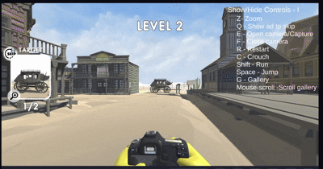

I also found [Totally Secure Airport on Steam](https://store.steampowered.com/app/4348760/Totally_Secure_Airport/). I found that its laser screen luggage idea maybe could benefit to my game setting, as the player scroll into the camera frame is two angle. So the player could have first-person scene, and after the “3,2,1” then show the camera side photo.

 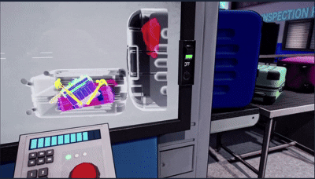

After I did the research, I use my draft to list out all the related features and idea by drawing. I also draw the possible scene flow of how the family photo game could be.

<p align="left">
     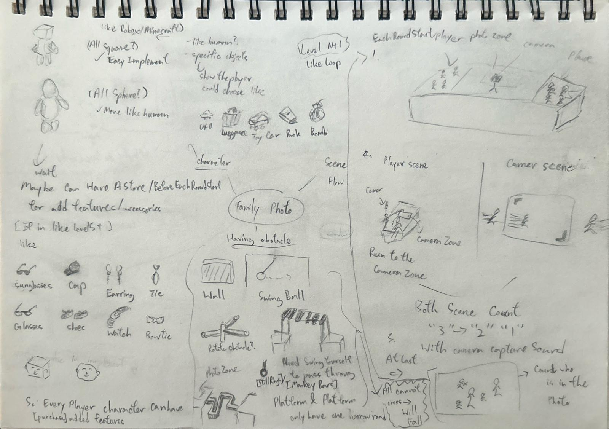
</p>

For the character, I think player could choose their prefer object (e.g. UFO, luggage, toy car) or build a human like player character but use simple shapes, like square / sphere. While I think that, I found that how about keep the human-look character design and having a store before each round start features, that player can add accessories on their character and add bonus point / match the photo requirement.

Also, while I think of different level or possible enhance possible, I think between the photo zone could have obstacle to block the road, like obstacle race game. The time could be now like count down 20, while player not only rush to the photo zone, but need to pass all the obstacle like wall, swing ball, rotate obstacle, need swing yourself to pass the platform (money bar / still rings), and one way narrow road between platform.

So after combine all the idea, I think that this game should be 3D version. 2D is ok, but the player scene and camera scene should have different. The player should be first person angle, as same as the camera first person angle too, also with a top view / bird’s eye view.So it is better to use 3D game to display.

I also suddenly think about the game I played during in my high school time [Stumble Guys](https://www.stumbleguys.com/), that its rule is massive multiplayer party knockout game with up to 32 players online. Each round it cut off half the player, 32→16→8→1, then the player need to rush to final area as soon as possible. The game rules seems like my obstacles idea and also the rush to the camera zone idea. So I think that will be a great direction.

 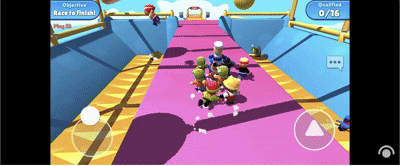


### Prototype Testing

For testing, I want to test whether I could create the player first-person scene with WASD movement and jump section. Also test the camera “3,2,1” capture and show the picture at the end.

For obstacles I may just implement basic features like wall and one narrow way road, but these are additional testing. The main point is test whether the main game idea could work in the whole world scene or not. Accessories are add on, so not testing this time.

During start the implement, I think of Week 2 I explore the 3D objects, that I could use those features as basic and continue build on top of it.So , the object will be the UFO objects that I used in Week2 , while for the future plan the object would change to the designed character.

Also, this time I also create a 3D video prototype about how I think about it would be in testing prototype.

 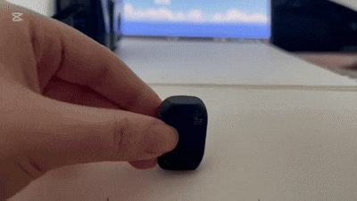

### What Success

The core loop works. A 10-second countdown starts (I changed from 5 seconds to 10 seconds for implementation testing). The player moves to the photo zone, and at 0 the game captures a photo, checks whether the player is inside the zone, freezes movement, and shows the result UI.

I added restart flow (press R) and world-space UI that follows the player. The screenshot system uses a dedicated result camera and shows the captured image together with result and restart text. I debugged camera visibility and trigger detection with logs.

Overall, the basic round system, screenshot capture, UI display, and game reset all work as I imagined.

 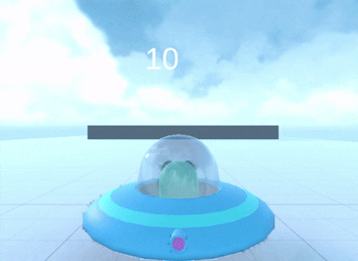

### Notes That I Facing This Time (Important Reminders)

I also document these notes during this implementation for future reference.

1. If have 2 camera, ensure the nonused Camera is disabled by default in the Inspector in Unity. Otherwise, the cameras will conflict and not show the correct result.
   
2. As I assign the text in the world for the countdown, it was not showing while the player was playing. After that I found that it is because it is not link to the player object. Hence, I add a Canvas with the Countdown text and make the Player object the parent of it.
    
    Even if the Render Mode is set to “Screen Space - Camera”, it is not work. When set to “World Space”, the text seems very far from the screen. After exploring a bit, I found that the issue is about the Canvas scale. After I set the Scale to 0.0005 and move the position of Z to 1.5, the result looks better. The text could show properly while the player is moving.

<p align="left">
     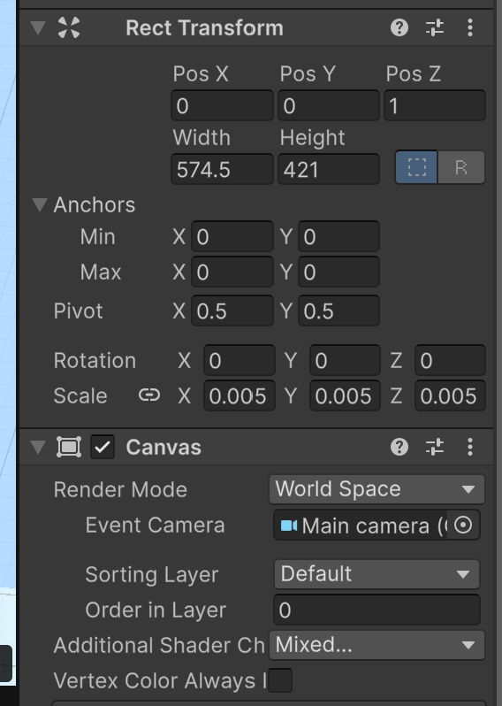
</p>
    
3. In the last scene UI, I couldn’t see the success or “press restart” text. Later I figure out that TextTMP need to be below the screenImage in the Hierarchy, then it can show on top of the image in the player scene. Remember : Lower position in the same Hierarchy will show on top of the upper features.

 <p align="left">
     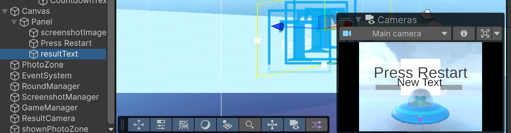
</p>

4. The logic and time flow always be messy. Hence, I set the end moment code flow clearly to ensure all the features work as what I expected in my mind:
    - Countdown ends
    - Player freezes
    - Screenshot captured
    - Player teleports to start
    - UI shows
    
    However, I still face the issue that when the player object is back to the original position, the screen capture camera could not take the object appear or not. Hence, I create a shorter and clearer flow to ensure everything work step by step from the countdown reach 0 to restart the game:
    
    - Countdown reaches 0 → player frozen
    - Result camera captures (end of frame)
    - After 1 second → player teleports back to start
    
    So as a remember, in 1 second many things will happen. It is better to set how the flow works first before implement.
    
### Future Plan

During implementation I think about is there are any 3D objects can paste in Unity, like assets from Blender. I search through internet and found [Unity ProBuilder tutorial](https://www.youtube.com/watch?v=4Am9E36-7HM&embeds_referring_euri=https%3A%2F%2Fwww.bing.com%2F&embeds_referring_origin=https%3A%2F%2Fwww.bing.com&source_ve_path=Mjg2NjY), that I could use 3D object with texture on it, also additional features like lights, splines or lightmaps. This time I don’t have enough time to try it, but I think it is a good tutorial to try later in my project. 

Also, since now I am using week2 UFO object as assistance for testing, it is better to create the character later and implement them for testing later.

The future plan will also include that ideas I made but not testing this time, like different level obstacles, adding more obstacles, and explore how can let the game could play by multiplayer. Seeking feedback from others will also be part of the future plan.

Overall, I think it is a good iterative prototyping. I come up the idea from my daily struggles, research similar games, do drawing prototype and core idea implementation for test. So , I quite happy of it!!! 😊

## Extra Credit: Design Journal - Game Analysis(Overcooked)
#### Why I Chose This Game:

For the game analysis, I choose Overcooked as it is the game that I mentioned in the first lecture. I think I know the game well because I play it during every family gathering or when my friends come to my home. At the same time, I think it is a very good multiplayer and family game. I usually play it on Nintendo Switch, so my analysis is based on playing with the Switch controller.

#### Background and Basic Information

After choosing the game , I did a reasearch of the game. Overcooked is a 2016 cooking simulation game developed by Ghost Town Games and published by Team17. It is a local cooperative experience where players control chefs in kitchens filled with obstacles and hazards to rapidly prepare meals according to specific orders under a time limit. The game was first released on PlayStation 4, Windows, and Xbox One in 2016, and later on Nintendo Switch in 2017. After that, Overcooked 2 was released in 2018. After the research, I played the game one more time and recorded some notes.

### What Makes the Game Interesting

#### 1. Everyday Chaos as a Core System

From my own experience, I think the game is interesting because it is related to daily life struggle. Recently, I heard the idiom “Too many cooks in the kitchen,” which means that too many people involved in a task can result in confusion and chaos. I think that is exactly how the idea of the game feels. In Overcooked, the designers created a scene that represents the struggle in the kitchen. They use the restaurant backend scenario to create pressure, limited space, and shared responsibility. Mechanically, the game forces multiplayer cooperation.

- Limited space
- Time pressure
- Shared resources
- Task dependency

Players cannot efficiently complete dishes alone. One person chops, another cooks, another plates, another washes dishes. Communication becomes part of the gameplay system. In this way, the chaos becomes the core experience.

#### 2. Easy to learn

Another important decision is how simple the controls are. The game is very easy to learn. On Switch, players mainly:

- Move
- Pick up / put down
- Chop
- Interact

<p align="left">
     
</p>

(Since the game card I brought is in chinese version , I used google translate to translate the text of the game screenshot)


For all the cooking methods, such as boiling, steaming, pan-frying, and deep-frying, the game limits the real-life complications of how they actually work. Instead of simulating temperature control and timing precision, the mechanic is simplified into: put the food in the pan or pot, wait until it finishes, then pick it up and place it on a plate. The game reduces cooking into a few clear, repeatable interactions.

By simplifying all the steps, the system assumes that everyone theoretically knows how cooking works at a basic level. Whether it is kids or elderly players, most people have at least a slight idea of what a cooking experience looks like. This shared real-world understanding lowers the learning barrier of the game.

Also, before each round, the system teaches how a dish is assembled and what ingredients require which methods. For example, in a hamburger order, the meat, tomato, and lettuce need to be chopped, and the chopped meat needs to be pan-fried. At the end, everything is combined into a finished burger: sesame seed bun + fried meat + tomato + lettuce.

<p align="left">
     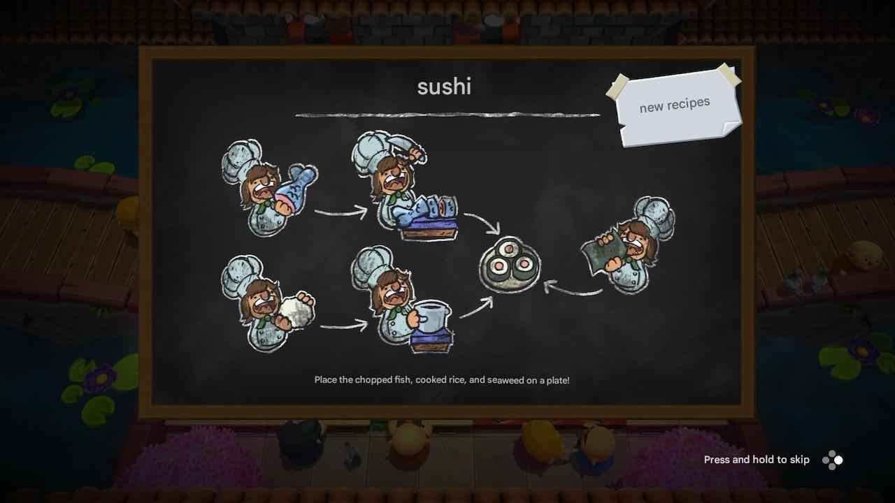
</p>

With this kind of guidance, players can understand the recipe almost like a simple math equation. The game removes real-life cooking complexity such as exact measurements, seasoning, or portion control. Players do not need to think about how many grams of meat or how many slices of tomato are required. The system reduces cooking into clear, visible steps.

If players forget how to prepare a dish, the visual pending orders at the top of the screen continue to guide them. The orders pile up, showing the required ingredients and their icons. This constantly reminds players what to focus on next and helps them plan ahead. The design ensures that players always know what they should be doing in the moment and what they need to prepare for upcoming orders.

<p align="left">
     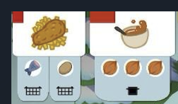
</p>

Because of this easy-to-learn structure, the game successfully reaches a wide range of players across different ages and gaming experiences. Beginners, kids, and elderly players can all participate. From my personal experience, I usually play with my family members, including my mum who does not normally play games, she still enjoys Overcooked. This shows that the simplified mechanical structure and clear guidance system effectively enlarge the target audience and make the game accessible without lowering its cooperative challenge.

#### 3.  Foreshadowing and Guidance Technique

Third, I found the foreshadowing and guidance technique in the game is very successful. Each world introduces new dishes and equipment step by step. Early levels teach simple recipes, like sashimi or sushi. These recipes usually require only one or two steps, which allow players to first understand the basic loop: pick up ingredient → prepare → plate → serve. There are fewer obstacles and more open space, so players can focus on understanding the system.

Later levels mix multiple recipes together, like baking a cake, that require 4-5 steps for 1 dish. This increases cognitive load because players must manage different preparation methods at the same time due to the limited time. They are no longer just repeating one action. They must prioritize tasks, divide roles, and communicate more clearly.

At the same time, the kitchen layout becomes more complex with moving platforms, separated islands, ice floors, and conveyor belts. 

<p align="left">
     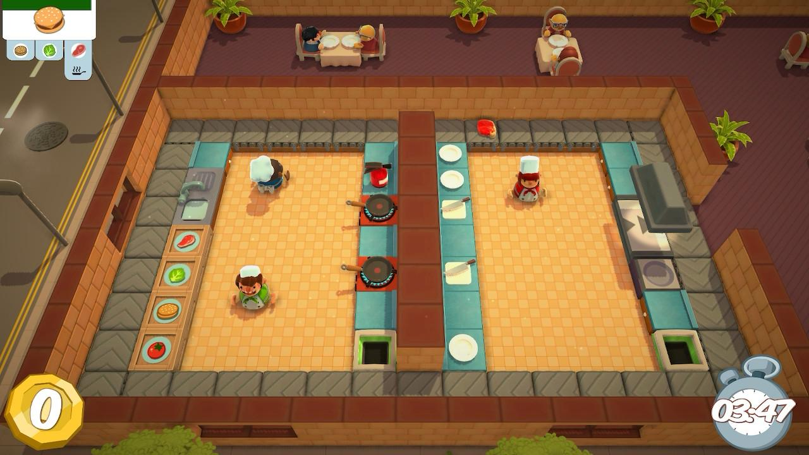
     
</p>
[Difficulties: from static wall (simple) to moving ingredient tracks (complicated)]

These spatial changes force players to rethink their workflow. They cannot rely on the same positioning strategy from earlier levels.

The difficulty increases in two directions:

- Recipe complexity
- Spatial disruption

Recipe complexity increases mental pressure, while spatial disruption increases physical coordination difficulty. By combining both, the game challenges both planning and execution.

By the final level of each world, all previous mechanics are combined. Players must manage multiple recipes while adapting to unstable environments. However, because the game introduced these mechanics gradually, so players do not feel completely overwhelmed. 

Instead of using long tutorials or heavy text instructions, the game teaches through repetition and escalation. Players fail, adjust, and improve naturally. This scaffolding design creates a strong sense of progression. Players feel that their improvement comes from experience, which makes the learning process more satisfying and engaging.

#### 4. Clear Goals and Visible Feedback

The game has a very clear mission structure. Before the level starts, it shows how many points (coins) are required to achieve 1, 2, or 3 stars. One star is enough to pass the level, but higher scores are needed to unlock later stages. For example, in higher levels such as 4-4, players need a total of 42 stars to unlock it. 

<p align="left">
     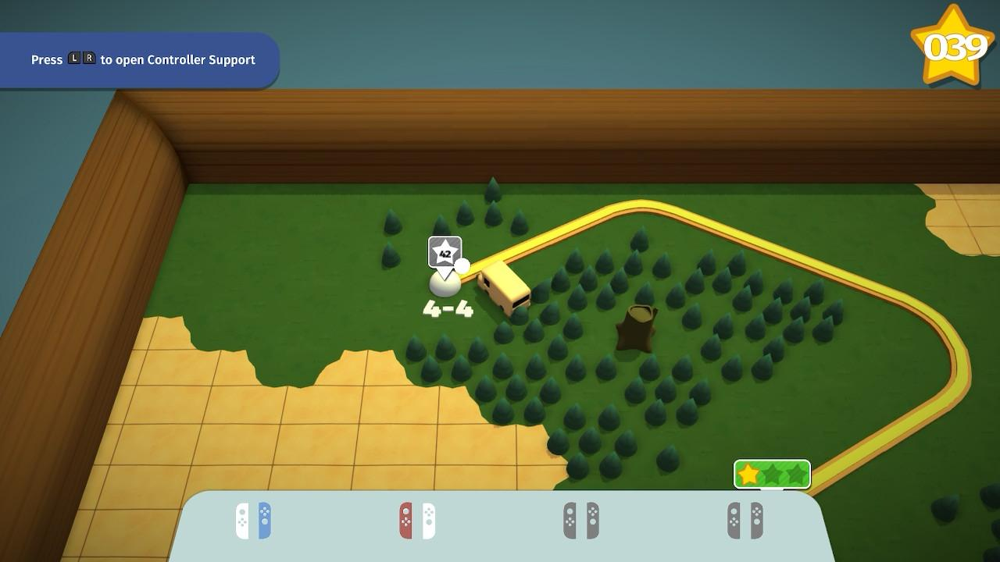
</p>

This system creates layered goals:

- 1 star → minimum success
- 2–3 stars → better performance

It first asks the player to simply pass the level. The requirement for 1 star is usually achievable, so players are not blocked too early. This lowers frustration and allows them to move forward in the game.

However, when players replay the level to aim for 2 or 3 stars, the experience changes. They are no longer just trying to survive , but they are trying to optimize workflow, divide roles more efficiently, reduce mistakes, and communicate better. In this way, the system encourages players to learn from their previous attempt, like the third point I said previously. 

<p align="left">
     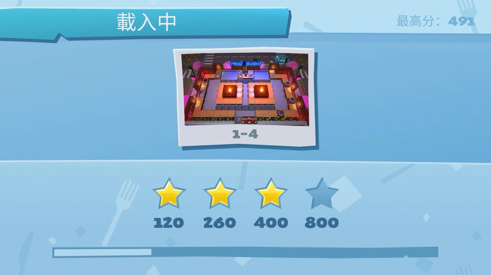
</p>

The game also provides strong visual feedback for time pressure. The timer of each order is represented by a progress bar instead of exact numbers. When the order is close to expiring, the bar turns red. This creates urgency without forcing players to calculate time precisely. Players can quickly glance at the color change and understand that the order needs immediate attention.

<p align="left">
     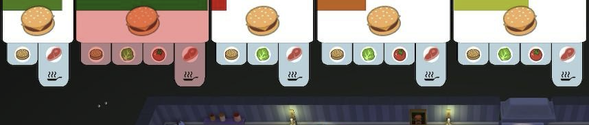
</p>

Another example of clear feedback is the cooking system itself. After players place ingredients into a pot or pan, the food cooks automatically. However, if players ignore the cooking station after the food is finished, the dish will begin to burn and eventually catch fire. When this happens, players must use a fire extinguisher to put out the flames before they can continue cooking.

<p align="left">
     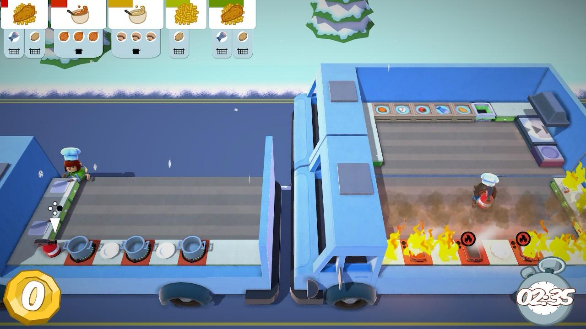
</p>

This mechanic adds another layer of pressure to the gameplay. Players must not only complete dishes quickly but also monitor cooking stations carefully. The game communicates this problem clearly through smoke, fire effects, and warning sounds, so players immediately recognize that something is going wrong. Because of this, players often need to divide responsibilities, with one person watching the cooking stations while others prepare ingredients or serve dishes.

#### 5. Environmental Storytelling and Obstacles

the game creates a detailed storyboard for every obstacle and each level. For example, when preparing dishes from different countries, the game designs matching backgrounds, music, and visual themes. This helps players feel the mood and atmosphere of the specific environment, making each level more engaging.

The kitchens also include unusual mechanical obstacles, such as wind, ice, flowing islands, moving cars, conveyor belts, and even cooking on a hot air balloon. These are impossible scenarios in real-life kitchens, but they are carefully designed to create fun and challenge in the game.

<p align="left">
     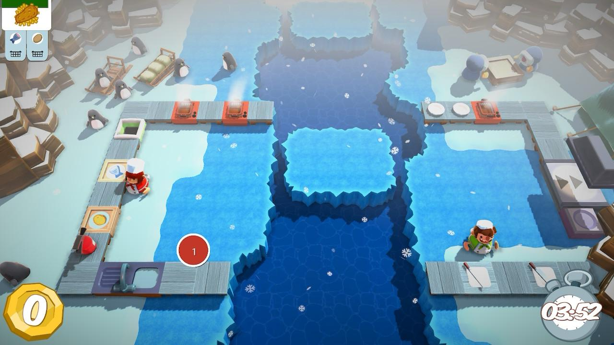
     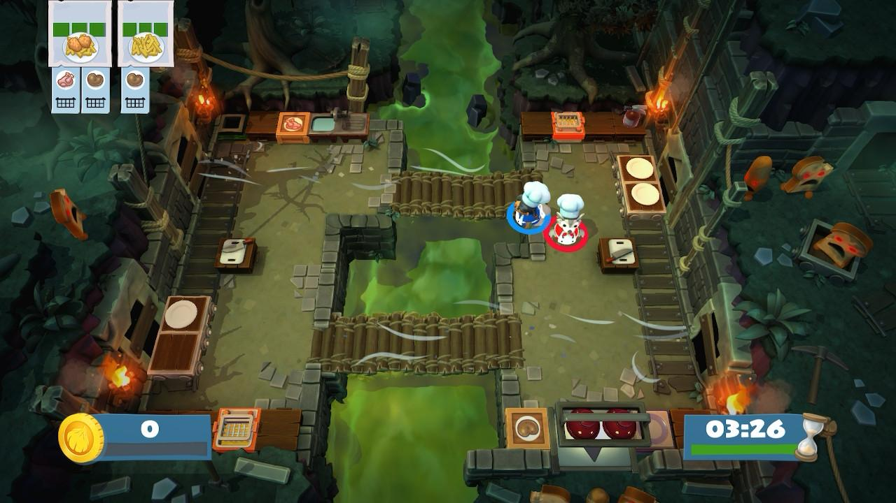
     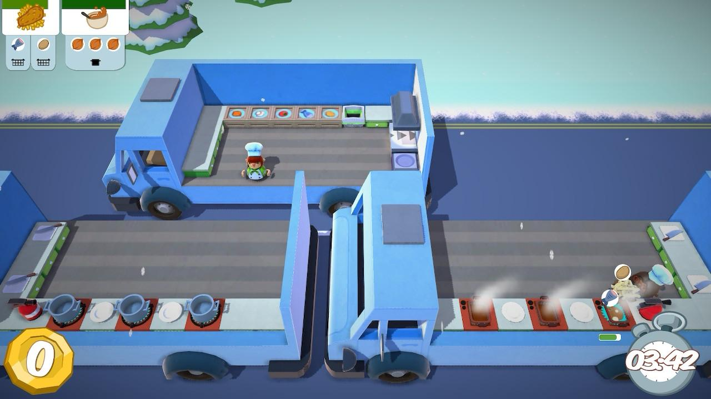
</p>

Rather than adding obstacles randomly, each one has a purpose. They force players to adapt their workflow, coordinate more carefully with teammates, and react to dynamic changes in the environment. This combination of storytelling, visual design, and mechanical challenge prevents the core loop from feeling too static and enhances both the aesthetic experience and the cooperative gameplay.

### Where have they failed? → Where have they changed?

To think about where Overcooked has failed is difficult, because as a fan, I think it is a very successful and complete game. Also, The [Steam](https://store.steampowered.com/app/448510/Overcooked/#app_reviews_hash) and [Best Buy Switch](https://www.bestbuy.com/site/reviews/overcooked-2-nintendo-switch/6261023) ratings also show very positive feedback from players.

However, from my personal experience, I noticed something interesting. I purchased a Switch card that included both Season 1 and Season 2 of Overcooked. Whenever my family or friends come over, we almost always choose to play Season 2. This made me curious about analysis what changed between the first and second game. Studying these changes may help understand how the developers addressed minor shortcomings or expanded the game.

<p align="left">
     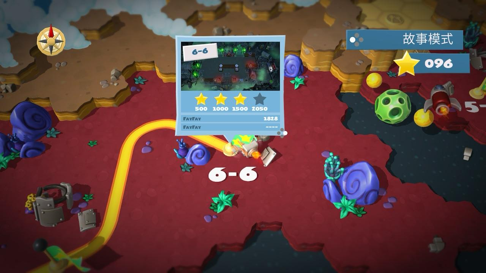
     
</p>
(On my account, I completed all the levels in Overcooked 2, but I’m stuck on level 4-4 in Overcooked 1)

#### 1. Adding Throw Features

One major change is the addition of the throw mechanic in Overcooked 2. Players can now throw ingredients to teammates. From my experience, this greatly improves efficiency and reduces the need to walk through obstacles. 

 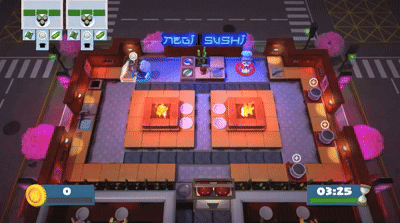
 
It also balances skill differences. In my family, my cousin and I are more familiar with the controls, while my mum and uncle are not. By throwing ingredients to them, we can reduce their difficulty and allow everyone to participate. 

This feature increases the skill ceiling for advanced players, because throwing ingredients accurately and timing them correctly requires coordination and planning. At the same time, it does not add mechanical complexity for beginners, since they can still play using the basic pick-up and drop controls. This makes the game more inclusive and enjoyable for a wider audience while still rewarding mastery and strategic play.

#### 2. UI Clarity and Player Feedback Improvements

The UI feedback in Overcooked 2 is also clearer. Timing bars are more visually distinct by using three sections in the progress bar instead of just one. The green, yellow, and red sections make it easier for players to see when a dish is almost due, without needing exact numbers. 

<p align="left">
     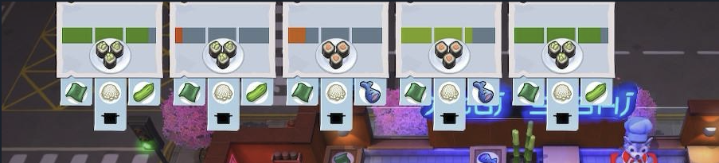
     
</p>
( Left: Overcooked2 version , Right: Overcooked1 version(previously shown in Part 4:Visible Feedback))

Before going into a level, it also shows a line bar about the system process. The game even uses something like a “spin wheel,” where transparent objects go from small to big or from big to small to show the scene transition. This way, the player knows what the system is doing instead of just waiting. It reminds me of the website design I learned for user design.

 

These changes make the game easier to follow and more understandable. Players can see the progress and timing better.

#### 3. Player Roles and Engagement

Switching positions allows players to choose their personal character, which also adds a small level of variety. From my personal experience, although Overcooked is beginner-friendly and focused on cooperation, there are not many controls for players to use. Because of this, the gameplay can feel repetitive after a while — only receive orders, grab ingredients, chop them, cook, combine, serve, and then loop again. It can start to feel tiring.

<p align="left">
     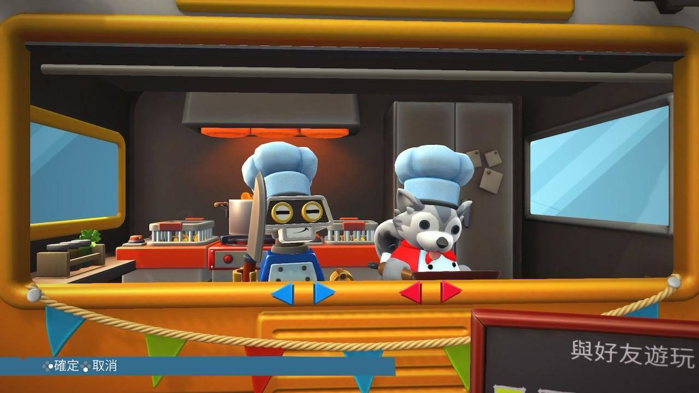
</p>

Having more character options could make the game feel fresher and give players more ways to engage with the mechanics. Personally, I would also like to see more cooking methods included in the future to create variety in the game. In the current game, there are about 10 methods, but if there were more and players were encouraged to learn and use them, it could make the gameplay more interesting and engaging.

### What I Would Borrow for Future Projects

One of the most important things I learned from Overcooked and would like to borrow for future projects is its idea generation process. Personally, I really like how the game concept comes from daily life experiences. I found a document [Game Design Deep Dive: Building truly cooperative play in Overcooked](https://www.gamedeveloper.com/design/game-design-deep-dive-building-truly-cooperative-play-in-i-overcooked-i-) that explained how the team came up with the idea . Originally, the team didn’t start with the concept of a kitchen or cooking—they just knew they wanted the game to be about cooperation. They noticed that many modern games allow players to work as a team, but the focus is often on individual skills rather than how well the team communicates and coordinates. One team member, who had worked in restaurants for years, mentioned that kitchens are a perfect analogy for cooperative play, since teamwork, time management, spatial awareness, and even shouting are all important. From this, I realized how valuable it is to grab personal experiences and explore different disciplines when designing a game. It can widen my perspective and inspire more creative ideas.

The team also approached development through design risks and prototyping, which reminds me of what we learned in class. They asked questions like:

- How do you encourage players to work together?
- How do you make that a fun experience?

Their prototypes focused on the basics: players would pick up an ingredient, take it to a chopping board, add it to a plate, and then serve it. This simple process highlighted how sharing the workload in a team reduces time and makes achieving goals easier than doing everything alone. Testing these basic mechanics first taught them what was essential and what could wait, which I think is an important lesson for any project. It reminded me that when working with a team, I should first focus on the core features, identify the biggest uncertainties, and test them before building everything at once. This approach helps prioritize the features and avoid unnecessary complexity, especially when considering the target audience and game context.

I also found their iterative approach with player feedback very insightful. In originally design , players were given three lives and would lose one for each failed order, and they had no indication of what was in a pot. While with their testing , this often caused frustration, so they adjusted it to make the game less punishing. From this, I learned to accept that ideas that sound good may fail, observe players instead of defending an idea, and adjust difficulty based on the players’ emotional responses. Balancing difficulty is about understanding the difference between unfair punishment and focused challenge, and testing is the only way to find that line. Watching how players behave and noticing when frustration turns into anger or when challenge becomes fun tension is key.

Here are the notes that I markdown after reading their game prototype documentation about how to balance difficulty and player feelings:

- Watch how players behave.
- Notice when frustration becomes anger.
- Notice when challenge becomes fun tension.
- Understand the difference between confusion/unfair punishment and focused pressure/chaos.

Also, testing is the only reliable way to find this balance.

Another lesson comes from their use of a central design pillar. One sentence from the document really stuck with me: “Having a central pillar to always look to was extremely useful on the project, it was a filter through which we could run any new idea and against which we could measure any feature.” I think this is a very smart way to start a design project. Having a core idea helps guide every decision and ensures that features, mechanics, and risks are aligned with the central goal of the game. For future projects, I would write down the design risks first, prototype to test them, and always measure new ideas against the main concept instead of trying to implement everything at once.

Finally, I really admire how Overcooked teaches players through play rather than long tutorials. The game provides clear but minimal instructions and boundaries, so players can learn by doing. All the features are visible on the screen, such as timers, performance thresholds, and coordination windows, so players do not need to constantly focus on them. This invisible but clear UI design helps players stay engaged and understand the game systems naturally. 

Overall, these are the key lessons I would borrow from Overcooked for future projects:

- Make systems visible.
- Keep instructions minimal.
- Let players learn by doing.
- Clear core pillars.
- Focused prototyping.
- Risk testing.
- Emotional balance.
- System clarity.

This design process shows that good games are not only about creative ideas, but also about careful testing, iteration, and understanding player experience. Remember repeated testing and repeated improve , just like the prototype loop. 😉

## **Week7** (26.2.2026 to 12.3.2026) – Iterative Prototyping 2 (War + Storytelling Game)

So this week start with a long discussion first, as I want the project to be a 3D world. No matter whether to put it in my portfolio or even apply to the game industry later, it would be a bonus point. Many industries nowadays are looking for skills in 3D development, so I think it is worth trying.

While I was asking others about their ideas, I also wanted to see whether we could match our ideas together to build a more well-organized game. I asked Banacia what they think, and they said 3D is good, so we matched on that direction.

From the start, all of us brought out a bunch of ideas, such as RPG or mission-based games. However, after discussing for a while, we found that many of these ideas focus heavily on storytelling, while in the real implementation it would depend a lot on the artist workload, especially when building a 3D world.

Since we only have four people in the group, and we already separated our roles into two artists and two programmers, we realized that many of our ideas were not balanced. They depended too much on the artists’ work. Because of that, we decided to clean up the ideas and go back to the speed-ideation process from last week, listing out the core things we really want in the game.

Banacia and Sean mentioned that they want to implement companion AI, as they want to experiment with AI features and see how they could collaborate on that part. On the other hand, I really want to build a 3D game environment. Because of that, we summarized our main direction as:

- 3D world
- Companion AI

After that, we started thinking about the possible combinations between these two ideas, like what we did in the speed-idealization that we did previously. We listed out several possible game types that might work with them:

- survive game
- exploring world game
- communication game
- puzzle game

At the same time, we also listed some synonyms or related concepts for companion AI, such as:

- personal assistant
- partner
- friends

During the discussion, Banacia raised an interesting idea. They suggested that when the player walks through a building, the game could show the history of that place. Another example was that when the player walks past a ghost, the game could reveal the background story or history related to it.

After hearing that idea, I thought about using a “War” theme. In this idea, when the player passes through certain locations, they could read about the history of soldiers who fought there. Most of the team members agreed with this direction.

We also discussed that if the game includes actions like battle, hitting, or carrying someone, then it makes sense to have two programmers in the project, because the system would become more complex.

At that point, we had a rough idea of the concept. Our main theme is related to a war environment, where the player can discover and read the stories of offensive soldiers. However, we also think that later on our teammates might come up with better ideas about the game background. For this week, our goal is mainly to separate the work first, and test whether the core features can actually be implemented.

So our main design question becomes:

- How might we create a game in a war environment where players can explore and view the stories of offensive soldiers?

### Work Distribution

After deciding the direction, we started distributing our tasks for this week.

Me: 3D environment

Banicia: character design

Alex: testing the feature of carrying the soldier to the room

Sean: checking whether the AI component could be implement in the game

### Risks Exploration

This week I mainly focused on testing two risks.

#### Risk 1: Is this game idea unique?

One concern I had was that this idea might not feel innovative enough. Because of that, I started researching existing games with war storytelling themes.

I first looked at [War Stories – Firelock Games](https://firelockgames.com/pages/war-stories) that I search through online, and I also searched on [itch.io for games with historical and war tags](https://itch.io/games/free/tag-historical/tag-war). I found that many of those games focus on major historical events, such as World War II or the Civil War. Most of them are more related to global historical history, and around 70% of them use maps as the main gameplay interface.

I also searched using the keyword [“game in war background”](https://www.ranker.com/list/best-war-games-on-steam/bobby-bernstein), and found many examples. However, most war games in the market still focus mainly on combat gameplay, such as [Call of Duty](https://www.callofduty.com/ca/en/) or [Tom Clancy’s The Division](https://store.steampowered.com/agecheck/app/2221490/). These games are mainly centered around battle mechanics.

Because of that, I realized that although the war genre has already been explored a lot, combining 3D exploration, companion AI, and historical storytelling could still provide a different perspective.

One possible way to make our game stand out would be through the execution, such as how the AI interacts with the player, how the history is presented, and how the world reveals stories through exploration.

#### Risk 2: How should the war environment look?

Another risk I wanted to test was the environment design. During our discussion, we mentioned that the environment could be indoor, because we should at least have one room in the game.

Another possibility is to use different buildings to represent different rooms or functions. However, I also started thinking that the game should not only be indoor environments. After thinking about it for a day, I realized it could also be an outdoor environment, such as a campus-like zone or special area, where different locations represent different stories.

During class discussion, my teammates also suggested environments like an old church or a castle. However, in my mind I was imagining something more like broken buildings surrounded by sand, which could create a stronger war atmosphere. While I think both ideas could work, I felt like I needed to start searching online for reference buildings and environments that match the idea I have in my head and see whether it is possible to implement in my level. So I looked up a bunch of images and references that I thought fit the vibe.
Here are the reference images I search through online:
<p align="left">
     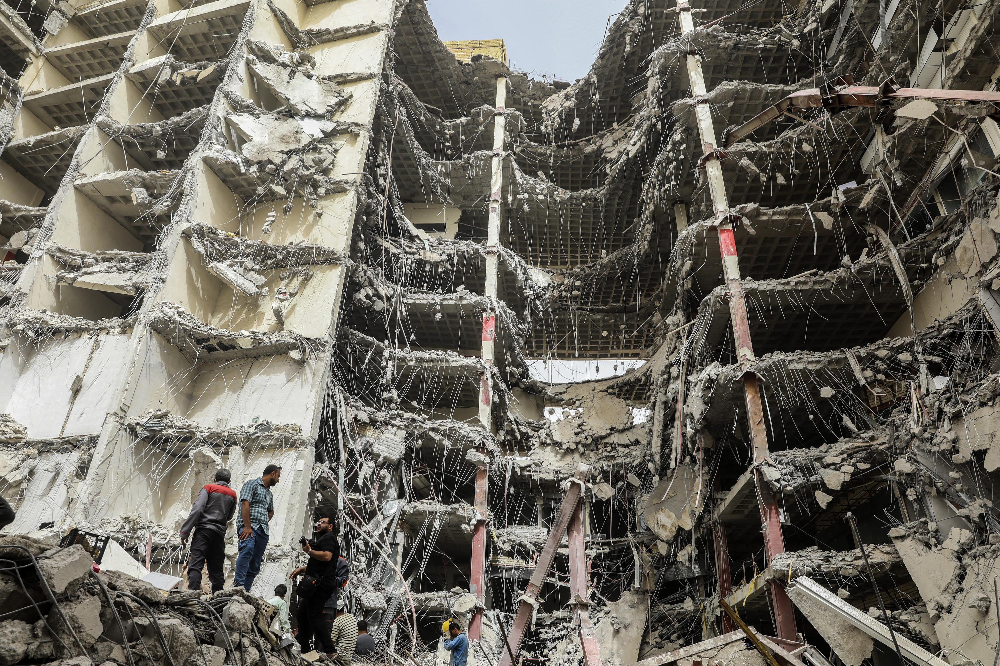
     
     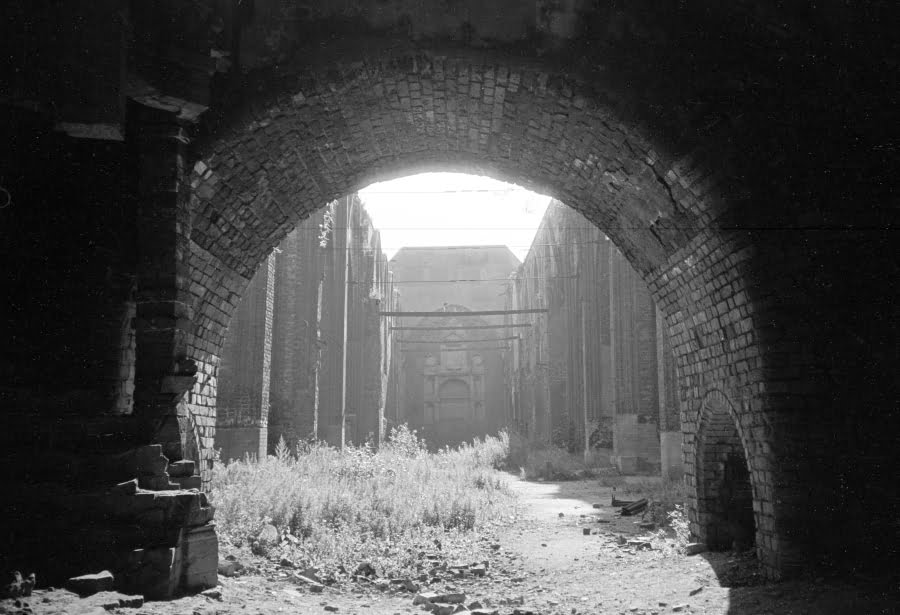
     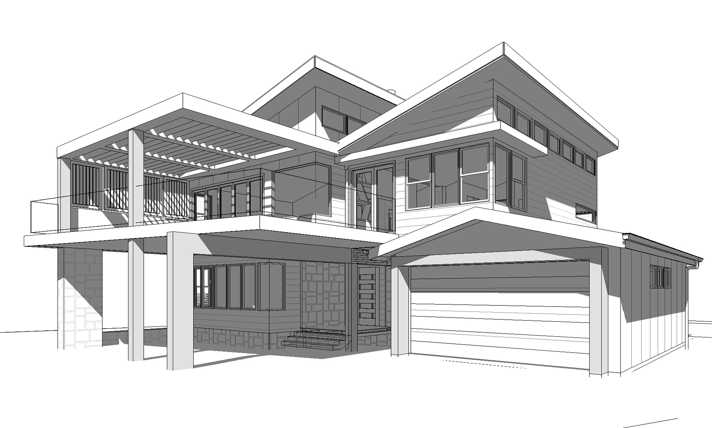
     
     
</p>

I also draw some of the elements I think would be useful in environment creation:
<p align="left">
     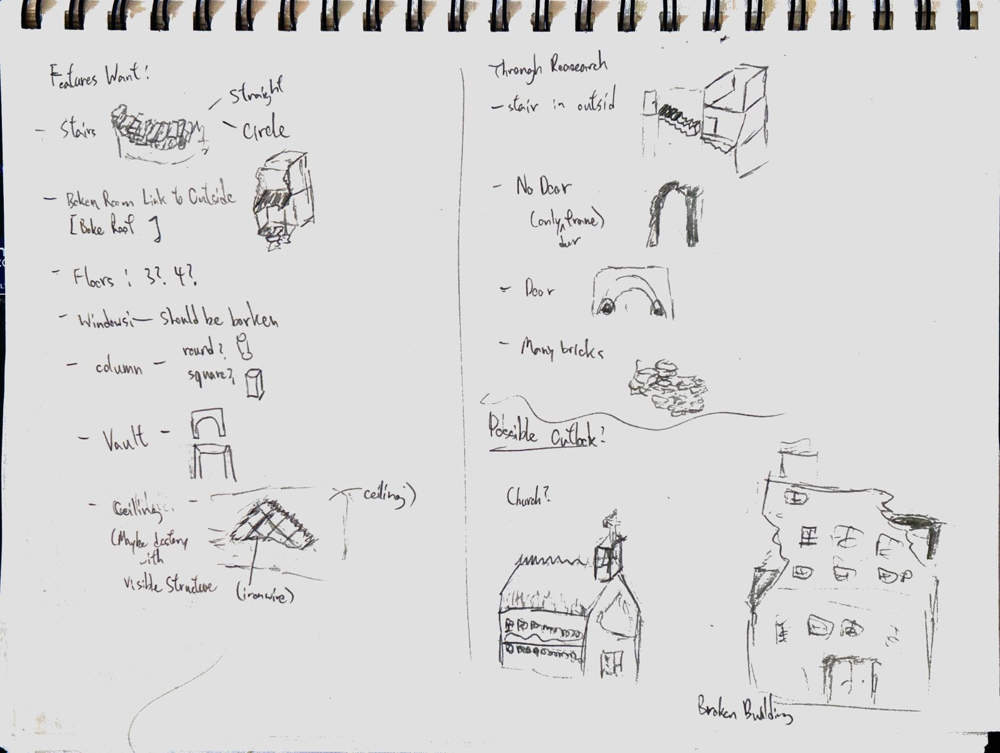
</p>

### 3D Environment Exploration

Since this is the first time I use Unity to create a 3D environment, I searched for tutorials on YouTube. I found a tutorial called [Destroyed Building Kit – Unity Tutorial](https://www.youtube.com/watch?v=zQRe2dX9B6M), which seemed relevant to the environment I had in mind.

I also searched the Unity Asset Store for possible assets that could help with building destroyed environments. However, I quickly realized that most of the assets cost money, and many of them are around $40, for example [Destroyed Buildings and Debris Pack](https://assetstore.unity.com/packages/3d/environments/urban/destroyed-buildings-and-debris-pack-223947). As a beginner exploring 3D environment creation, I kept trying to find free , so I could try how the assets could work first.

At that moment, I suddenly remembered that my original idea to build a 3D game came from a tutorial I saw before about ProBuilder. So I went back and searched for more tutorials about ProBuilder.

Although I could not find a tutorial specifically about war environments, I did find a [Unity official tutorial on Unity Learn](https://learn.unity.com/tutorial/working-with-shapes-in-probuilder). It mentioned that ProBuilder has limited functionality compared to professional 3D tools, but it is still useful for quickly creating simple 3D objects inside Unity without opening another modeling software.

Since I had a good experience with Unity’s official tutorials before, I decided to start by learning the tools first, before building the environment.

#### Asset and Material Setup

I downloaded several free materials that could be useful for environment building by using ProBuilder, such as ground and architectural materials. These include [ground textures](https://assetstore.unity.com/packages/2d/textures-materials/nature/yughues-free-ground-materials-13001), [pavement textures](https://assetstore.unity.com/packages/2d/textures-materials/roads/yughues-free-pavement-materials-12952), [architectural textures](https://assetstore.unity.com/packages/2d/textures-materials/yughues-free-architectural-materials-13234),and other realistic materials that could help create a war-damaged environment.

<p align="left">
          
     </p>

##### ProBuilder Issues

While following [the tutorials](https://www.youtube.com/watch?v=Ta3HkV_qHTc), I discovered that I could not open the ProBuilder Window. After searching online, I found that in Unity 6.0, the ProBuilder interface has changed, and the old “ProBuilder Window” no longer appears.

Many users online were also facing the same issue and complaining about the new UX design in [Unity Discussion](https://discussions.unity.com/t/probuilder-window-missing-in-unity-6/944138/4).

Because of this change, editing objects became more difficult. I tried to search specifically for “ProBuilder 2026” tutorials, since many older tutorials use the previous version with better UI.However, I could not even find a good one.

### Prototype Building

Since the editing tools were a bit difficult to use, I decided to simplify my plan. Instead of trying to build a full environment right away, I focused on creating one building structure first.

I used simple shape elements from ProBuilder and tried to implement the low prototype building structure that I had sketched earlier. In the end, I managed to build a four-level building structure to show the interior layout.

<p align="left">
     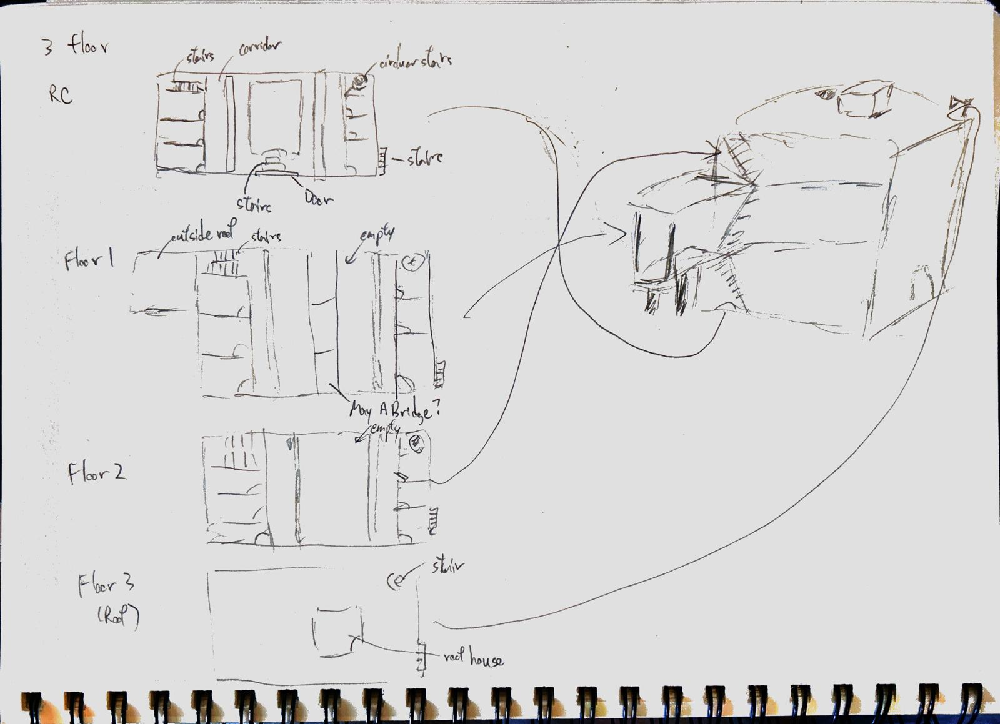
</p>

At this stage, I mainly focused on creating the floor structure, while leaving the external walls for later. I think this is better for the prototype because I think the building structure is more important at the prototype stage.

I also created floors for the corridors, although I have not implemented the full corridor design yet. One issue I encountered was that the door shape element is very thin, which does not look good visually. For now, I just used walls to represent the doors so the space feels correct.

For the top floor, I changed the roof idea. I left the room walls partially open and resized them so the building looks damaged or broken. 

 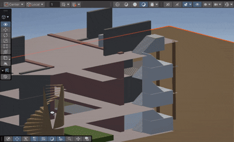

### Asset Integration

Later, I also tried using the [Cathedral and Cemetery Kit assets](https://assetstore.unity.com/packages/3d/environments/dungeons/cathedral-and-cemetery-kit-29240) that I found by accident in the Unity Asset Store. During the earlier discussion with my teammates, someone mentioned that maybe the environment could also include places like an old church or cathedral, so I thought this asset might be a good example to test.

 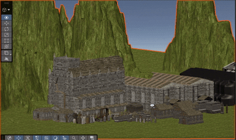

After importing the asset into Unity, I started exploring the prefab objects inside the package. When I looked through them, I realized that this type of modular asset could actually be very useful, because it allows us to build a large environment faster, instead of creating every building from scratch.

Another reason I wanted to test these assets is because I wanted to compare two different approaches for building the environment. One approach is to build the whole structure by using ProBuilder, which gives more control for designing the layout. The other approach is using pre-made modular assets, which can help speed up the development process but might limit some customization. By trying the asset early in the prototype stage, I want to see whether this could help reduce the workload, especially since we only have two people working on the art side.

At this moment, I am thinking that maybe the best approach is to combine both methods. For example, I could use the main structure or frame from the asset pack, such as the walls or pillars, and then design the interior layout ourselves using simple shapes or ProBuilder objects. In that way I keep some flexibility in the design, but also save time when building the environment.

### Technical Issue and Adjustment

During the process of setting up the environment, I also faced several technical issues, especially related to materials, rendering pipelines, and Unity tools. Some of these problems slowed down the progress of this two week. 

1. One major issue happened when I imported some assets into the project. All the objects appeared pink in the scene.
    <p align="left">
         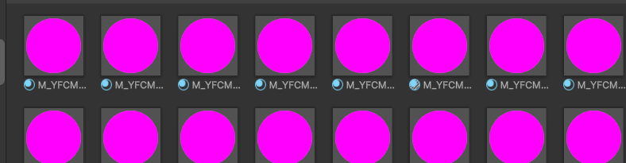
         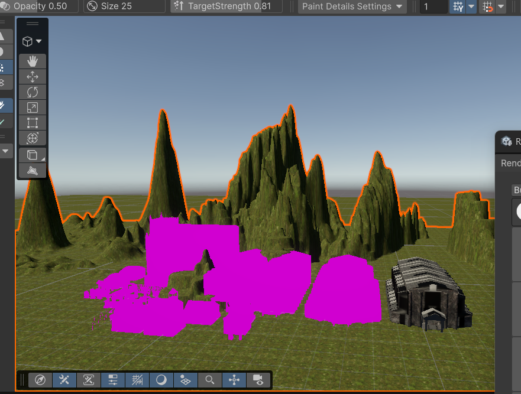
    </p>
    
    At first, I was confused because the models were there, but none of the textures were showing. I managed to solve the issue by selecting each material and, in the Inspector, changing the shader from Standard to Universal Render Pipeline. The problem is, I had to do this one by one, which was really time-consuming. 
    
    <p align="left">
         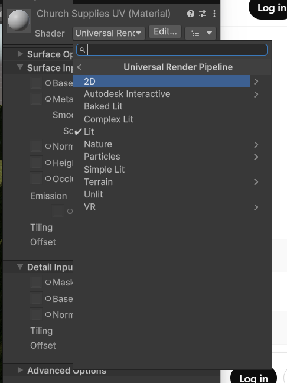
    </p>
    
    
    Then I searched online, and the AI solution recommended the following steps:
    
    Go to the top menu:
    
    ```
    Edit → Render Pipeline → Universal Render Pipeline
    ```
    
    Then look for the option:
    
    ```
    Upgrade Project Materials to UniversalRP Materials
    ```
    
    However, when I tried this in Unity, I could not find these options. I think maybe it is because the Unity version I am using is different ( I use the newest verion 6.3), so the location of the button is not the same as what the solution mentioned.
    
    Because of that, I continued searching for other tutorials with the search in specific for Unity 2026 version. I found a [YouTube tutorial](https://www.youtube.com/watch?v=016E8Ld6uto&t=167s) explaining how to convert standard materials to URP materials, which helped me understand the issue better.
    
    From that tutorial and other searches, I realized that in my Unity version the process is slightly different. Instead of going through the Edit menu, the conversion tool is located in another place.
    
    So the actual path I used in Unity is:
    
    ```
    Window → Rendering → Render Pipeline Converter → Material Upgrade
    ```
    
    <p align="left">
     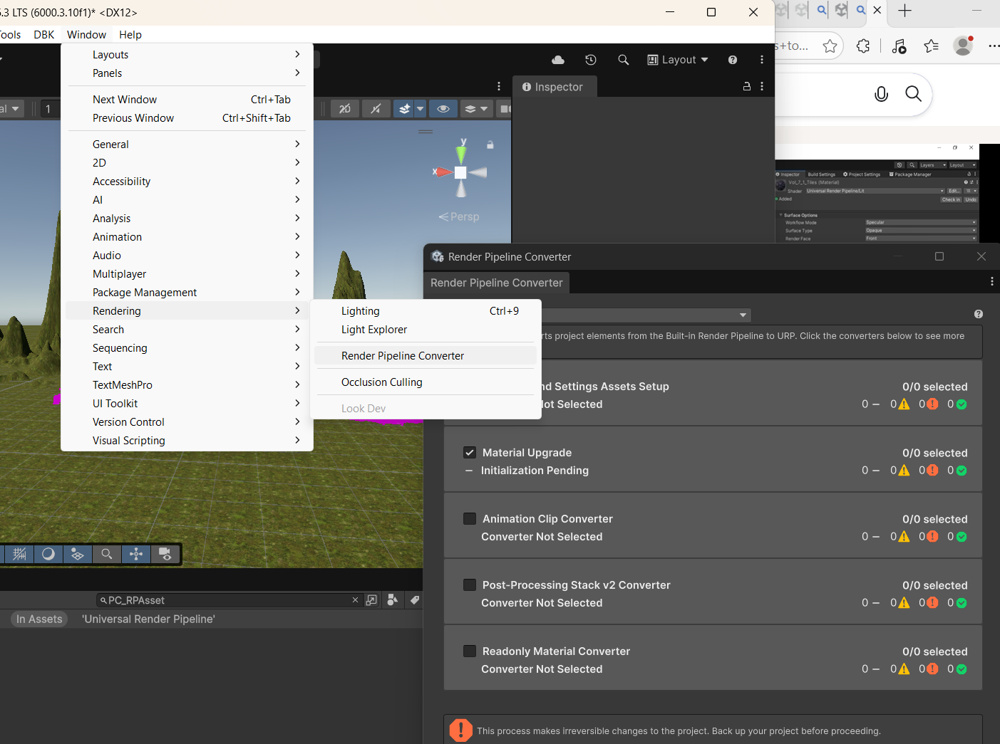
    </p>
    
    After opening the Render Pipeline Converter, I first clicked Detect, which scans the project to find materials that need to be upgraded. Then I ran the Material Upgrade process, which converts the materials so they are compatible with Universal Render Pipeline (URP).
    
    After running the process, Unity updated most of the materials automatically, and the assets started displaying their textures correctly.

    <p align="left">
        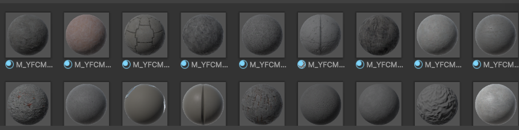
        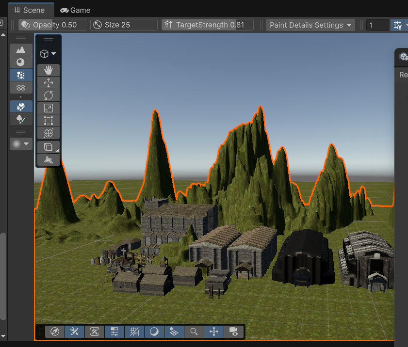
   </p>
    
2. Another issue I encountered was related to ProBuilder. Many tutorials online show a ProBuilder Window where users can easily access tools like Extrude, Bevel, Bridge, and Pivot editing. However, in Unity 6, this window no longer appears in the same way, because the interface has changed. Because of this change, it became harder to follow many of the tutorials that were created for earlier Unity versions.
    
    This difference in the interface made the workflow a bit confusing, especially since I am still learning the tool. I also noticed that many other users online were facing the same problem and discussing it in Unity forums.

    <p align="left">
          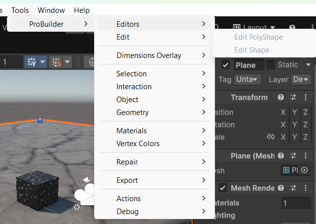
          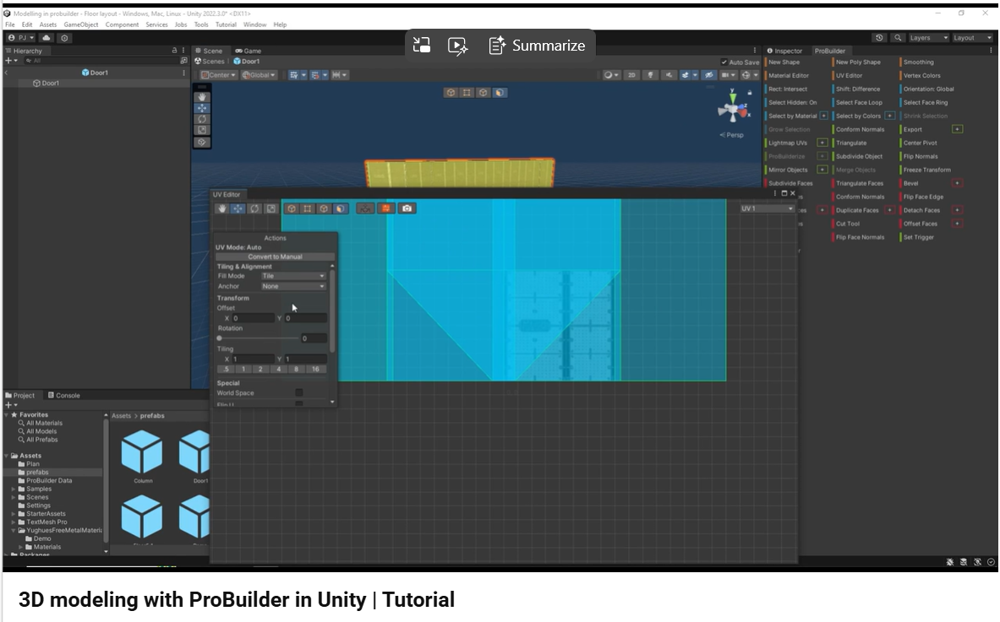
     </p>
     (Left:  shows that there is no ProBuilder Window in the ProBuilder Editor in my Unity version. Right: shows how ProBuilder normally looks and how it helps when editing objects.)
    
3. Another technical issue was related to the Scene View camera controls. Normally in Unity I can move around the scene using right mouse button + WASD keys, which allows I to navigate the 3D environment more easily. However, in my project this control sometimes stopped working. When this happens, it becomes difficult to move around the scene while building the environment. 
    
    At the same time, I also noticed that all the textures were not showing in the ProBuilder elements, even though it worked before I upgraded the Project Materials.
    
    I searched through tutorials online, and some of them mentioned options like “Built-in Material in URP” inside the rendering settings that could solve this issue. However, I could not find the same option in my Unity version (the version I am using is the newest). These issues may be due to the same reason, because they happened at the same time. So they are still something I need to figure out and solve later.

### Possible War Atmosphere Features

To make the environment feel more like a war zone, I started listing out several possible elements that could help create that atmosphere when they came to my mind during researching. I realized that the environment itself plays a very important role in storytelling, especially since our game idea is related to exploring soldiers’ stories in a war environment. 

Because of that, I started listing several possible features that could help strengthen the war atmosphere in the environment:

- bomb damage effects
- sand and dust in the environment
- destroyed buildings and ruins
- explosion effects
- war sound effects

Although I may not implement all of these features soon, listing them out helps me think about the direction of the environment design. These ideas could be added later when we start improving the environment details and overall atmosphere of the game.

### What I Learned

Setting up a 3D environment in Unity is much harder than I expected. Such like,  I learned that ProBuilder is useful for quickly building shapes, but it has a lot of limitations, like with doors and some editing tools. It is also really hard to learn this year because the User Interface changed this year and as a beginner it is not easy to find YouTube tutorials that actually help. On top of that, I found that many assets do not work perfectly at first, which took a lot of time to figure out. The environment setting spend much more than I expected. 

From this stage, I realized it is better to focus on layout and structure first, like floors, walls, and corridors, before spending too much time on details. Even with simple shapes, the space can already show how the player might move through the building.

Overall, this stage taught me a lot about technical side of Unity,  which will help guide the next steps for the prototype.

### Future Plan

In the next step, I plan to ask my teammates for their opinions about the environment design. I want to show them both the assets I found and the building structure I created, and ask which approach they prefer.

I will also share some reference images that I found online so they can understand where my environment ideas come from. In addition, I will ask for feedback about the environment features I listed earlier, such as destruction effects or war sounds.

At the same time, I also found some additional tutorials that might help the project later. One tutorial explains the [Unity Stats Window](https://learn.unity.com/course/vr-curricular-framework-resources/tutorial/working-with-the-stats-window-2019-3), which can be useful for monitoring game performance and player settings. Another tutorial explains [Unity Terrain](https://www.youtube.com/watch?v=46Mc0gORwg8&t=134s), which could help us build a larger environment.

Hope that in the next weeks I can solve these problems and have a clearer way to improve the game environment. 🥹

## **Week8** (13.3.2026 to 19.3.2026) – Iterative Prototyping 3 (Design Value + Therapy Room Prototype)

At the start of this week, I started from looking through the instructions on GitHub again. I saw the question asking: *what is my (our) core design value of our final projects?* Then I started thinking about what is the design value for our game, and how to make it more clear to understand the design value. I also read through the reading again.

For the broadest design, which are the five key approaches that Holm identifies (aesthetic, social, environmental, traditional, and gender-based), I think our project game meets the social one. This is because the game focuses on war issues happening in the world, no matter past or present, and also focuses on soldiers or citizens who suffer from PTSD after being in war zones. It is not only about gameplay, but also about reflecting real-world issues and emotional impact.

Then I move on to answer the general questions to discuss while
establishing the design values for a game

- **Experience**: What does the player do when playing? As game designer and educator Tracy Fullerton puts it, what does the player get to do? And how does this make the player feel physically and emotionally?
    - The player attacks enemy soldiers or protects themselves, and lures NPCs and saves them through answering questions. The player uses a first-person experience view and experiences the gameplay directly.
    - Physically, the player is moving, aiming, shooting, and reacting. Emotionally, the player may feel excitement and tension during combat, but this shifts when entering the therapy room, where the player becomes more focused and reflective.
- **Theme:** What is the game about? How does it present this to players? What concepts, perspectives, or experiences might the player encounter during play? How are these delivered? Through story? Systems modeling? Metaphor?
    - I think the game will metaphor the effect when people get PTSD after experiencing war. Instead of directly explaining PTSD, the game presents it through systems, environment, and interaction. The therapy room, the NPC dialogue, and the maze all work together as a metaphor for memory, trauma, and recovery.
- **Point of view:** What does the player see, hear, or feel? From what cultural reference point? How are the game and the information within it represented? Simple graphics? Stylized geometric shapes? Highly detailed models?
    - The player sees enemy soldiers and shoots back when attacked, and the whole game is in first-person view.
    - For the war experience and memory metaphor, the environment should be dark, messy, and a bit blurred, which may be caused by dust or sand.
- **Challenge:** What kind of challenges does the game present? Mental challenge? Physical challenge? Or is it more a question of a challenging perspective, subject or theme?
    - The game includes multiple types of challenges
        - Physical challenge: Player needs to move around, shoot, and lure NPCs.
        - Mental challenge : player needs to handle the saving questions and find fallacies in what NPCs say to assist them (in therapy room)
        - At the same time, I think the theme itself creates a challenge, since the war and PTSD metaphor may raise strong emotions during gameplay.
- **Decision-making:** How and where do players make decisions? How are decisions presented?
    - The player makes decisions in both the shooting system and the therapy system. The shooting decisions are made in real time, while the therapy decisions require more thinking, as the player needs to choose answers carefully during the interaction.
- **Skill, strategy, chance, and uncertainty:** What skills does the game ask of the player? Is the development of strategy important to a fulfilling play experience? Does chance factor into the game? From what sources does uncertainty develop?
    - The player needs basic skills such as movement, jumping, and shooting, using WASD, space, and shooting controls. These skills are important for the overall experience, because if the player does not understand them, they may feel confused or frustrated and may even give up the game. Strategy is also important for understanding how to interact with NPCs and progress.
    - I do not think chance plays a big role in the game, since most outcomes depend on skill and decisions. However, uncertainty still exists, especially from NPC behavior, where they may react unexpected ways due to different player approaches.
- **Context:** Who is the player? Where are they encountering the game? How did they find out about it? When are they playing it? Why are they playing it
    - The player is controlling the character in first-person view and experiences the game through exploring and interacting. The player encounters the game by progressing through the environment, and we provide panel hints to guide them during important steps so they do not feel lost.
- **Emotions:** What emotions might the game create in players?
    - The game should generate a strong sense of focus. It may feel exciting during combat, but during therapy interactions, the mood should become heavier and more serious.
    - Also , it is not a chill game. The player may feel responsibility, sadness, helplessness, or worry, and may also connect the experience to real-world war issues and their own feelings.

So overall answering all the questions , I think the core design value of the game is 

- create an experience that generates a feeling similar to PTSD, especially in war or post-war situations, through gameplay and metaphor.

The goal is not just to show war, but to let the player feel and reflect on its psychological impact.

### Technical Exploration — Unity Terrain

At the beginning part of the week, I wanted to follow up on the previous week where I found a [Unity tutorial](https://learn.unity.com/tutorial/working-with-the-terrain-editor-1) for terrain, so I continued exploring what is design in the 3D world. However, I faced the material assets issue again. Some of the terrain textures worked, but for the tree assets, which are mandatory for the tree brush, they appeared all pink.

<p align="left">
          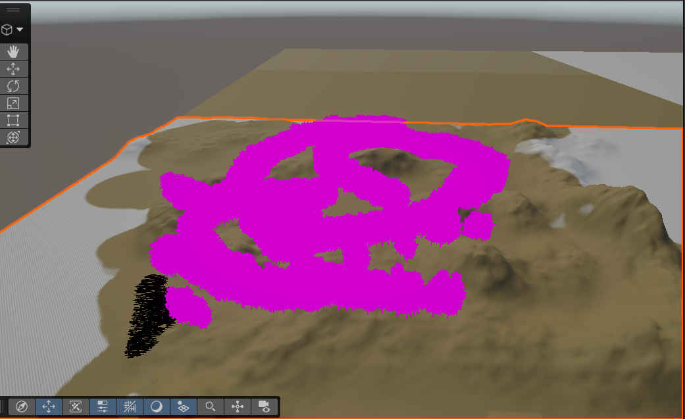
</p>

Even after upgrading the rendering settings in Unity, it still did not work. Because of this, I decided to leave the 3D environment for now, and maybe come back later after more exploration. I also asked friends who have more experience in 3D building, like using Blender, and waited for their reply on how to handle these issues.

### Prototype Direction — Therapy Room Mechanic

After discussing with the group last week, I started thinking about contributing to the mechanic prototype of the game. Sean suggested that I could take part in the therapy room feature.

The idea of this feature is based on a rehumanization process, where the player helps NPCs through their struggles and finds fallacies in what they say in order to assist them properly. This connects strongly to the emotional and social design value of the game.

Then, i started the therapy room prototype. For the prototype, I wanted to implement the flow of what happens when the player lures a soldier into the therapy room and what happens afterward. At the beginning, I started by questioning how the system would detect whether the player is entering the correct therapy room, and what the player should actually do once inside.

I then started thinking about the player’s actions in the therapy room and how the system should respond.

### Initial Flow Idea

I first imagined a simple flow:

1. Load the room
2. A screen opens
3. The player goes into a minigame or story-based interaction
    - Answer correct / success → save the soldier
    - Answer wrong / fail → the soldier dies
4. Back to the room

At this stage, I kept the success and failure simple, because it helps me imagine how the mechanic works first before refining it.

### Therapy room functions idealization

Previously, one of us mentioned that the therapy room could use a system like having a clipboard and drag-and-paste terms into a paragraph. Because of this, I started thinking about different possible minigames.

I searched online for ideation, including [Roblox](https://www.roblox.com/games/101623798877678/100-Minigames) and [CrazyGames](https://www.crazygames.com/t/mini), and found ideas such as choosing doors, jumping on rocks, spotlight catching, jumping bridges that fall based on luck, and obstacle jumping. However, I realized that many of these are competitive-based or infinite-based games. The competitive environment already exists in the main shooting gameplay, while infinite games may take too long and distract the player from the main experience. Because of this, I did not choose these types of minigames.

While finishing another class assignment, I explored the Figma community and found a 3D pixel world game projects. I thought this could be a great idea for the therapy room feature. The pixel blocks can represent memory, similar to how some films use blocks or objects to represent brain functions, such as Inside Out.

The 3D aspect also suggests that people can see the same story from different angles, which connects to bias and misunderstanding. Based on this, I thought that using a 3D pixel maze would be a good metaphor. The maze represents how people with PTSD may feel trapped in their memories, and how they need to move forward instead of staying stuck in past traumatic experiences.

### **Low Prototype**

I then drew the game flow on paper as a low prototype to better imagine how it works in Unity. The flow is:

1. When the player is close to the door, the door automatically opens
    - If only the player enters, nothing happens
    - If the player brings an NPC, a panel appears
2. Then player clicks “next” to enter the NPC mindset
3. After that, the player sees a panel with background information and a question
4. The player click “next”  to close the panel and enters the 3D maze , while at the same time player needs to remember the answer
5. After pass through the 3D maze, the player chooses a zone (A, B, C, D)
    - When entering a zone, a 3-second timer starts
    - The player can leave and choose another zone, which resets the timer
    - If the player stays until the timer reaches 0, the answer is locked
6. Then player is sent back to the main scene and sees the result
    - Correct → NPC saved
    - Wrong → NPC dies
      
    <p align="left">
              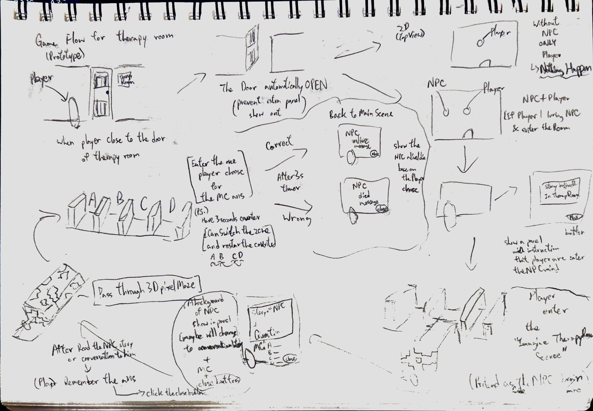
    </p>

I also created a video prototype to demonstrate the features that may appear in the therapy room scene.

   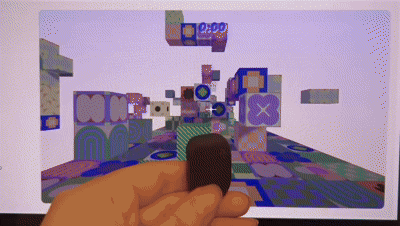


### **Implementation Process**

For the implementation, I reused features from earlier prototypes. During my Week 2 exploration prototype, I had already developed two relevant systems: duplicating collectible objects and a door-opening mechanism. I revisited that tutorial to review how these features were built. After that, I exported the door system and its associated assets, then imported them into the final project. Using these elements, I created a rough block-out of the therapy room area to represent the scene and integrate the door functionality.

   <p align="left">
             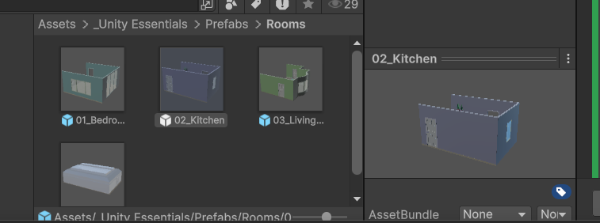
   </p>

Then, I try to implement all the features I designed for the therapy room. I also create a left-side road so for prototype testing I can walk through it without crossing the 3D pixel maze every time, while the bridge (long platform) will be reduced in width in the official gameplay so that players can only pass through the 3D pixel maze to reach the choice zone.

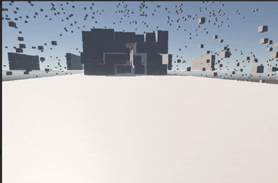

For the environment, I created the 3D environment by duplicating many blocks and building a floating maze-like space. While doing this, I realized I could create something similar to a Minecraft-like floating structure, which fits well with the idea of a mental space.

   <p align="left">
             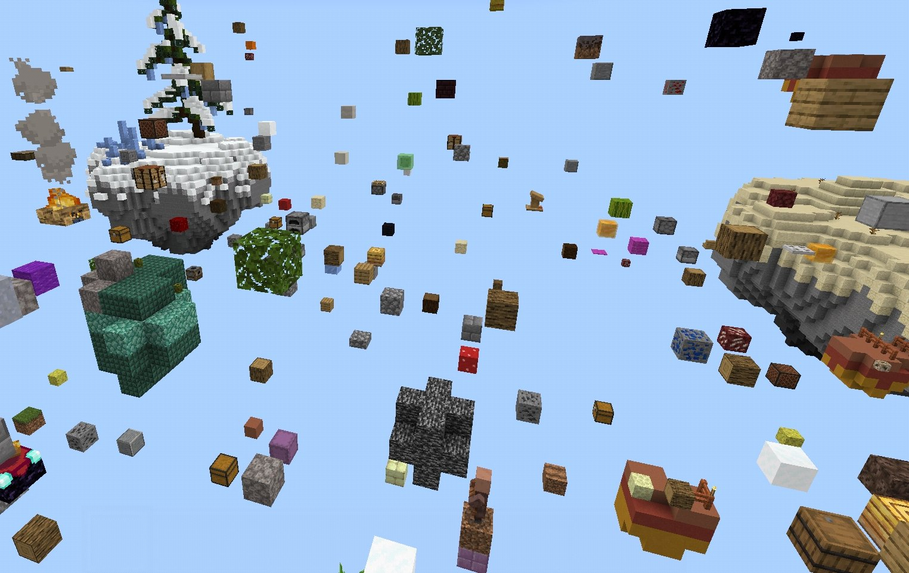
   </p>

   [Picture: Minecraft floating block reference used for designing the therapy room environment.]

   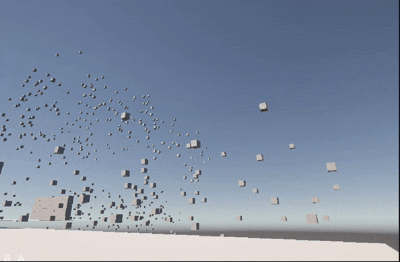

   [Therapy room GIF: 3D therapy room environment with floating blocks]

I also resized the player object to be smaller, so when walking through the maze, the blocks feel very large and overwhelming. This creates an “ant view” feeling, where the player is small inside a massive environment. This helps represent the idea that the therapy space is part of a mindset, which is abstract and larger than expected.

### Refined features based on previous prototype:

   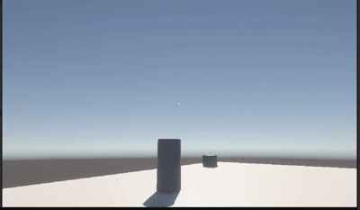

[Recording based on confusion I faced when the player meets the NPC and does not know how to trigger interaction.]

While working on the prototype based on Alex’s luring features ( we shared the code through GitHub) , I realized I did not know how to trigger the “Talk to User” feature. Looking through the code, I found that the player needs to press the E key to start it. So, I rewrote the “Talk to User” feature and added “(click key E)” as a clear guideline for the player.

<p align="left">
          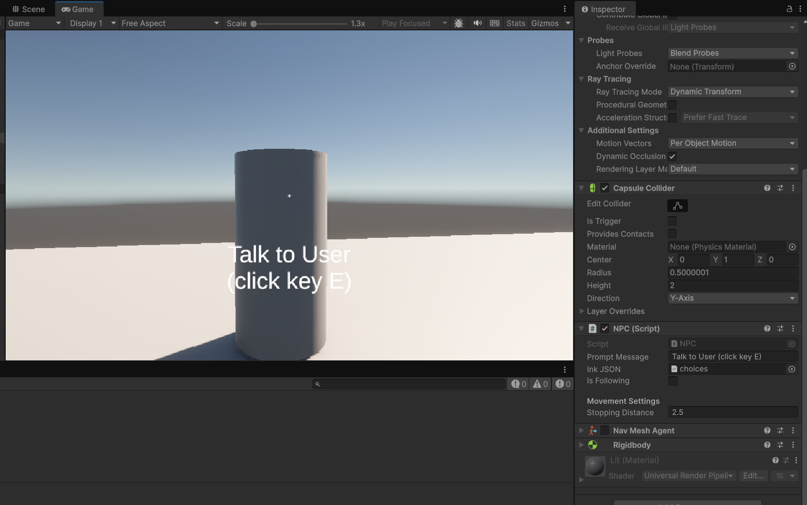
</p>

   [The result after adding a guiding text prompt “(click key E)” to clearly indicate how to interact.]

I think this also helps when working with a team and shared code. It makes it easier for the next person to understand previous features, follow up, and refine them if any issues come up during gameplay.

### **What Worked**

The therapy room system works well overall. Most of the core features functioned as intended. 

**Key Features Implemented:**

- Door opens automatically when the player enters.
- Box colliders detect whether only the player or the player + NPC enters the therapy room.
- Panels guide the player through the game flow.
- 3D floating maze environment created with flowing blocks.
- Long platform with 3D maze and zones for choices A, B, C, D.
- 3-second timer in each zone, which resets if the player leaves.
- System records the zone the player stands in, transfers them to the main scene, and shows the result based on their choice.


    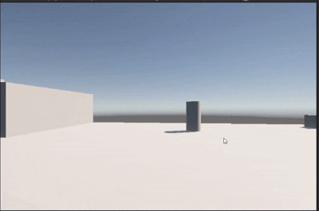

    [The upper GIF records the whole game flow, from luring the NPC and entering the therapy room, to passing through the 3D maze, selecting the wrong answer, and returning to the main scene with the NPC death message.]

   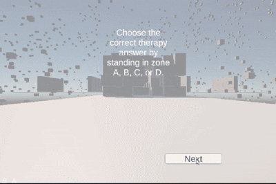

   [This GIF shows the player passing through the 3D maze, selecting the correct answer, and returning to the main scene with the NPC saved message.]


I also showcased the environment, including the 3D maze and ABCD zones, to my friends. They said they loved the design and were excited to try it. I think this is a good success, as it shows the idea was well-received and accepted.

### **What Did Not Work**

I originally implemented the big “A”, “B”, “C”, “D” letters to represent each zone, but now they all appear as tiny text on the player’s screen all the time. I already moved all four letters out of the Question Panel (which appears at the first scene in the therapy room world), so they should not be affected by the panel showing or not.

I think it might be a canvas-related issue, and I will try to solve it later by asking others or researching online later.

<p align="left">
          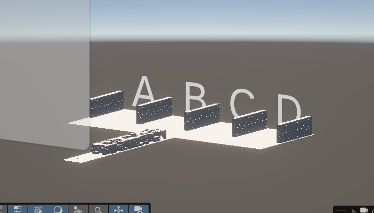
</p>

### **Notes**

Some notes I recorded during the process are important for future work and debugging. 

1. When duplicating objects, remember I could use shortcut **Ctrl + D** and also needed to pay attention to the axis when duplicating. 
2. For the button OnClick setup, remember need to assign the GameObject, not just the script, while the GameObject must contains the script functions for onclick.
3. I also faced an issue with SceneManager.LoadScene, where I could not add the scene into the list. I remembered that we learned to solve it using the “+” button, but it did not work. After searching online and watching [a tutorial](https://www.youtube.com/watch?v=5HgVnu2LGfI&t=100s), I found that in Unity 6, I found that I need to drag the scene into the Scene List instead. So, I recorded this process in case I face the same issue again.

    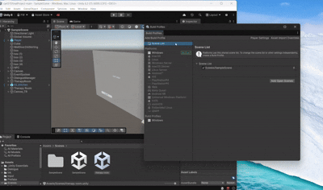

### **Future Plan**

For the future plan, I think there are many things that I need to continue improving, both technically and in design. 

1. I need to fix the UI issues, especially the canvas problem that affects the A, B, C, and D labels, since this directly affects how the player understands the choices. 
2. I also need to adjust the scene transition, because currently the player is sent back to the starting location. I need to discuss with my teammates whether the player should return to the therapy room or the main scene spawn point, as this will affect the overall gameplay flow.
3. Another important focus for the future plan  is adding a fall reset system. Right now, if the player falls off the maze, they will fall infinitely, which breaks the experience. I am thinking of implementing a system where if the player falls for around 3 to 5 seconds, they will be reset back to a safe position. I also need to think more carefully about whether this reset should return the player to the therapy maze or completely back to the main scene, depending on what makes more sense for the design.
   
    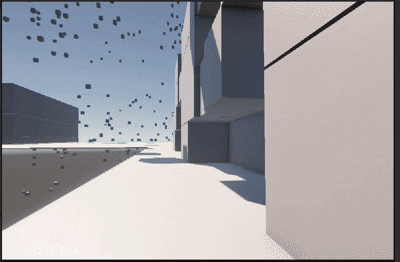
   
4. For the therapy room itself, I think the environment is currently too bright, and it does not match the emotional tone that I want. I want to make it darker and more atmospheric, so it better represents memory, confusion, and trauma. I may also refine the maze design further so that it is not just functional, but also more meaningful as a metaphor.

I also plan to conduct playtesting, both with teammates and with other people. This will help me understand if the gameplay flow is clear, if the emotional impact is working, and if the difficulty level is appropriate. Based on feedback, I can continue refining both the mechanics and the experience.

Finally, I also want to return to the terrain issue and try to solve the purple material problem. I may explore Unity settings more deeply or get help from others who have more experience. This is important because the environment design will also affect the overall experience of the game.

Overall, I think the therapy room feature is working well and looks cool now. The system successfully connects gameplay with emotional meaning, which supports our core design value. I am looking forward to the next steps to improve it, especially by refining both the technical implementation and the emotional experience after more testing and feedback. 😄

## **Week9** (20.3.2026 to 26.3.2026) – Iterative Prototyping 4 (Dialogue & Visual Novel Features)

As last week of meeting, we showcased everything we did during the past week and listed what we should do for this week. After talking with Matthew, the main focus is still the mansion (the 3D world). This time, as Sean mentioned, he has built 3D environments with assets before, and his AI features are almost finished, so he is okay to take over the 3D assets part.

So me and Sean switched positions. He will focus on the 3D assets mentioned, while I pass all the resources that I found before to him, like the asset links for buildings, textures, environments, and effects. I also followed up on the pink issue that he faced using my previous solution, and it worked. The “Material Update” solution that I learned last week actually helps to solve other issues as well.

### **Focus This Week – AI Communication Mechanic**

Then, for my side I take care of the communication mechanic, thinking about how healing dialogue is powered by AI and how player successfully heals them.

So my this week prototype is to build the game that works with the AI communication and with playful features.

The question that I am focusing this week is: 

    **How might the dialogue features work and could also be playful?**

### **Reference Games & Research**

Before I start the prototype, Bianca also showed me some reference games that I could take a reference of, so I take a note of how those games work.

For [Danganronpa Chapter 5 Trial](https://www.youtube.com/watch?v=4D7Ejc-Y3gc), the gameplay includes exploring the school grounds, conversing with characters, and progressing the story. The player answers the questions by choosing the correct choice, while every choice has a follow-up explanation. There is also a time counter, and the communication happens through a communication bar.

For [Phoenix Wright: Ace Attorney Trilogy](https://www.youtube.com/watch?v=qx5BV__S3DE), the player takes the role of various defense attorneys and speaks in a communication bar. Similar to Danganronpa, communication is presented through a dialogue bar, but it also has an evidence system where players can collect and present evidence during interactions. The player can save evidence and choose choices by clicking buttons, which directly affect the progression of the case.

So as a summary, both of these are visual novel adventure games. Based on that, I also searched through visual novel games on itch.io, especially those made with Unity. I found that most of them follow a similar structure. That, they all have a communication phase first, and then after the communication, there will be some mission that the player needs to complete. For example, answering the NPC questions through choices, or selecting objects to continue. So, all of these feature story-based progression, with player interaction (choices or actions) driving the story forward.

### **Exploring Journal-Based Gameplay Inspiration**

Hence, I also search through the internet that see if any interesting idea will inspire me in designing this mechanic, specifically argumented or conversational game (play type) and work with text.

So I again search through internet to find any [journal game/communication game in itch.io](https://itch.io/games/genre-visual-novel/made-with-unity). During this process, I found the “Bloom” which the cover pictures is catching my eyes.

After I clicking it, I found the “Bloom” game is based on [The Wretched](https://loottheroom.itch.io/wretched) by Chris Bissette and was created for [Wretched Jam](https://itch.io/jam/wretched-jam). I watch the [introduction/template videoof The Wretched](https://www.youtube.com/watch?v=_V-wQtZamzA&t=88s) that explain how the The Wretched journal features look, I think is quite a cool idea and could be put into our communication part too. As, the journaling system feels very immersive and personal, and I think it could match well with our project theme, especially related to memory and emotion.

#### **Combining Journal + Dialogue Features**

While when I start thinking how to combine the journal features and the dialogue features (visual novel features) together, I first start searching how can I implement the making a visual novel in Unity. I then found that I could try to implement the dialogue system in Unity by a [YouTube tutorial](https://www.youtube.com/watch?v=8oTYabhj248&t=287s).

Then, I start to form an idea on how this could work. I also take reference from Danganronpa, where the player chooses objects, and each object has explanation that player can refer to. This makes me think about how information can be interactively explored instead of only reading dialogue.

Also through many similar games searching, I think the best to implement the game mechanic is through asking and choosing through from the choice. This is a more possible way to implement, and also allow more variety. Then , the features of journal are not showcase as dialogue, while is as a supporting features. The main interaction still comes from dialogue and choices, while the journal supports the player to find information.

### **Core Gameplay Idea**

So I think about how about having a dialogue features, that the NPC is taking what it thinking / feeling, follow up with some confusion caused by forgotten or missing memories. Then after the talking that show with the dialogue, the screen will showcase the NPC (the dead soldier) journal, and with the questions that the NPC ask to the player. The player need to read through each day journal then find out the answer to reply the NPC.

If it is correct answer, the NPC will have corresponding feedback, while if it is answered wrongly, the NPC will have prompt that the player answer wrongly and need to re-answer again. While in this part I do not think that there should be a punishment, because the wrong answer prompt itself will already make the player feel bad, and maybe sorry, as the player may feel that due to answering wrongly, it causes the NPC to have a stress response.

After I had the idea, I drew the low prototype of the game flow of the dialogue features. 

So the Flow will be: 

1. After the player lures the NPC to the therapy room, and the player transfers into the NPC mind (brain). Then a dialogue box shows up with typing animation, which represents the speech that the NPC (dead soldier) wants to say. Since it is inside the NPC mind, the player cannot see the NPC object, which works as a metaphor of entering the NPC brain.
2. After several dialogue lines, a journal from the war period will show. The player can click each “Day X” button, and it will respond to that specific day’s journal. At the same time, below the journal, the dialogue box will still exist and show questions with choices. The player can read different journal entries to find the answer.
3. If the player chooses the correct choice, it will show a correct follow-up text message and move to the next question. If the player chooses wrongly, it will show a stress response and the player must choose again until correct. (The default loop is 3 questions, but it can be extended later.)
4. After finishing all questions, a final prompt panel appears showing that the NPC understands or remembers what actually happened, resolves their regret, and are willing to leave the world.

For the story design, I try to make the journal content natural as a soldier journal that could seems realistically happen during the war period. I also design misunderstanding or forgotten key events that lead to regret.

For the MCQ options setting, the questions are mainly based on the journal content. However, during testing, when every question had the same correct and wrong follow-up text, the game felt a bit too systematic and coded, so I changed it by adding corresponding follow-up text for each question.

So now, the player can clearly know if they chose the correct answer or not, but it still feels like part of the dialogue. Now each response is more connected to the story.

I also made a video prototype of how this will work smoothly. 

### **Implementation Process**

In the implementation process, I first implemented the dialogue box feature and tested whether the typing animation works smoothly. I experimented with several speed values and found that 0.03 gives the most smooth experience.

Then I created the journal panel. I set it so the journal panel only appears after the first introduction dialogue (the NPC expressing their regret). After that, the questions and choices will activate together with the panel.

I also created several buttons labeled “Day X”, where each button links to a specific journal text. For example, clicking “Day 3” will display the Day 3 journal content in the text box. The title and content are all editable through the Unity Inspector.

The questions are also shown using the dialogue box typing animation. The question text, answers, and choices are also all editable through the Inspector, which makes it flexible for different NPCs. So now, all journal content, titles, and question sets can be changed easily depending on the character(NPC).

The answers are linked to button objects. Since there are 4 buttons reused for choices, I assign the correct button object for each question’s answer. For example, if Q1 correct answer is option 3, it links to Button 3. If Q2 correct answer is option 2, it links to Button 2.

After the last question, the journal and the dialogue box will close, and a big prompt panel with a “Next” button will appear. After clicking “Next,” all panels will be closed.

### **Issues & Adjustments**

During implementation, I found several issues and improved parts of the system.

1. First, sometimes text overflowed outside the box. I tried to solve this using maxCharactersPerPage (default 180). But this did not really work. Some of the text is over 180 words, which splits the text, but because they are in paragraphs, they do not overflow the text box, so they should not split. However, if the text includes 2 new lines, it will overflow the text box, but it does not split through this solution.
    
    Then I updated `DialogueBox_TR.cs` so the page splitting would check the actual `TextMeshProUGUI` box height and line layout, not just the number of characters. But even after that, it still didn’t work.
    
2. Add “N-Next” Prompt for the next dialogue box. I first thought about using a button as “Next,” but that seemed to take up a bit of screen space and was not that important to show in the panel. I took reference from the *Phoenix Wright* game. In that game, the next button is “>>,” but I also noticed that they use the “Esc” key instruction to open the options, which looks good and is easy for the player to understand. Even though I never played the game before, I knew that pressing “Esc” would open the options. So, I added a similar feature with a prompt that says “N-Next” in the dialogue box, so the player can understand what they need to do at every step.

3. After clicking the wrong choice button, the system shows the wrong follow-up text. However, during testing, I noticed that an extra “N” key press was needed before a choice could be selected again. The reason could be that the wrong follow-up text is using the dialogue box features, and every next step in the dialogue feature requires clicking the “N” key to move on. As a result, all the buttons became available, and the player could click them, but there was no response when clicking the right or wrong choice.
    
    To fix this, I made all the buttons block input and turn grey when the wrong prompt text is showing. This also creates a visual cue that the “N” key must be pressed before the player can choose a new option.
    

### **Refined Features**

Following up from last week, I improved the falling system. Previously, the player would fall infinitely. Now I added UpdateFallTimer() and RespawnAtSpawnPoint() functions in PlayerMotor. If the player falls for more than 5 seconds, they will respawn at the original spawn point of the scene.

### **What Success**

The dialogue features work well. The dialogue text shows properly in the panel box, the buttons to switch between different journal content work smoothly, and the flow of the gameplay features works exactly as I originally imagined. The normal dialogue, question dialogue, correct/wrong follow-up text, re-choosing options, and smoothly ending this section all work perfectly!

Here are some key highlights that I consider real successes:

1. **GitHub batches and merging are successful**
    
    After working on this for some time, now every teammate can pull and push our own batches and merge them together without conflicts. This is great because everyone can follow each other’s work without manually combining features one by one.
    
    Previously, I did not pull Alex’s batches, so the way I solved it was to select from my Unity file, export it, and import it into the additional file pulled from Alex’s file. (Big thanks to Jimmy and Sean for helping me solve this issue!)
    
2. **Dialogue system success**
    
    The dialogue text now shows with typing animation, not just a bunch of pasted text. This makes the communication feel much more natural and gives the game a proper visual novel style.
    
3. **Buttons and question editing in Unity**
    
    I made the buttons linked to the option features, and the questions can now be edited directly through the Unity Inspector. This makes it much easier and more convenient to control, instead of editing code every time. Also, the number of questions is no longer limited to 3, they can be increased or reduced as needed.
    
    At the same time, all correct follow-up texts and wrong-answer texts can be edited according to each question. Now, each response can feel more connected to the story, and it is easy to change them whenever needed.
    

### **What Not Works**

Following up from last week’s environment concerns, I tried to make the environment lighting darker and add an area light that spots on the bridge.

However, when I tried to change the Directional Light, it only affected the light on the bridge (turning it orange, blue, or dark), and it did not change the overall environment lighting.

Then I searched online and found [an Unity Document- Manual: Add ambient light from the environment](https://docs.unity3d.com/6000.0/Documentation/Manual/lighting-ambient-light.html) that I can edit the environment light through **Window > Rendering > Lighting > Environment** and change the **Skybox Material** property. I tried some material assets I had downloaded before, but they did not work and gave a warning: “Shader of this material does not support skybox rendering”. So, later I may need to import some specific material assets that support skybox rendering to fix this.

### **Notes**

I also want to document some important notes from this week’s process for future reference and reminders:

- Remember to clone the GitHub and pull the latest batch first before making changes. Otherwise, it need to add back each change manually, which can lead to conflicts.
- Be careful with the hierarchy of canvases and panels
    - Use a `xxxManager` (by adding an empty GameObject and linking it to the related script). Do not attach scripts directly to panels or GameObjects that control many components. As it can become hard to figure out which GameObject is holding which script, and sometimes scripts may even get duplicated.
- If the Inspector field is too small to edit, can change the `promptQuestion` string using a `[TextArea(...)]` attribute. Then , this could type the text with newlines and multiple sentences directly in the Unity Inspector.

```
    [TextArea(3, 8)]
    [SerializeField] private string promptQuestion = "";
```

### **What I Learned**

This is the first time I have worked on a [visual novel](https://en.wikipedia.org/wiki/Visual_novel) [adventure game](https://en.wikipedia.org/wiki/Adventure_game). Since I’m not a fan of this type of game and rarely play them, my only prior experience was seeing instructions or storyboards explained by assistant NPCs.

So this has been a really good learning and iterative prototyping experiment. My teammate had a draft idea of how the communication part could work, and I explored possible features, looked at similar game types, found their common patterns, and considered ways to include them in the game we ate working on. I also tried to find features that could benefit the current prototype without feeling awkward or forced.

It was a great experience because I explored an unfamiliar game type, figured out how to implement it in Unity, and at the same time iterated on ideas in the context of what our group had already built.

Now, I feel much more familiar with visual novel adventure games and how to implement dialogue features in Unity.

### **Future Plan**

Overall, I am quite happy that the prototype actually works as I originally imagined. It answers the questions I set earlier about creating a text-based dialogue game with playful features.

I also gave the prototype I built to my friends to play and test. They liked the journal idea and many of them said it was interesting and really fits the theme of dead soldiers and PTSD. They also gave some feedback that I think is useful for future improvements:

1. The text in the journal is hard to read. This might be because I set the font size below 20, and they were testing it in the small Unity Scene view (not sure if I am naming it correctly). I need to double-check whether the unclear text issue only happens in the small view or if it will also appear in the full scene.
2. The second issue is that while in the therapy room, even during the dialogue and journal questions, the player can still move using WASD. In the future, I need to force the player to stay in place during dialogue and questioning periods.
3. Lastly, for the skybox material issue, I will keep looking for assets or other possible solutions to make the world environment darker. This will also be part of my future plan.

Also, as mentioned in our group chat, Sean finished the 3D mansion, and now the majority of our group is successfully linked to GitHub. In our next meeting, we can see how the whole game flow works. I am looking forward to seeing how everyone combines our prototypes together and hope there are no conflicts when merging our batches.😃
